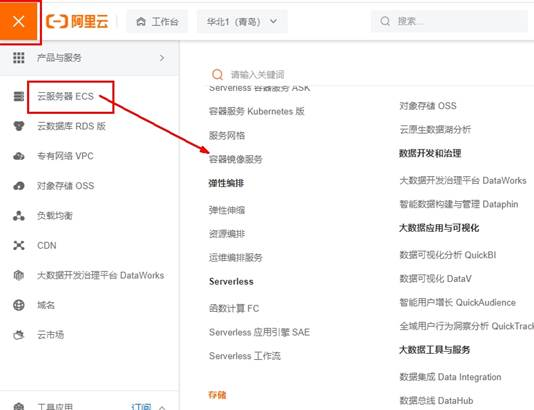
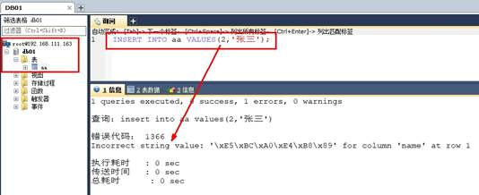
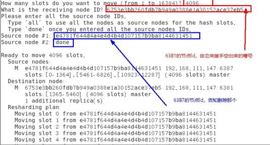
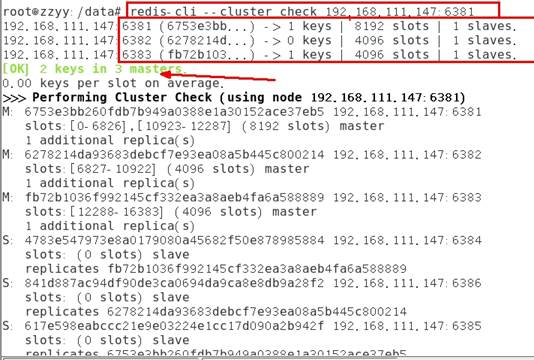
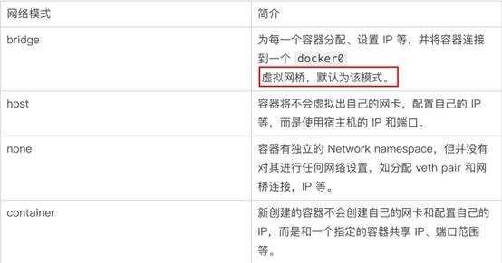
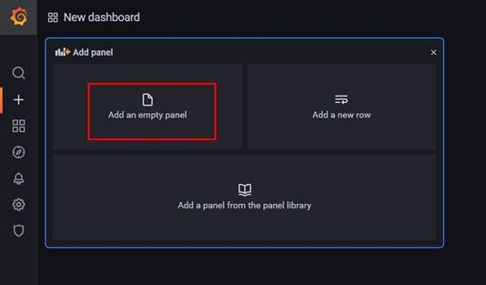

# docker简介

## 为什么会有docker出现

假如您在开发一个尚硅谷的谷粒商城，您使用的是一台笔记本电脑而且您的开发环境具有特定的配置。其他开发人员身处的环境配置也各有不同。您正在开发的应用依赖于您当前的配置且还要依赖于某些配置文件。此外，您的企业还拥有标准化的测试和生产环境，且具有自身的配置和一系列支持文件。您希望尽可能多在本地模拟这些环境而不产生重新创建服务器环境的开销。请问？

您要如何确保应用能够在这些环境中运行和通过质量检测？并且在部署过程中不出现令人头疼的版本、配置问题，也无需重新编写代码和进行故障修复？


**使用容器**。Docker之所以发展如此迅速，也是因为它对此给出了一个标准化的解决方案-----**系统平滑移植，容器虚拟化技术**。

环境配置相当麻烦，换一台机器，就要重来一次，费力费时。很多人想到，能不能从根本上解决问题，**软件可以带环境安装**？也就是说，**安装的时候，把原始环境一模一样地复制过来。开发人员利用 Docker 可以消除协作编码时“在我的机器上可正常工作”的问题**


之前在服务器配置一个应用的运行环境，要安装各种软件，就拿尚硅谷电商项目的环境来说，**Java/RabbitMQ/MySQL/JDBC**驱动包等。安装和配置这些东西有多麻烦就不说了，它还不能跨平台。假如我们是在 Windows 上安装的这些环境，到了 Linux 又得重新装。况且就算不跨操作系统，换另一台同样操作系统的服务器，要**移植**应用也是非常麻烦的。

传统上认为，软件编码开发/测试结束后，所产出的成果即是程序或是能够编译执行的二进制字节码等(java为例)。而为了让这些程序可以顺利执行，开发团队也得准备完整的部署文件，让维运团队得以部署应用程式，**开发需要清楚的告诉运维部署团队，用的全部配置文件+所有软件环境。不过，即便如此，仍然常常发生部署失败的状况。**

**Docker的出现使得Docker得以打破过去「程序即应用」的观念。透过镜像(images)将作业系统核心除外，运作应用程式所需要的系统环境，由下而上打包，达到应用程式跨平台间的无缝接轨运作**

---


## docker理念

**Docker是基于Go语言实现的云开源项目**。

Docker的主要目标是“Build，Ship and Run Any App,Anywhere”，也就是通过对应用组件的封装、分发、部署、运行等生命周期的管理，使用户的APP（可以是一个WEB应用或数据库应用等等）及其运行环境能够做到“**一次镜像，处处运行**”。


Linux容器技术的出现就解决了这样一个问题，而 Docker 就是在它的基础上发展过来的。将应用打成镜像，通过镜像成为运行在Docker容器上面的实例，而 Docker容器在任何操作系统上都是一致的，这就实现了跨平台、跨服务器。**只需要一次配置好环境，换到别的机子上就可以一键部署好，大大简化了操作**


- 总结：解决了**运行环境和配置问题的软件容器**， 方便做持续集成并有助于整体发布的容器虚拟化技术

---


## 容器与虚拟机比较


虚拟机（virtual machine）就是带环境安装的一种解决方案。

它可以在一种操作系统里面运行另一种操作系统，比如在Windows10系统里面运行Linux系统CentOS7。应用程序对此毫无感知，因为虚拟机看上去跟真实系统一模一样，而对于底层系统来说，虚拟机就是一个普通文件，不需要了就删掉，对其他部分毫无影响。这类虚拟机完美的运行了另一套系统，能够使应用程序，操作系统和硬件三者之间的逻辑不变。 

| Win10 | VMWare | Centos7 | 各种cpu、内存网络额配置+各种软件 | 虚拟机实例 |
| ----- | ------ | ------- | -------------------------------- | ---------- |

 


### 虚拟机的缺点：

**1   资源占用多        2   冗余步骤多         3   启动慢**


###  容器虚拟化技术

由于前面虚拟机存在某些缺点，Linux发展出了另一种虚拟化技术：

**Linux容器(Linux Containers，缩写为 LXC)**

Linux容器是与系统其他部分隔离开的一系列进程，从另一个镜像运行，并由该镜像提供支持进程所需的全部文件。容器提供的镜像包含了应用的所有依赖项，因而在从开发到测试再到生产的整个过程中，它都具有可移植性和一致性。

 

**Linux 容器不是模拟一个完整的操作系统**而是对进程进行隔离。有了容器，就可以将软件运行所需的所有资源打包到一个隔离的容器中。**容器与虚拟机不同，不需要捆绑一整套操作系统**，只需要软件工作所需的库资源和设置。系统因此而变得高效轻量并保证部署在任何环境中的软件都能始终如一地运行。

 


 

### 对比

| 关系 | 对比 - 指向 [底层原理](#DsC1I8EsDk+9cwDs84NUPw==) |
| ---- | ------------------------------------------------- |

 


比较了 Docker 和传统虚拟化方式的不同之处：

- 传统虚拟机技术是虚拟出一套硬件后，在其上运行一个完整操作系统，在该系统上再运行所需应用进程；
- 容器内的应用进程直接运行于宿主的内核，容器内没有自己的内核**且也没有进行硬件虚拟**。因此容器要比传统虚拟机更为轻便。
-  每个容器之间互相隔离，每个容器有自己的文件系统 ，容器之间进程不会相互影响，能区分计算资源

### [Docker容器](https://so.csdn.net/so/search?q=Docker容器&spm=1001.2101.3001.7020)和虚拟机的区别

1. Docker容器启动速度快，资源消耗小，扩展方便，但app的隔离没有虚拟机彻底
2. 传统虚拟机，虚拟出一套硬件，运行一个完整的操作系统，然后在这个系统上安装和运行软件
3. 容器内的应用直接运行在宿主机的内核，容器没有自己的内核，也没有虚拟出硬件，所有十分轻便
4. 容器之间互相隔离，每个容器内都有一个属于自己的文件系统，互不影响


```sh
netstat -lntp 查看端口使用
```


### Docker的作用

**（1）应用更快速的交付和部署**

传统：一堆帮助文档，安装程序

Docker：打包镜像发布测试，一键运行

**（2）更便捷的升级和扩缩容**

使用了Docker之后，我们部署应用就和搭积木一样简单！

**（3）更简单的系统运维**

在容器化之后，我们的开发、测试环境都是高度一制的！

**（4）更高效的计算资源利用**

Docker是内核级别的虚拟化，可以在一个物理机上运行很多的容器实例，服务器的性能可以被压榨到极致！

---


## 能干嘛

### 更快速的应用交付和部署

传统的应用开发完成后，需要提供一堆安装程序和配置说明文档，安装部署后需根据配置文档进行繁杂的配置才能正常运行。Docker化之后只需要交付少量容器镜像文件，在正式生产环境加载镜像并运行即可，应用安装配置在镜像里已经内置好，大大节省部署配置和测试验证时间


### 更便捷的升级和扩缩容

传统的应用开发完成后，需要提供一堆安装程序和配置说明文档，安装部署后需根据配置文档进行繁杂的配置才能正常运行。Docker化之后只需要交付少量容器镜像文件，在正式生产环境加载镜像并运行即可，应用安装配置在镜像里已经内置好，大大节省部署配置和测试验证时间。


###  更简单的系统运维

随着微服务架构和Docker的发展，大量的应用会通过微服务方式架构，应用的开发构建将变成搭乐高积木一样，每个Docker容器将变成一块“积木”，应用的升级将变得非常容易。当现有的容器不足以支撑业务处理时，可通过镜像运行新的容器进行快速扩容，使应用系统的扩容从原先的天级变成分钟级甚至秒级


### 更高效的计算资源利用

Docker是**内核级虚拟化**，其不像传统的虚拟化技术一样需要额外的Hypervisor支持，所以在一台物理机上可以运行很多个容器实例，可大大提升物理服务器的CPU和内存的利用率


### Docker应用场景


---

# Docker安装


## 前提条件

目前，CentOS 仅发行版本中的内核支持 Docker。Docker 运行在CentOS 7 (64-bit)上，

要求系统为64位、Linux系统内核版本为 3.8以上，这里选用Centos7.x

 

## 查看自己的内核

uname命令用于打印当前系统相关信息（内核版本号、硬件架构、主机名称和操作系统类型等）。


### Docker的基本组成

#### 镜像(image)

Docker 镜像（Image）就是一个<span style='color:red'>**只读**</span>的模板。镜像可以用来创建 Docker 容器，<span style='color:red'>**一个镜像可以创建很多容器**</span>。

它也相当于是一个root文件系统。比如官方镜像 centos:7 就包含了完整的一套 centos:7 最小系统的 root 文件系统。

相当于容器的“源代码”，<span style='color:red'>**docker镜像文件类似于Java的类模板，而docker容器实例类似于java中new出来的实例对象**</span>。

 

 


 

 

####  容器(container)

 

- 从面向对象角度

Docker 利用容器（Container）独立运行的一个或一组应用，应用程序或服务运行在容器里面，容器就类似于一个虚拟化的运行环境，<span style='color:red'>容器是用镜像创建的运行实例</span>。就像是Java中的类和实例对象一样，镜像是静态的定义，容器是镜像运行时的实体。容器为镜像提供了一个标准的和隔离的运行环境，它可以被启动、开始、停止、删除。每个容器都是相互隔离的、保证安全的平台

 

-  从镜像容器角度

bootloader<span style='color:red'>**可以把容器看做是一个简易版的\*** ***Linux\*** ***环境\***</span>（包括root用户权限、进程空间、用户空间和网络空间等）和运行在其中的应用程序。


#### 仓库(repository)

 

仓库（Repository）是集中存放镜像文件的场所。

 

类似于

Maven仓库，存放各种jar包的地方；

github仓库，存放各种git项目的地方；

Docker公司提供的官方registry被称为Docker Hub，存放各种镜像模板的地方。

 

仓库分为公开仓库（Public）和私有仓库（Private）两种形式。

最大的公开仓库是 Docker Hub(https://hub.docker.com/)，

存放了数量庞大的镜像供用户下载。国内的公开仓库包括阿里云 、网易云等


#### 小总结

需要正确的理解仓库/镜像/容器这几个概念:

Docker 本身是一个容器运行载体或称之为管理引擎。我们把应用程序和配置依赖打包好形成一个可交付的运行环境，这个打包好的运行环境就是image镜像文件。只有通过这个镜像文件才能生成Docker容器实例(类似Java中new出来一个对象)。

 

image文件可以看作是容器的模板。Docker 根据 image 文件生成容器的实例。同一个 image 文件，可以生成多个同时运行的容器实例。

 

镜像文件

\*  image 文件生成的容器实例，本身也是一个文件，称为镜像文件。

容器实例

\*  一个容器运行一种服务，当我们需要的时候，就可以通过docker客户端创建一个对应的运行实例，也就是我们的容器

仓库

\* 就是放一堆镜像的地方，我们可以把镜像发布到仓库中，需要的时候再从仓库中拉下来就可以了。


[博客地址](https://blog.csdn.net/weixin_44411385/article/details/123777778)

https://www.jianshu.com/p/d40607777178


---

## Docker平台架构图解(架构版)

Docker 是一个 C/S 模式的架构，后端是一个松耦合架构，众多模块各司其职。 


---


## CentOS7安装Docker

https://docs.docker.com/engine/install/centos/

 

 

#### 卸载旧版

```sh
# 卸载旧版本
yum remove docker \
                  docker-client \
                  docker-client-latest \
                  docker-common \
                  docker-latest \
                  docker-latest-logrotate \
                  docker-logrotate \
                  docker-engine
```


#### yum安装gcc相关

CentOS7能上外网

 

|      |                                  |
| ---- | -------------------------------- |
|      |  |


```sh
yum -y install gcc
yum -y install gcc-c++
```


#### 安装需要的软件包

官网要求


执行命令

```sh
yum install -y yum-utils
```

设置stable镜像仓库		**大坑**

| 单图标 |  CustomIcon-663735520; ["", "4MyPJwAAAAAAAAAAAAAAAA=="] |
| ------ | ------------------------------------------------------------ |

yum-config-manager --add-repo https://download.docker.com/linux/centos/docker-ce.repo

 

 

 

报错：

1  [Errno 14] curl#35 - TCP connection reset by peer

2  [Errno 12] curl#35 - Timeout

官网要求

 

 

#### 添加国内阿里云的仓库

```sh
yum-config-manager --add-repo http://mirrors.aliyun.com/docker-ce/linux/centos/docker-ce.repo
```

我们自己

 


#### 更新yum软件包索引

```sh
yum makecache fast
```


#### 安装DOCKER CE

```sh
# docker-ce:社区版 ee:企业版
yum -y install docker-ce docker-ce-cli containerd.io
```

官网要求

 


执行结果


#### 启动docker

```sh
systemctl start docker
```


#### 测试

```sh
docker version
```

本次安装时间2021.11

 

本次安装时间2021.11

 


```sh
docker run hello-world
```

 


卸载

 


```sh
systemctl stop docker

yum remove docker-ce docker-ce-cli containerd.io

rm -rf /var/lib/docker

rm -rf /var/lib/containerd
```

## 阿里云镜像加速

是什么

https://promotion.aliyun.com/ntms/act/kubernetes.html

注册一个属于自己的阿里云账户(可复用淘宝账号)

获得加速器地址连接

登陆阿里云开发者平台


点击控制台

 


选择容器镜像服务

 


#### 获取加速器地址

 


粘贴脚本直接执行

直接粘

```sh
mkdir -p  /etc/docke

tee  /etc/docker/daemon.json <<-'EOF'  
{     
	"registry-mirrors": ["https://aa25jngu.mirror.aliyuncs.com"]  
}
EOF
```


 


或者分步骤都行


```sh
mkdir -p /etc/docker
```

```sh
vim /etc/docker/daemon.json
```


 \#阿里云

```sh
{

 "registry-mirrors": ["https://｛自已的编码｝.mirror.aliyuncs.com"]

}
```

####  重启服务器

```sh
systemctl daemon-reload

systemctl restart docker
```

**1.1.3.**      **永远的HelloWorld**

启动Docker后台容器(测试运行 hello-world)

​     

```sh
docker run hello-world
```


输出这段提示以后，hello world就会停止运行，容器自动终止。

run干了什么

 


## 底层原理

| 关系 | 对比 - 开始 [对比](#QcEpcVMaLU2pXBY2SvyWlA==) |
| ---- | --------------------------------------------- |

### 为什么Docker会比VM虚拟机快

**(1)docker有着比虚拟机更少的抽象层**

  由于docker不需要Hypervisor(虚拟机)实现硬件资源虚拟化,运行在docker容器上的程序直接使用的都是实际物理机的硬件资源。因此在CPU、内存利用率上docker将会在效率上有明显优势。


**(2)docker利用的是宿主机的内核,而不需要加载操作系统OS内核**

  当新建一个容器时,docker不需要和虚拟机一样重新加载一个操作系统内核。进而避免引寻、加载操作系统内核返回等比较费时费资源的过程,当新建一个虚拟机时,虚拟机软件需要加载OS,返回新建过程是分钟级别的。而docker由于直接利用宿主机的操作系统,则省略了返回过程,因此新建一个docker容器只需要几秒钟。


---


# Docker常用命令

## 帮助类启动命令

| 注释                                           | 命令                                  |
| ---------------------------------------------- | ------------------------------------- |
| 启动docker                                     | systemctl start docker                |
| 停止docker                                     | systemctl stop docker                 |
| 重启docker                                     | systemctl restart docker              |
| 查看docker状态                                 | systemctl status docker               |
| 开机启动                                       | systemctl enable docker               |
| 查看docker概要信息                             | docker info                           |
| 查看docker总体帮助文档                         | docker --help                         |
| 查看docker命令帮助文档                         | docker 具体命令 --help                |
| 每次跟随docker重启容器(也可以在启动容器时指定) | docker run --restart always           |
| 参考 Docker轻量级可视化工具Portainer 目录      | docker update 容器名 --restart=always |


## 镜像命令

### 列出本地主机上的镜像

```sh
# 列出本地主机上的镜像
docker images
=
# 列出本地所有的镜像
docker image -a


# 只显示镜像ID
			-q
# 显示镜像的摘要信息
			--digests 
```


 

各个选项说明:

  REPOSITORY：表示镜像的仓库源  TAG：镜像的标签版本号  IMAGE ID：镜像ID  CREATED：镜像创建时间  SIZE：镜像大小  

 同一仓库源可以有多个 TAG版本，代表这个仓库源的不同个版本，我们使用 REPOSITORY:TAG 来定义不同的镜像。

如果你不指定一个镜像的版本标签，例如你只使用 ubuntu，docker 将默认使用 ubuntu:latest 镜像

 

 

OPTIONS说明：

- -a :列出本地所有的镜像（含历史映像层）
- -q :只显示镜像ID。
- docker search 某个XXX镜像名字


### 搜索镜像

```sh
docker search [OPTIONS] 镜像名字
```

网站

https://hub.docker.com

案例


 

 

OPTIONS说明：

--limit : 只列出N个镜像，默认25个

```sh
docker search --limit 5 redis
```

docker pull 某个XXX镜像名字


### 下载镜像

```sh
# 下载镜像
docker pull 镜像名字[:TAG]

docker pull 镜像名字
```

没有TAG就是最新版

等价于

```sh
docker pull 镜像名字:latest

docker pull ubuntu
```

 


### 查看镜像占用空间

```sh
# 查看镜像/容器/数据卷所占的空间
docker system df
```

 


### 删除镜像

**docker rmi 某个XXX镜像名字ID**

```sh
docker rmi 镜像ID

# 删除单个 -f 表示强制执行
docker rmi -f 镜像ID

# 删除多个
docker rmi -f 镜像名1:TAG 镜像名2:TAG/镜像ID1 镜像ID2

# 删除全部
docker rmi -f $(docker images -qa)
```

# 删除none镜像

```sh
#查 询所有的none镜像
docker images  | grep none

# 查询所有的none镜像的id
docker images  | grep none | awk '{print $3}'

# 删除所有的none镜像
docker images  | grep none | awk '{print $3}' | xargs docker rmi
```


### 面试题：谈谈docker虚悬镜像是什么？

是什么

**仓库名、标签都是<none>的镜像，俗称虚悬镜像dangling image**

长什么样

 

 


后续Dockerfile章节再介绍

思考


结合我们Git的学习心得，大家猜猜是否会有 docker commit /docker push？？

## 容器命令

**有镜像才能创建容器， 这是根本前提(下载一个CentOS或者ubuntu镜像演示)**

说明

 


```sh
# 拉取centos环境 比较大
docker pull centos

# 拉取ubuntu环境 比较小 推荐
docker pull ubuntu
```

 


本次演示用ubuntu演示

### 新建+启动容器     

```sh
docker run [OPTIONS] IMAGE [COMMAND] [ARG...]
```

#### OPTIONS说明

 OPTIONS说明（常用）：有些是一个减号，有些是两个减号

 

- --name="容器新名字"    为容器指定一个名称；

- -d: 后台运行容器并返回容器ID，也即启动守护式容器(后台运行)；

  

- <span style='color:red'>-i：以交互模式运行容器，通常与 -t 同时使用；</span>

- <span style='color:red'>-t：为容器重新分配一个伪输入终端，通常与 -i 同时使用；</span>

- 也即<span style='color:red'>启动交互式容器(前台有伪终端，等待交互)；</span>

  

- -P: <span style='color:red'>随机</span>端口映射，大写P

- -p: <span style='color:red'>指定</span>端口映射，小写p

**左边的端口为外部暴露的端口	右边为docker内部的端口**


#### 启动交互式容器(前台命令行)

it(缩写): interactive terminal

**表示可以和容器进行交互的命令行**

```sh
docker -it ubuntn /bin/bash
docker -it ubuntn bash
docker -it ubuntn sh

docker -it --name=ubuntn01 ubuntn bash
```


| 关系 | 前后对比 - 开始 [启动守护式容器(后台服务器)](#QRvvQPSoeUSyQ50ciz6Q/g==) |
| ---- | ------------------------------------------------------------ |


```sh
# 使用镜像centos:latest以交互模式启动一个容器,在容器内执行/bin/bash命令。

docker run -it centos /bin/bash 
```

 

  参数说明： 

-  -i: 交互式操作。  
- -t: 终端。  
- centos : centos 镜像。  
- /bin/bash：放在镜像名后的是命令，这里我们希望有个交互式 Shell，因此用的是 /bin/bash。  
- 要退出终端，直接输入 exit:  

 

### 列出当前所有正在运行的容器

```sh
docker ps [OPTIONS]
```

#### OPTIONS说明

OPTIONS说明（常用）：

 

- -a: 列出当前所有**正在运行的容器+历史上运行过的**

- -l : 显示最近创建的容器。

- -n：显示最近n个创建的容器。

- ```sh
  # 控制显示个数
  docker ps -n 1
  ```

  

- -q: **静默模式，只显示容器编号**。

### 退出容器

两种退出方式

```sh
exit
run进去容器，exit退出，		容器停止

ctrl+p+q
run进去容器，ctrl+p+q退出，	容器不停止
```


### 启动已停止运行的容器

```sh
docker start 容器ID或者容器名
```


### 进入正在运行的容器

```sh
docker exec -it 容器名或id /bin/bash      
```


### 重启容器

```sh
docker restart 容器ID或者容器名
```


### 停止容器

```sh
docker stop 容器ID或者容器名

# 停止所有容器
docker stop $(docker ps -a -q)
```


### 强制停止容器

```sh
docker kill 容器ID或容器名
docker rm -f 容器ID或容器名
```


### 删除已停止的容器 

```sh
docker rm 容器ID

# 一次性删除多个容器实例
docker rm -f $(docker ps -a -q)

docker ps -a -q | xargs docker rm

# 删除所有ubuntu容器 
docker rm -f $(docker ps -a | grep ubuntu | awk '{print $1}')
```


### 查看所有运行容器的进程信息

```sh
for i in  `docker ps |grep Up|awk '{print $1}'`;do echo \ &&docker top $i; done
```


### <span style='color:red'>**重要**</span>

**有镜像才能创建容器，这是根本前提** **(下载一个Redis6.0.8镜像演示)**

启动守护式容器(后台服务器)

在大部分的场景下，我们希望 docker 的服务是在后台运行的， 我们可以过 -d 指定容器的后台运行模式。

```sh
docker run -d 容器名/容器id
```

 

```sh
# 使用镜像centos:latest以后台模式启动一个容器

docker run -d centos

# tail -f 是一直挂起的，普通的 tail 不会一直挂起
```

 

问题：然后docker ps -a 进行查看, **会发现容器已经退出**

很重要的要说明的一点: <span style='color:red'>Docker容器后台运行,就必须有一个前台进程</span>

容器运行的命令如果不是那些**一直挂起的命令**（比如运行top，tail），就是会自动退出的。

```
# 参考 https://blog.csdn.net/myli92/article/details/122993078?spm=1000.2123.3001.4430
docker run -d ubuntn tail -f /bin/bash
docker run -i ubuntn
docker run -dit ubuntn

# 参考 https://blog.csdn.net/u010900754/article/details/78526479?spm=1001.2101.3001.6650.3&depth_1-utm_source=distribute.pc_relevant.none-task-blog-2%7Edefault%7ECTRLIST%7ERate-3-78526479-blog-122993078.pc_relevant_multi_platform_whitelistv3
docker run -it id top
# 保持后台运行
docker run -it -d ubuntn top
```

 

这个是docker的机制问题,比如你的web容器,我们以nginx为例，正常情况下,

我们配置启动服务只需要启动响应的service即可。例如service nginx start

但是,这样做,nginx为后台进程模式运行,就导致docker前台没有运行的应用,

这样的容器后台启动后,会立即自杀因为他觉得他没事可做了.

所以，最佳的解决方案是,将你要运行的程序以前台进程的形式运行，

常见就是命令行模式，表示我还有交互操作，别中断，O(∩_∩)O哈哈~


```sh
#redis 前后台启动演示case

#前台交互式启动	不推荐 窗口关掉就停止
docker run -it redis:6.0.8

#后台守护式启动
docker run -d redis:6.0.8
```

### 查看容器日志

```sh
docker logs 容器ID

docker logs -f --tail 100 0b83f42a0efa
```


### 查看容器内运行的进程

```sh
docker top 容器ID
```


## 查看容器内部细节
```sh
docker inspect 容器ID

```

### 进入正在运行的容器并以命令行交互

```sh
docker exec -it 容器ID/容器名 /bin/bash
docker exec -it nginx bash -c 'nginx -s reload'
# 可直接运行指定容器的代码
```


### 重新进入docker attach 容器ID

案例演示，用centos或者unbuntu都可以

#### 上述两个区别

attach 直接进入容器启动命令的终端，不会启动新的进程 **用exit退出，会导致容器的停止**。

 


exec 是在容器中打开新的终端，并且可以启动新的进程 **用exit退出，不会导致容器的停止**。

 


推荐大家**使用 docker exec 命令**，因为退出容器终端，不会导致容器的停止。

用之前的redis容器实例进入试试

#### 进入redis服务

```sh
docker exec -it 容器ID /bin/bash

docker exec -it 容器ID redis-cli
```

一般用-d后台启动的程序，再用exec进入对应容器实例

### 从容器内拷贝文件到主机上

容器→主机

docker cp 容器ID:容器内路径 目的主机路径

 


 

```sh
公式：docker cp  容器ID:容器内路径 目的主机路径

# 容器外执行; 目录一定要存在, 否则就是一个文件形式
docker cp 89487e78609b:/tmp/a.txt /root/tmp
```

 

### 导入和导出容器

export 导出容器的内容留作为一个tar归档文件[对应import命令]

import 从tar包中的内容创建一个新的文件系统再导入为镜像[对应export]

案例


```sh
# 导出
docker export 容器ID > 文件名.tar
# docker export 89487e78609b > ./abc.tar

```

 


```sh
# 导入
cat 文件名.tar | docker import - 镜像用户/镜像名:镜像版本号
# cat ./abc.tar | docker import - f/ubuntn:0.1

# 查看
docker images

# 运行
docker run -it 容器id/容器名
```

 


#### **重要**

**import会丢弃历史记录和元数据信息，而docker save将保存完整记录，体积就比较大。**

[参考](https://baijiahao.baidu.com/s?id=1735240481594773070&wfr=spider&for=pc)


## 小总结

- 常用命令

图片正下方还有命令


 

| 命令    | 注释                                                         |
| ------- | ------------------------------------------------------------ |
| attach  | 当前 shell 下 attach 连接指定运行镜像                        |
| build   | 通过 Dockerfile 定制镜像                                     |
| commit  | 提交当前容器为新的镜像                                       |
| cp      | 从容器中拷贝指定文件或者目录到宿主机中                       |
| create  | 创建一个新的容器，同 run，但不启动容器                       |
| diff    | 查看 docker 容器变化                                         |
| events  | 从 docker 服务获取容器实时事件                               |
| exec    | 在已存在的容器上运行命令                                     |
| export  | 导出容器的内容流作为一个 tar 归档文件[对应 import ]          |
| histor  | 展示一个镜像形成历史                                         |
| images  | 列出系统当前镜像                                             |
| import  | 从tar包中的内容创建一个新的文件系统映像[对应export]          |
| info    | 显示系统相关信息                                             |
| inspect | 查看容器详细信息                                             |
| kill    | kill 指定 docker 容器                                        |
| load    | 从一个 tar 包中加载一个镜像[对应 save]                       |
| login   | 注册或者登陆一个 docker 源服务器                             |
| logout  | 从当前 Docker registry 退出                                  |
| logs    | 输出当前容器日志信息                                         |
| port    | 查看映射端口对应的容器内部源端口                             |
| pause   | 暂停容器                                                     |
| ps      | 列出容器列表                                                 |
| pull    | 从docker镜像源服务器拉取指定镜像或者库镜像                   |
| push    | 推送指定镜像或者库镜像至docker源服务器                       |
| restart | 重启运行的容器                                               |
| rm      | 移除一个或者多个容器                                         |
| rmi     | 移除一个或多个镜像[无容器使用该镜像才可删除，否则需删除相关容器才可继续或 -f 强制删除] |
| run     | 创建一个新的容器并运行一个命令                               |
| save    | 保存一个镜像为一个 tar 包[对应 load]                         |
| search  | 在 docker hub 中搜索镜像                                     |
| start   | 启动容器                                                     |
| stop    | 停止容器                                                     |
| tag     | 给源中镜像打标签                                             |
| top     | 查看容器中运行的进程信息                                     |
| unpause | 取消暂停容器                                                 |
| version | 查看 docker 版本号                                           |
| wait    | 截取容器停止时的退出状态值                                   |

---

## Docker镜像

- 是什么

**镜像**

是一种轻量级、可执行的独立软件包，它包含运行某个软件所需的所有内容，我们把应用程序和配置依赖打包好形成一个可交付的运行环境(包括代码、运行时需要的库、环境变量和配置文件等)，这个打包好的运行环境就是image镜像文件。

 

只有通过这个镜像文件才能生成Docker容器实例(类似Java中new出来一个对象)。


- 分层的镜像

以我们的pull为例，在下载的过程中我们可以看到docker的镜像好像是在一层一层的在下载


 

### UnionFS（联合文件系统）

UnionFS（联合文件系统）：Union文件系统（UnionFS）是一种分层、轻量级并且高性能的文件系统，它支持<span style='color:red'>对文件系统的修改作为一次提交来一层层的叠加</span>，同时可以将不同目录挂载到同一个虚拟文件系统下(unite several directories into a single virtual filesystem)。Union 文件系统是 Docker 镜像的基础。**镜像可以通过分层来进行继承**，基于基础镜像（没有父镜像），可以制作各种具体的应用镜像。

 

特性：一次同时加载多个文件系统，但从外面看起来，只能看到一个文件系统，联合加载会把各层文件系统叠加起来，这样最终的文件系统会包含所有底层的文件和目录

### Docker镜像加载原理

 

 Docker镜像加载原理：

  docker的镜像实际上由一层一层的文件系统组成，这种层级的文件系统UnionFS。

bootfs(boot file system)主要包含bootloader和kernel, bootloader主要是引导加载kernel, Linux刚启动时会加载bootfs文件系统，在<span style='color:red'>Docker镜像的最底层是引导文件系统bootfs</span>。这一层与我们典型的Linux/Unix系统是一样的，包含boot加载器和内核。当boot加载完成之后整个内核就都在内存中了，此时内存的使用权已由bootfs转交给内核，此时系统也会卸载bootfs。

 

rootfs (root file system) ，在bootfs之上。包含的就是典型 Linux 系统中的 /dev, /proc, /bin, /etc 等标准目录和文件。rootfs就是各种不同的操作系统发行版，比如Ubuntu，Centos等等。 

。 

 平时我们安装进虚拟机的CentOS都是好几个G，为什么docker这里才200M？？


对于一个精简的OS，rootfs可以很小，只需要包括最基本的命令、工具和程序库就可以了，因为底层直接用Host的kernel，自己只需要提供 rootfs 就行了。由此可见对于不同的linux发行版, bootfs基本是一致的, rootfs会有差别, 因此不同的发行版可以公用bootfs。

 

### 为什么 Docker 镜像要采用这种分层结构呢

镜像分层最大的一个好处就是共享资源，方便复制迁移，就是为了复用。

 

比如说有多个镜像都从相同的 base 镜像构建而来，那么 Docker Host 只需在磁盘上保存一份 base 镜像；

同时内存中也只需加载一份 base 镜像，就可以为所有容器服务了。而且镜像的每一层都可以被共享。

 

 

### 重点理解

<span style='color:red'>Docker镜像层都是只读的</span>，容器层是可写的 当容器启动时，一个新的可写层被加载到镜像的顶部。 这一层通常被称作“容器层”，“容器层”之下的都叫“镜像层”。

当容器启动时，一个新的可写层被加载到镜像的顶部。这一层通常被称作“容器层”，“容器层”之下的都叫“镜像层”。

所有对容器的改动 - 无论添加、删除、还是修改文件都只会发生在容器层中。只有容器层是可写的，容器层下面的所有镜像层都是只读的。


### Docker镜像commit操作案例

```sh
# 提交容器副本使之成为一个新的镜像
docker commit

# 提交的描述信息" -a="作者" 容器ID 要创建的目标镜像名:[标签名]
docker commit -m="
```

案例演示ubuntu安装vim

从Hub上下载ubuntu镜像到本地并成功运行

原始的默认Ubuntu镜像是不带着vim命令的

 


#### 外网连通的情况下，安装vim

 

docker容器内执行上述两条命令：

```sh
# 更新包管理工具
apt-get update

# 安装vim
apt-get -y install vim

# 提交自己的容器成一个镜像		描述			作者		容器id		创建的目标镜像名:[标签名/版本号]
docker commit -m="vimc cmd add ok" -a="f" 6411d52794ea f-code/myubuntn:0.1

# 查看镜像
docker images


```

 

 


 

安装完成后，commit我们自己的新镜像


 

 

#### 启动我们的新镜像并和原来的对比

 


1 官网是默认下载的Ubuntu没有vim命令

2我们自己commit构建的镜像，新增加了vim功能，可以成功使用。

 

### 小总结

 

Docker中的镜像分层，<span style='color:red'>支持通过扩展现有镜像，创建新的镜像</span>。类似Java继承于一个Base基础类，自己再按需扩展。

新镜像是从 base 镜像一层一层叠加生成的。每安装一个软件，就在现有镜像的基础上增加一层


1.2.     本地镜像发布到阿里云

 

|      |                                  |
| ---- | -------------------------------- |
|      |  |


**1.2.1.**      **本地镜像发布到阿里云流程**

 


 

#### 镜像的生成方法

上一讲已经介绍过

基于当前容器创建一个新的镜像，新功能增强 docker commit [OPTIONS] 容器ID [REPOSITORY[:TAG]]

OPTIONS说明：

- -a :提交的镜像作者；
- -m :提交时的说明文字；

本次案例centos+ubuntu两个，当堂讲解一个，家庭作业一个，请大家务必动手，亲自实操。


 


后面的DockerFile章节，第2种方法

#### 将本地镜像推送到阿里云

本地镜像素材原型

 


 

 

 

 

 


阿里云开发者平台

https://promotion.aliyun.com/ntms/act/kubernetes.html

 


创建仓库镜像

 


选择控制台，进入容器镜像服务

 



选择个人实例

 


命名空间


 

继续


仓库名称

 

 

 

继续


进入管理界面获得脚本

 


将镜像推送到阿里云

将镜像推送到阿里云registry

管理界面脚本


脚本实例

```sh
#						阿里云账号	
# 回车后, 密码是容器镜像下面的访问凭证设置固定密码的
docker login --username=zzyybuy registry.cn-hangzhou.aliyuncs.com

# 			镜像id															镜像版本号
docker tag  cea1bb40441c registry.cn-hangzhou.aliyuncs.com/atguiguwh/myubuntu:1.1
# 																	镜像版本号
docker push  registry.cn-hangzhou.aliyuncs.com/atguiguwh/myubuntu:1.1
```

 

#### 将阿里云上的镜像下载到本地

下载到本地

 


 

将阿里云上的镜像下载到本地

```sh
# 																	镜像版本号
docker pull registry.cn-hangzhou.aliyuncs.com/atguiguwh/myubuntu:1.1
```


## 本地镜像发布到私有库流程

 

 

### **是什么**

 **Docker Registry**


- 官方Docker Hub地址：https://hub.docker.com/，中国大陆访问太慢了且准备被阿里云取代的趋势，不太主流。

  

- Dockerhub、阿里云这样的公共镜像仓库可能不太方便，涉及机密的公司不可能提供镜像给公网，所以需要创建一个本地私人仓库供给团队使用，基于公司内部项目构建镜像。

  

-   Docker Registry是官方提供的工具，可以用于构建私有镜像仓库


### 将本地镜像推送到私有库

#### 下载镜像Docker Registry

```sh
docker pull registry 
```


 

 

 

**运行私有库Registry，相当于本地有个私有Docker hub**

 

```sh
#		-d后台运行	外部端口:后台端口	
docker run -d -p 5000:5000 -v /zzyyuse/myregistry/:/tmp/registry --privileged=true registry
```

默认情况，仓库被创建在容器的/var/lib/registry目录下，建议自行用容器卷映射，方便于宿主机联调

 


 

 

**案例演示创建一个新镜像，ubuntu安装ifconfig命令**

从Hub上下载ubuntu镜像到本地并成功运行

原始的Ubuntu镜像是不带着ifconfig命令的

 


外网连通的情况下，安装ifconfig命令并测试通过

docker容器内执行上述两条命令：

```
apt-get update

apt-get install net-tools
```


**安装完成后，commit我们自己的新镜像**

```sh
#公式：
docker commit -m="提交的描述信息" -a="作者" 容器ID 要创建的目标镜像名:[标签名]

#命令：在容器外执行，记得
docker commit -m="ifconfig cmd add" -a="zzyy" a69d7c825c4f zzyyubuntu:1.2
```

 


 

启动我们的新镜像并和原来的对比

1 官网是默认下载的Ubuntu没有ifconfig命令

2我们自己commit构建的新镜像，新增加了ifconfig功能，可以成功使用。


 

curl验证私服库上有什么镜像

```sh
 curl -XGET http://192.168.111.162:5000/v2/_catalog
```

 

可以看到，目前私服库没有任何镜像上传过。。。。。。

 


将新镜像zzyyubuntu:1.2修改符合私服规范的Tag

 

- 按照公式： docker  tag  镜像:Tag  Host:Port/Repository:Tag

- 自己host主机IP地址，填写同学你们自己的，不要粘贴错误，O(∩_∩)O

- 使用命令 docker tag 将zzyyubuntu:1.2 这个镜像修改为192.168.111.162:5000/zzyyubuntu:1.2

  

```sh
docker tag zzyyubuntu:1.2 192.168.111.162:5000/zzyyubuntu:1.2
```

 


修改配置文件使之支持http

 


 

  别无脑照着复制，registry-mirrors 配置的是国内阿里提供的镜像加速地址，不用加速的话访问官网的会很慢。  

- **2**个配置中间有个逗号\*** ***','\******别漏了\***，这个配置是json格式的。  **
- **2**个配置中间有个逗号\*** ***','\******别漏了\***，这个配置是json格式的。  **
- **2****个配置中间有个逗号\*** ***','\******别漏了\***，这个配置是json格式的。  

 

vim命令新增如下红色内容：vim /etc/docker/daemon.json

```sh
{
    "registry-mirrors": [
        "https://aa25jngu.mirror.aliyuncs.com"
    ], 
    "insecure-registries": [
        "192.168.111.162:5000"
    ]
}
```

 

上述理由：docker默认不允许http方式推送镜像，通过配置选项来取消这个限制。====> 修改完后如果不生效，**建议重启docker**

 

#### push推送到私服库

```sh
docker push 192.168.111.162:5000/zzyyubuntu:1.2
```

 


 

 

#### curl验证私服库上有什么镜像

 

```sh
curl -XGET http://192.168.111.162:5000/v2/_catalog
```

 


#### pull到本地并运行

```sh
docker pull 192.168.111.162:5000/zzyyubuntu:1.2
```


```sh
docker run -it 镜像ID /bin/bash
```


---


## Docker容器数据卷


### 坑：容器卷记得加入

| 单图标 |  CustomIcon-663735520; ["", "4MyPJwAAAAAAAAAAAAAAAA=="] |
| ------ | ------------------------------------------------------------ |
|        |                                                              |

```sh
# 开启权限
--privileged=true
```


why

  Docker挂载主机目录访问如果出现<span style='color:red'>cannot open directory .: Permission denied</span>

解决办法：在挂载目录后多加一个--privileged=true参数即可

 

 

如果是CentOS7安全模块会比之前系统版本加强，不安全的会先禁止，所以目录挂载的情况被默认为不安全的行为，

在SELinux里面挂载目录被禁止掉了额，如果要开启，我们一般使用--privileged=true命令，扩大容器的权限解决挂载目录没有权限的问题，也即

使用该参数，container内的root拥有真正的root权限，否则，container内的root只是外部的一个普通用户权限。

### 回顾下上一讲的知识点，参数V

 

还记得蓝色框框中的内容吗？

```sh
#	-d后台运行	外部端口:后台端口	-v添加自定义容器卷 宿主机的路径:容器内的路径	放开权限	镜像名
docker run -d -p 5000:5000 -v /zzyyuse/myregistry/:/tmp/registry --privileged=true registry

# 默认情况，仓库被创建在容器的/var/lib/registry目录下，建议自行用容器卷映射，方便于宿主机联调
```

 


### 是什么

 卷就是目录或文件，存在于一个或多个容器中，由docker挂载到容器，但不属于联合文件系统，因此能够绕过Union File System提供一些用于持续存储或共享数据的特性：

卷的设计目的就是<span style='color:red'>数据的持久化</span>，**完全独立于容器的生存周期，因此Docker不会在容器删除时删除其挂载的数据卷**

 

- 一句话：**有点类似我们Redis里面的rdb和aof文件**

-  将docker容器内的数据保存进宿主机的磁盘中

- 运行一个带有容器卷存储功能的容器实例

- ```sh
  docker run -it --privileged=true -v /宿主机绝对路径目录:/容器内目录   镜像名
  ```

  


### 能干嘛

\* 将运用与运行的环境打包镜像，run后形成容器实例运行 ，但是我们对数据的要求希望是**持久化的**

 

Docker容器产生的数据，如果不备份，那么当容器实例删除后，容器内的数据自然也就没有了。

为了能保存数据在docker中我们使用卷。

 

特点：

- 1：数据卷可在容器之间共享或重用数据
- 2：卷中的更改可以直接**实时生效**，爽
- 3：数据卷中的更改不会包含在镜像的更新中
- 4：数据卷的生命周期一直持续到没有容器使用它为止

 

### 数据卷案例

#### 宿主vs容器之间映射添加容器卷

直接命令添加

```sh
# 命令

# 宿主机如果没有目录, docker会自动创建
公式：docker run -it --privileged=true -v /宿主机目录:/容器内目录 ubuntu /bin/bash
docker run -it --privileged=true -v /宿主机绝对路径目录:/容器内目录   镜像名

docker run -it --name=myubuntn --privileged=true -v /root/tmp/myHostData:/tmp/docker_data ubuntu /bin/bash
```


 


#### 查看数据卷是否挂载成功

 

```sh
# 将容器内部的各种信息, 以json串展示
docker inspect 容器ID
```

 

 


容器和宿主机之间数据共享

- 1、 docker修改，主机同步获得 
- 2、 主机修改，docker同步获得
- 3、 docker容器stop，主机修改，docker容器重启看数据是否同步。  会同步


#### 读写规则映射添加说明

读写(默认)


 

 rw = read + write


 

 

 

```sh
# 容器内可读可写
docker run -it --privileged=true -v /宿主机绝对路径目录:/容器内目录:rw   镜像名
```

默认同上案例，默认就是rw

只读

容器实例内部被限制，只能读取不能写


 

 /容器目录:ro 镜像名        就能完成功能，此时容器自己只能读取不能写 

 

ro = read only

 

**此时如果宿主机写入内容，可以同步给容器内，容器可以读取到**。

```sh
# 容器内只读
docker run -it --privileged=true -v /宿主机绝对路径目录:/容器内目录:ro   镜像名

docker run -it --name=myubuntn --privileged=true -v /root/tmp/myHostData/:/tmp/docker_data:ro  ubuntu
```

### 卷的继承和共享

#### 容器1完成和宿主机的映射

  


 


#### 容器2继承容器1的卷规则


```sh
docker run -it --privileged=true --volumes-from 父类 --name u2 ubuntu

docker run -it --name=myubuntn2 --privileged=true --volumes-from myubuntn ubuntu

# 如果父类停止, 那么本类仍然可以正常使用, 相当于只是继承的父类的规则
# 父类如果重启后, 那么本类创建或修改的数据仍然同步
```


# Docker常规安装简介

## 总体步骤

- 搜索镜像

- 拉取镜像

- 查看镜像

- 启动镜像

- 服务端口映射

- 停止容器

- 移除容器

- whereis mysql  # 查看mysql安装目录

## 安装tomcat

docker hub上面查找tomcat镜像

```sh
docker search tomcat
```


从docker hub上拉取tomcat镜像到本地

```sh
docker pull tomcat
```


docker images查看是否有拉取到的tomcat

 

 


使用tomcat镜像创建容器实例(也叫运行镜像)

```sh
docker run -it -d --name tomcat01 -p 8080:8080 tomcat
```

- -p 小写，主机端口:docker容器端口
- -P 大写，随机分配端口   省略写端口  随机分配的是外部的端口， 内部端口不变

- i:交互

- t:终端

- d:后台


访问猫首页

**问题**

 


**解决**

```sh
# 进入tomcat
docker exec -it tomcat01 /bin/bash

# 由于webapps下没有任何文件, 所以访问不到, 真实的文件在webapps.dist
# 删除webapps
rm -r ./webapps

# 重命名
mv ./webapps.dist webapps
```

可能没有映射端口或者没有关闭防火墙


把webapps.dist目录换成webapps

先成功启动tomcat


查看webapps 文件夹查看为空

 


### 免修改版说明

```sh
# 装过jdk8的tomcat
docker pull billygoo/tomcat8-jdk8

docker run -d -p 8080:8080 --name mytomcat8 billygoo/tomcat8-jdk8
```


## 安装mysql

docker hub上面查找mysql镜像

 


从docker hub上(阿里云加速器)拉取mysql镜像到本地标签为5.7

 


使用mysql5.7镜像创建容器(也叫运行镜像)

命令出处，哪里来的？


```sh
# 拉取指定版本
docker pull mysql:5.7.39

# 运行
docker run --name mysql5.7 -p 3306:3306 -e MYSQL_ROOT_PASSWORD=root -d mysql:5.7.39

# 进入mysql
docker exec -it mysql5.7  /bin/bash

# 如果出现中文错误: Incorrect string value: ' \xE7\x8E\x8B\xE4 \xBA\x94' for column 'name' at row 1

# mysql 查看字符集
SHOW VARIABLES LIKE 'CHARACTER%'


```


### 简单版

使用mysql镜像

| docker run -p 3306:3306  -e MYSQL_ROOT_PASSWORD=123456 -d mysql:5.7 |
| ------------------------------------------------------------ |
| docker ps                                                    |
| docker exec -it 容器ID /bin/bash                             |
| mysql -uroot -p                                              |

 


建库建表插入数据


外部Win10也来连接运行在dokcer上的mysql容器实例服务

 


问题

插入中文数据试试

 



为什么报错?

#### docker上默认字符集编码隐患

 

 docker里面的mysql容器实例查看，内容如下：

 

```mysql
 SHOW VARIABLES LIKE 'character%'
```

 


删除容器后，里面的mysql数据如何办

容器实例一删除，你还有什么？ 删容器到跑路。。。。。？

### 实战版

#### 新建mysql容器实例

  

```sh
# -d 后台运行
# -p 指定端口 外部端口:容器内端口
# --privileged 开启容器的权限
# -v 数据卷, 可以挂多个
docker run -d -p  3306:3306 --privileged=true -v /zzyyuse/mysql/log:/var/log/mysql -v  /zzyyuse/mysql/data:/var/lib/mysql -v /zzyyuse/mysql/conf:/etc/mysql/conf.d  -e MYSQL_ROOT_PASSWORD=123456 --name mysql mysql:5.7.39
```

 


#### 新建my.cnf

通过容器卷同步给mysql容器实例

 **注意**： 容器里面不能输入中文

```sh
vim my.cnf
```


```sh
[client]
default_character_set=utf8mb4
[mysqld]
collation_server=utf8mb4_general_ci
character_set_server=utf8mb4
```

 

 

 

**重新启动mysql容器实例再重新进入并查看字符编码**

 


再新建库新建表再插入中文测试


#### 结论

 之前的DB 无效

 修改字符集操作+重启mysql容器实例

 之后的DB 有效，需要新建

 结论：<span style='color:red'>docker安装完MySQL并run出容器后，建议请先修改完字符集编码后再新建mysql库-表-插数据</span>

 


假如将当前容器实例删除，再重新来一次，之前建的db01实例还有吗？trytry

存在，数据也会恢复；因为有挂载到物理文件夹

但是删除镜像，而物理文件夹的文件则可能被隐藏

## 安装redis

从docker hub上(阿里云加速器)拉取redis镜像到本地标签为6.0.8

 


入门命令

 


```sh
# 拉取redis
docker pull redis

# 运行redis
docker run -d -p 6379:6379 redis

# 需要先创建/mydata/redis/conf/redis.conf文件 默认是不存在redis.conf文件的	直接启动会默认为目录
mkdir -p /mydata/redis/conf
touch /mydata/redis/conf/redis.conf

docker run -p 6379:6379 --name redis --privileged=true \
-v /mydata/redis/data:/data \
-v /mydata/redis/conf/redis.conf:/etc/redis/redis.conf \
-d redis redis-server /etc/redis/redis.conf
# 指定配置文件启动

# 启动cli
docker exec -it redis redis-cli
```

<span style='color:red'>**命令提醒：容器卷记得加入**--privileged=true</span>

 

Docker挂载主机目录Docker访问出现cannot open directory .: Permission denied

解决办法：在挂载目录后多加一个--privileged=true参数即可

在CentOS宿主机下新建目录/app/redis

 


 

### 建目录

```sh
# 建目录

mkdir -p /app/redis
```

将一个redis.conf文件模板拷贝进/app/redis目录下

 


### 拷贝配置文件

 将准备好的redis.conf文件放进/app/redis目录下

/app/redis目录下修改redis.conf文件

 

### /app/redis目录下修改redis.conf文件

 3.1 开启redis验证  **可选**

```sh
requirepass 123
```

 

 3.2 允许redis外地连接 **必须**

   注释掉 # bind 127.0.0.1


 

 3.3   <span style='color:red'>将daemonize yes注释起来或者 daemonize no设置，因为该配置和docker run中-d参数冲突，会导致容器一直启动失败</span>

```sh
daemonize no
```

 

 

 3.4 开启redis数据持久化 appendonly yes **可选**

<span style='color:red'> **一切目录指向容器内目录**</span>

```conf
# bind 127.0.0.1
databases 16
protected-mode no
port 6379
tcp-backlog 511
timeout 0
tcp-keepalive 300
# daemonize yes
daemonize no
pidfile "/var/run/redis_6379.pid"
loglevel notice
# logfile "6379.log"

always-show-logo no
set-proc-title yes
proc-title-template "{title} {listen-addr} {server-mode}"
stop-writes-on-bgsave-error yes
rdbcompression yes
rdbchecksum yes
dbfilename "dump-6379.rdb"
rdb-del-sync-files no
dir "/data"
replica-serve-stale-data yes
replica-read-only yes
repl-diskless-sync no
repl-diskless-sync-delay 5
repl-diskless-load disabled
repl-disable-tcp-nodelay no
replica-priority 100
acllog-max-len 128
lazyfree-lazy-eviction no
lazyfree-lazy-expire no
lazyfree-lazy-server-del no
replica-lazy-flush no
lazyfree-lazy-user-del no
lazyfree-lazy-user-flush no
oom-score-adj no
oom-score-adj-values 0 200 800
disable-thp yes
save 10 2
appendonly yes
appendfilename "appendonly-6379.aof"
appendfsync always
no-appendfsync-on-rewrite no
auto-aof-rewrite-percentage 100
auto-aof-rewrite-min-size 64mb
aof-load-truncated yes
aof-use-rdb-preamble yes
lua-time-limit 5000
slowlog-log-slower-than 10000
slowlog-max-len 128
latency-monitor-threshold 0
notify-keyspace-events ""
hash-max-ziplist-entries 512
hash-max-ziplist-value 64
list-max-ziplist-size -2
list-compress-depth 0
set-max-intset-entries 512
zset-max-ziplist-entries 128
zset-max-ziplist-value 64
hll-sparse-max-bytes 3000
stream-node-max-bytes 4kb
stream-node-max-entries 100
activerehashing yes
client-output-buffer-limit normal 0 0 0
client-output-buffer-limit replica 256mb 64mb 60
client-output-buffer-limit pubsub 32mb 8mb 60
hz 10
dynamic-hz yes
aof-rewrite-incremental-fsync yes
rdb-save-incremental-fsync yes
jemalloc-bg-thread yes
# Generated by CONFIG REWRITE
user default on nopass ~* &* +@all
replicaof 127.0.0.1 6380
```

 

 

### 使用redis6.0.8镜像创建容器(也叫运行镜像)


```sh
# -p 指定端口 外部端口:内部端口
# -name 指定名称
# -v 挂载数据卷 外部文件夹:内部文件夹
# -d 后台运行
# redis-server /etc/redis/redis.conf 指定容器内部配置运行
docker run -p 6379:6379 --name myr3 --privileged=true -v  /app/redis/redis.conf:/etc/redis/redis.conf -v /app/redis/data:/data -d  redis:6.0.8 redis-server /etc/redis/redis.conf  
```

 

```sh
docker exec -it myr3 /bin/bash
```

 

 

测试redis-cli连接上来

 


 

```sh
docker exec -it 运行着Rediis服务的容器ID redis-cli
```

请证明docker启动使用了我们自己指定的配置文件

修改前

 


 

我们用的配置文件，数据库默认是16个

修改后


 

宿主机的修改会同步给docker容器里面的配置。

<span style='color:red'>记得重启服务</span>

测试redis-cli连接上来第2次


## 安装Nginx

见高级篇Portainer


```sh
# 优先创建目录
mkdir -p \
/opt/nginx/html \
/opt/nginx/conf \
/opt/nginx/logs \
/opt/nginx/cache

# 复制文件倒目录(需要挂载的文件)
docker cp nginx:/usr/share/nginx/html/* /mydata/nginx/html
docker cp nginx:/var/log/nginx /mydata/nginx/logs
docker cp nginx:/var/cache/nginx /mydata/nginx/cache
docker cp nginx:/etc/nginx/conf.d/default.conf /mydata/nginx/conf/default.conf
docker cp nginx:/etc/nginx/nginx.pid /mydata/nginx/nginx.pid
```


```sh
docker run -d -p 80:80 -p 443:443 --name nginx \
-v /mydata/nginx/html:/usr/share/nginx/html \
-v /mydata/nginx/conf/nginx.conf:/etc/nginx/nginx.conf \
-v /mydata/nginx/conf/default.conf:/etc/nginx/conf.d/default.conf \
-v /mydata/nginx/conf/conf.d:/etc/nginx/conf.d \
-v /mydata/nginx/nginx.pid:/var/run/nginx.pid \
-v /mydata/nginx/logs:/var/log/nginx \
-v /mydata/nginx/cache:/var/cache/nginx \
--restart=always nginx
```


反向代理基本代码

```sh

user  nginx;
worker_processes  auto;

error_log  /var/log/nginx/error.log notice;
pid        /var/run/nginx.pid;


events {
    worker_connections  1024;
}


http {
    include       /etc/nginx/mime.types;
    # include /mydata/nginx/conf/pandoragpt.conf;
    default_type  application/octet-stream;

    log_format  main  '$remote_addr - $remote_user [$time_local] "$request" '
                      '$status $body_bytes_sent "$http_referer" '
                      '"$http_user_agent" "$http_x_forwarded_for"';

    access_log  /var/log/nginx/access.log  main;

    sendfile        on;
    #tcp_nopush     on;

    keepalive_timeout  65;

    #gzip  on;

    upstream mygpt{
        server 172.17.0.1:8899;
    }

    # include /etc/nginx/conf.d/*.conf;
    server {
        listen       80;
        listen  [::]:80;
        server_name  localhost;

        #access_log  /var/log/nginx/host.access.log  main;

        #location / {
        #    proxy_set_header Host $http_host;
        #    proxy_set_header X-Real-IP $remote_addr;
        #    proxy_set_header REMOTE-HOST $remote_addr;
        #    proxy_set_header X-Forwarded-For $proxy_add_x_forwarded_for;
	#    proxy_pass http://mygpt;
        #}
	location / {
	    proxy_pass http://172.17.0.1:8899;
	}
	location /gpt {
 	    #这里也可以设置成text/plain
	    #default_type text/html;
	    #return 200 "This is nginx's text";
	    proxy_pass http://172.17.0.1:8899;
	}
        #location / {
        #    root   /usr/share/nginx/html;
        #    index  index.html index.htm;
        #}

        #error_page  404              /404.html;

        # redirect server error pages to the static page /50x.html
        #
        error_page   500 502 503 504  /50x.html;
        location = /50x.html {
            root   /usr/share/nginx/html;
        }
    }
}

```


---


# 高级进阶

## Docker复杂安装详说

### 安装mysql主从复制

- 主从复制原理

- 默认你懂

- 主从搭建步骤


#### 新建主服务器容器实例3307

 

```sh
# 			指定端口 外部端口:容器内部端口	容器名称
docker run -p 3307:3306 --name mysql-master  --privileged=true \
# 挂载数据卷	外部文件夹:容器内部文件夹
-v /mydata/mysql-master/log:/var/log/mysql \

-v /mydata/mysql-master/data:/var/lib/mysql \

-v /mydata/mysql-master/conf:/etc/mysql/conf.d \

-e MYSQL_ROOT_PASSWORD=root \
# 后台启动
-d mysql:5.7.39
```


#### 进入/mydata/mysql-master/conf目录下新建my.cnf


```sh
vim my.cnf
```

```cnf
[mysqld]
# 设置server_id，同一局域网中需要唯一
server_id=101
# 指定不需要同步的数据库名称
binlog-ignore-db=mysql
# 开启二进制日志功能
log-bin=mall-mysql-bin
# 设置二进制日志使用内存大小（事务）
binlog_cache_size=1M
# 设置使用的二进制日志格式（mixed,statement,row）
binlog_format=mixed
# 二进制日志过期清理时间。默认值为0，表示不自动清理。
expire_logs_days=7
# 跳过主从复制中遇到的所有错误或指定类型的错误，避免slave端复制中断。
# 如：1062错误是指一些主键重复，1032错误是因为主从数据库数据不一致
slave_skip_errors=1062
```


#### 修改完配置后重启master实例

```sh
docker restart mysql-master
```


#### 进入mysql-master容器

```sh
docker exec -it mysql-master /bin/bash

mysql -uroot -proot
```


#### master容器实例内创建数据同步用户

```sh
CREATE USER 'slave'@'%' IDENTIFIED BY '123456';

GRANT REPLICATION SLAVE, REPLICATION CLIENT ON *.* TO 'slave'@'%';
```


#### 新建从服务器容器实例3308

 

```sh
docker run -p 3308:3306 --name mysql-slave \
-v /home/mysql/docker-slave/conf:/etc/mysql/conf.d \
-v /home/mysql/docker-slave/logs:/var/log/mysql \
-v /home/mysql/docker-slave/data:/var/lib/mysql \
-e MYSQL_ROOT_PASSWORD=root -d mysql:5.7.39
```


#### 进入/mydata/mysql-slave/conf目录下新建my.cnf

```sh
vim my.cnf
```

```sh
[mysqld]
# 设置server_id，同一局域网中需要唯一
server_id=102
# 指定不需要同步的数据库名称
binlog-ignore-db=mysql  
# 开启二进制日志功能，以备Slave作为其它数据库实例的Master时使用
log-bin=mall-mysql-slave1-bin  
# 设置二进制日志使用内存大小（事务）
binlog_cache_size=1M  
# 设置使用的二进制日志格式（mixed,statement,row）
binlog_format=mixed  
# 二进制日志过期清理时间。默认值为0，表示不自动清理。
expire_logs_days=7  
# 跳过主从复制中遇到的所有错误或指定类型的错误，避免slave端复制中断。
# 如：1062错误是指一些主键重复，1032错误是因为主从数据库数据不一致
slave_skip_errors=1062  
# relay_log配置中继日志
relay_log=mall-mysql-relay-bin  
# log_slave_updates表示slave将复制事件写进自己的二进制日志
log_slave_updates=1  
# slave设置为只读（具有super权限的用户除外）
read_only=1
```


#### 修改完配置后重启slave实例

```sh
docker restart mysql-slave
```


#### 在主数据库中查看主从同步状态

```sh
# 在3307执行
show master status;
```


#### 进入mysql-slave容器

```sh
docker exec -it mysql-slave /bin/bash

mysql -uroot -proot
```


#### 在从数据库中配置主从复制

```sh
change master to  master_host='宿主机ip',  master_user='slave', master_password='123456', master_port=3307,  master_log_file='mall-mysql-bin.000001', master_log_pos=154,  master_connect_retry=30;  

change master to  master_host='192.168.3.110',  master_user='slave', master_password='123456', master_port=3307,  master_log_file='mall-mysql-bin.000001', master_log_pos=154,  master_connect_retry=30;
```

 

 

主从复制命令参数说明

- master_host：主数据库的IP地址；

- master_port：主数据库的运行端口；

- master_user：在主数据库创建的用于同步数据的用户账号；

- master_password：在主数据库创建的用于同步数据的用户密码；

- master_log_file：指定从数据库要复制数据的日志文件，通过查看主数据的状态，获取File参数；

- master_log_pos：指定从数据库从哪个位置开始复制数据，通过查看主数据的状态，获取Position参数；

- master_connect_retry：连接失败重试的时间间隔，单位为秒。


 

#### 在从数据库中查看主从同步状态

```sh
# 非表格状态, k-v形式
show slave status \G;
```

 


#### 在从数据库中开启主从同步

```sh
# 3308执行
start slave;
```

 


#### 查看从数据库状态发现已经同步

如果Slave_IO_Running始终为 connecting；检查master_host ip地址

 


#### 主从复制测试

主机新建库-使用库-新建表-插入数据，ok

从机使用库-查看记录，ok


### 安装redis集群(大厂面试题第4季-分布式存储案例真题)

#### cluster(集群)模式-docker版 哈希槽分区进行亿级数据存储

##### 面试题

1~2亿条数据需要缓存，请问如何设计这个存储案例

**回答**

单机单台100%不可能，肯定是分布式存储，用redis如何落地？

上述问题阿里P6~P7工程案例和场景设计类必考题目， 一般业界有3种解决方案

###### 哈希取余分区


| 2亿条记录就是2亿个k,v，我们单机不行必须要分布式多机，假设有3台机器构成一个集群，用户每次读写操作都是根据公式：  <span style='color:red'>hash(key) % N个机器台数</span>，计算出哈希值，用来决定数据映射到哪一个节点上。 |
| ------------------------------------------------------------ |
| 优点：   简单粗暴，直接有效，只需要预估好数据规划好节点，例如3台、8台、10台，就能保证一段时间的数据支撑。使用Hash算法让固定的一部分请求落到同一台服务器上，这样每台服务器固定处理一部分请求（并维护这些请求的信息），起到负载均衡+分而治之的作用。 |
| 缺点：    原来规划好的节点，进行扩容或者缩容就比较麻烦了额，不管扩缩，每次数据变动导致节点有变动，映射关系需要重新进行计算，在服务器个数固定不变时没有问题，如果需要弹性扩容或故障停机的情况下，原来的取模公式就会发生变化：Hash(key)/3会变成Hash(key) /?。此时地址经过取余运算的结果将发生很大变化，根据公式获取的服务器也会变得不可控。  某个redis机器宕机了，由于台数数量变化，会导致hash取余全部数据重新洗牌。 |

 

缺点那？？？


|                                                              |
| ------------------------------------------------------------ |
| 缺点：                                                       |
| 原来规划好的节点，进行扩容或者缩容就比较麻烦了额，不管扩缩，每次数据变动导致节点有变动，映射关系需要重新进行计算，在服务器个数固定不变时没有问题，如果需要弹性扩容或故障停机的情况下，原来的取模公式就会发生变化：Hash(key)/3会变成Hash(key) /?。此时地址经过取余运算的结果将发生很大变化，根据公式获取的服务器也会变得不可控。  某个redis机器宕机了，由于台数数量变化，会导致hash取余全部数据重新洗牌。 |

 

###### 一致性哈希算法分区

**是什么**

一致性Hash算法背景

　　一致性哈希算法在1997年由麻省理工学院中提出的，设计目标是为了解决

<span style='color:red'>分布式缓存数据变动和映射问题，某个机器宕机了，分母数量改变了，自然取余数不OK了。</span>

   

**能干嘛**

提出一致性Hash解决方案。 目的是当服务器个数发生变动时， 尽量减少影响客户端到服务器的映射关系

**3大步骤**

**算法构建一致性哈希环**

一致性哈希环

  一致性哈希算法必然有个hash函数并按照算法产生hash值，这个算法的所有可能哈希值会构成一个全量集，这个集合可以成为一个hash空间[0,2^32-1]，这个是一个线性空间，但是在算法中，我们通过适当的逻辑控制将它首尾相连(0 = 2^32),这样让它逻辑上形成了一个环形空间。

 

  它也是按照使用取模的方法，前面笔记介绍的节点取模法是对节点（服务器）的数量进行取模。而一致性Hash算法是对2^32取模，<span style='color:red'>简单来说，一致性Hash算法将整个哈希值空间组织成一个虚拟的圆环</span>，如假设某哈希函数H的值空间为0-2^32-1 （即哈希值是一个32位无符号整形），整个哈希环如下图：整个空间按顺时针方向组织，圆环的正上方的点代表0，0点右侧的第一个点代表1，以此类推，2、3、4、……直到2^32-1，也就是说0点左侧的第一个点代表2^32-1， 0和2^32-1在零点中方向重合，我们把这个由2^32个点组成的圆环称为Hash环。


**服务器IP节点映射**

节点映射

  将集群中各个IP节点映射到环上的某一个位置。

  将各个服务器使用Hash进行一个哈希，<span style='color:red'>具体可以选择服务器的IP或主机名作为关键字进行哈希，这样每台机器就能确定其在哈希环上的位置</span>。假如4个节点NodeA、B、C、D，经过IP地址的哈希函数计算(hash(ip))，使用IP地址哈希后在环空间的位置如下： 


**key落到服务器的落键规则**

当我们需要存储一个kv键值对时，首先计算key的hash值，hash(key)，将这个key使用相同的函数Hash计算出哈希值并确定此数据在环上的位置，**<span style='color:red'>从此位置沿环顺时针行走</span>**，第一台遇到的服务器就是其应该定位到的服务器，并将该键值对存储在该节点上。

如我们有Object A、Object B、Object C、Object D四个数据对象，经过哈希计算后，在环空间上的位置如下：根据一致性Hash算法，数据A会被定为到Node A上，B被定为到Node B上，C被定为到Node C上，D被定为到Node D上。


优点

一致性哈希算法的容错性

**容错性**

假设Node C宕机，可以看到此时对象A、B、D不会受到影响，只有C对象被重定位到Node D。一般的，在一致性Hash算法中，如果一台服务器不可用，<span style='color:red'>则受影响的数据仅仅是此服务器到其环空间中前一台服务器（即沿着逆时针方向行走遇到的第一台服务器）之间数据</span>，其它不会受到影响。简单说，就是C挂了，受到影响的只是B、C之间的数据，并且这些数据会转移到D进行存储。


 

一致性哈希算法的**扩展性**

 **扩展性**

数据量增加了，需要增加一台节点NodeX，X的位置在A和B之间，那收到影响的也就是A到X之间的数据，重新把A到X的数据录入到X上即可，

不会导致hash取余全部数据重新洗牌。


 

缺点

**一致性哈希算法的数据倾斜问题**

 

Hash环的数据倾斜问题

一致性Hash算法在服务**节点太少时**，容易因为节点分布不均匀而造成**数据倾斜**（被缓存的对象大部分集中缓存在某一台服务器上）问题，

例如系统中只有两台服务器：

 

小总结

为了在节点数目发生改变时尽可能少的迁移数据

 

将所有的存储节点排列在收尾相接的Hash环上，每个key在计算Hash后会**顺时针**找到临近的存储节点存放。

而当有节点加入或退出时仅影响该节点在Hash环上**顺时针相邻的后续节点**。 

 

- 优点

- 加入和删除节点只影响哈希环中顺时针方向的相邻的节点，对其他节点无影响。

-  

- 缺点 

- 数据的分布和节点的位置有关，因为这些节点不是均匀的分布在哈希环上的，所以数据在进行存储时达不到均匀分布的效果。


###### 哈希槽分区

- 是什么

-  

  - 为什么出现


哈希槽实质就是一个数组，数组**[0,2^14 -1]形成hash slot空间**。

 

- 能干什么


解决均匀分配的问题，<span style='color:red'>在数据和节点之间又加入了一层，把这层称为哈希槽（slot），用于管理数据和节点之间的关系</span>，现在就相当于节点上放的是槽，槽里放的是数据。


槽解决的是粒度问题，相当于把粒度变大了，这样便于数据移动。

哈希解决的是映射问题，使用key的哈希值来计算所在的槽，便于数据分配。

 

- 多少个hash槽


**一个集群只能有16384个槽**，编号0-16383（0-2^14-1）。这些槽会分配给集群中的所有主节点，分配策略没有要求。可以指定哪些编号的槽分配给哪个主节点。集群会记录节点和槽的对应关系。解决了节点和槽的关系后，接下来就需要对key求哈希值，然后对16384取余，余数是几key就落入对应的槽里。<span style='color:red'>slot = CRC16(key) % 16384</span>。以槽为单位移动数据，因为槽的数目是固定的，处理起来比较容易，这样数据移动问题就解决了。

 

- 哈希槽计算


Redis 集群中内置了 16384 个哈希槽，redis 会根据节点数量大致均等的将哈希槽映射到不同的节点。当需要在 Redis 集群中放置一个 key-value时，redis 先对 key 使用 crc16 算法算出一个结果，然后把结果对 16384 求余数，这样每个 key 都会对应一个编号在 0-16383 之间的哈希槽，也就是映射到某个节点上。如下代码，key之A 、B在Node2， key之C落在Node3上

 


##### 3主3从redis集群扩缩容配置案例架构说明

见自己的processon笔记

##### 开打步骤

###### 3主3从redis集群配置

**关闭防火墙+启动docker后台服务**

 

 

 


systemctl start docker

**新建6个docker容器redis实例**

```sh
# -d 后台运行
# --name 容器名称
# --net
# --privileged开启权限
# -v 容器数据卷挂载 物理文件夹:容器内部文件夹
# --cluster-enabled 开启集群
# --appendonly 只读
# --port 端口号
docker run -d --name redis-node-1 --net host --privileged=true -v /data/redis/share/redis-node-1:/data redis:6.0.8 --cluster-enabled yes --appendonly yes --port 6381

 

docker run -d --name redis-node-2 --net host --privileged=true -v /data/redis/share/redis-node-2:/data redis:6.0.8 --cluster-enabled yes --appendonly yes --port 6382

 

docker run -d --name redis-node-3 --net host --privileged=true -v /data/redis/share/redis-node-3:/data redis:6.0.8 --cluster-enabled yes --appendonly yes --port 6383

 

docker run -d --name redis-node-4 --net host --privileged=true -v /data/redis/share/redis-node-4:/data redis:6.0.8 --cluster-enabled yes --appendonly yes --port 6384

 

docker run -d --name redis-node-5 --net host --privileged=true -v /data/redis/share/redis-node-5:/data redis:6.0.8 --cluster-enabled yes --appendonly yes --port 6385

 

docker run -d --name redis-node-6 --net host --privileged=true -v /data/redis/share/redis-node-6:/data redis:6.0.8 --cluster-enabled yes --appendonly yes --port 6386
```

**如果运行成功，效果如下：**


```sh
# 命令分步解释

# docker run
创建并运行docker容器实例

--name redis-node-6

# 容器名字

--net host
# 使用宿主机的IP和端口，默认

--privileged=true
# 获取宿主机root用户权限

-v /data/redis/share/redis-node-6:/data
# 容器卷，宿主机地址:docker内部地址

redis:6.0.8
# redis镜像和版本号

--cluster-enabled yes
# 开启redis集群

--appendonly yes
# 开启持久化

--port 6386
# redis端口号
```


**进入容器redis-node-1并为6台机器构建集群关系**

```sh
# 进入容器

ocker exec -it redis-node-1 /bin/bash
```

**构建主从关系**

```sh
# 注意，进入docker容器后才能执行一下命令，且注意自己的真实IP地址
# --cluster create 构建集群
# --cluster-replicas 1 表示为每个master创建一个slave节点; 一主一从，刚好三队；基本上前面的为主节点

redis-cli  --cluster create 192.168.111.147:6381 192.168.111.147:6382  192.168.111.147:6383 192.168.111.147:6384 192.168.111.147:6385  192.168.111.147:6386 --cluster-replicas 1  
```

  


 

 

一切OK的话，3主3从搞定


**链接进入6381作为切入点，<span style='color:red'>查看集群状态</span>**

链接进入6381作为切入点，查看节点状态

 

 


```sh
# 集群信息
cluster info

# 查看集群节点关系
cluster nodes
```


###### 主从容错切换迁移案例

- 数据读写存储


启动6机构成的集群并通过exec进入

对6381新增两个key

**防止路由失效加参数-c并新增两个key**

```sh
docker exec -it redis-node-1 /bin/bash

redis-cli -p 6381

set k1 v1

```

 


**加入参数-c，优化路由；采用集群策略连接，设置数据会自动切换到相应的 写主机**

```sh
docker exec -it redis-node-1 /bin/bash

redis-cli -p 6381 -c

set k1 v1
```


查看集群信息

```sh
redis-cli  --cluster check 192.168.111.147:6381  
```

 


- 容错切换迁移


主6381和从机切换，先停止主机6381

6381主机停了，对应的真实从机上位

6381作为1号主机分配的从机以实际情况为准，具体是几号机器就是几号

再次查看集群信息

 


 

 

6381宕机了，6385上位成为了新的master。就算6381重启后，6385还是master

备注：本次脑图笔记6381为主下面挂从6385。

每次案例下面挂的从机以实际情况为准，具体是几号机器就是几号

先还原之前的3主3从

 


 

中间需要等待一会儿，docker集群重新响应。

先启6381


```sh
docker start redis-node-1
```

再停6385

 


```sh
docker stop redis-node-5
```

再启6385

 


```sh
docker start redis-node-5
```

主从机器分配情况以实际情况为准

**查看集群状态**

```sh
redis-cli --cluster check 自己IP:6381
```

 


###### 主从扩容案例

**新建6387、6388两个节点+新建后启动+查看是否8节点**

 

```sh
docker run -d  --name redis-node-7 --net host --privileged=true -v  /data/redis/share/redis-node-7:/data redis:6.0.8 --cluster-enabled yes  --appendonly yes --port 6387

docker run -d  --name redis-node-8 --net host --privileged=true -v  /data/redis/share/redis-node-8:/data redis:6.0.8 --cluster-enabled yes  --appendonly yes --port 6388


docker ps
```


**进入6387容器实例内部**

```sh
docker exec -it redis-node-7 /bin/bash
```

将新增的6387节点(空槽号)作为master节点加入原集群


**将新增的6387作为master节点加入集群** 

```sh
#6387 就是将要作为master新增节点  
#6381 就是原来集群节点里面的领路人，相当于6387拜拜6381的码头从而找到组织加入集群  

# redis-cli  --cluster add-node 自己实际IP地址:6387 自己实际IP地址:6381
redis-cli  --cluster add-node 192.168.3.110:6387 192.168.3.110:6381
```


 


**检查集群情况第1次**

```sh
redis-cli  --cluster check 真实ip地址:6381  
```

 

 


**重新分派槽号**

  重新分派槽号  

```sh
# 命令:redis-cli  --cluster **reshard**  IP地址:端口号  
# redis-cli  --cluster reshard 192.168.111.147:6381

redis-cli  --cluster reshard 192.168.3.110:6381
```


**分配多少槽位；俺总槽位16384 / 主节点个数**

**分配id；给定6387的id号即可**

**后面选择all；yes接口**


检查集群情况第2次

```sh
#  redis-cli  --cluster check 真实ip地址:6381

redis-cli  --cluster check 192.168.3.110:6381
```

 


**槽号分派说明**

   为什么6387是3个新的区间，以前的还是连续？  重新分配成本太高，所以前3家**各自匀出来一部分**，从6381/6382/6383三个旧节点分别匀出1364个坑位给新节点6387  

 


**为主节点6387分配从节点6388**


```sh
# 命令：redis-cli  --cluster add-node ip:新slave端口 ip:新master端口 --cluster-slave --cluster-master-id 新主机节点ID    

redis-cli  --cluster add-node 192.168.111.147:6388 192.168.111.147:6387 --cluster-slave  --cluster-master-id e4781f644d4a4e4d4b4d107157b9ba8144631451-------这个是6387的编号，按照自己实际情况  

redis-cli  --cluster add-node 192.168.3.110:6388 192.168.3.110:6387 --cluster-slave  --cluster-master-id cd15be815187179f5002a0aa29c73d22bbbf2c81
```


 


**检查集群情况第3次**

```sh
 redis-cli  --cluster check 192.168.111.147:638 
 
redis-cli  --cluster check 192.168.3.110:6382
```

 


###### 主从缩容案例

目的：6387和6388下线

**检查集群情况1获得6388的节点ID**


```sh
redis-cli  --cluster check 192.168.111.147:6382

redis-cli  --cluster check 192.168.3.110:6382
```

 

 


 

 

**将6388删除 从集群中将4号从节点6388删除**


```sh
# 命令：redis-cli  --cluster del-node ip:从机端口 从机6388节点ID

redis-cli  --cluster del-node  192.168.111.147:6388  5d149074b7e57b802287d1797a874ed7a1a284a8  

redis-cli  --cluster del-node  192.168.3.110:6388  8e6d891e92ca247978149a9931dd0ac0425d171e 
```

 


```sh
redis-cli  --cluster check 192.168.111.147:6382

redis-cli  --cluster check 192.168.3.110:6382
```

 

 **检查一下发现**，6388被删除了，只剩下7台机器了。

 

 

**将6387的槽号清空，重新分配，本例将清出来的槽号都给6381**

```sh
redis-cli  --cluster reshard 192.168.111.147:6381

redis-cli  --cluster reshard 192.168.3.110:6381
```

 

 




**检查集群情况第二次**

```sh
redis-cli  --cluster check 192.168.111.147:6381

redis-cli  --cluster check 192.168.3.110:6381
```

4096个槽位都指给6381，它变成了8192个槽位，相当于全部都给6381了，不然要输入3次，一锅端  

 


**将6387删除**


```sh
# 命令：redis-cli  --cluster del-node ip:端口 6387节点ID

redis-cli  --cluster del-node 192.168.111.147:6387  e4781f644d4a4e4d4b4d107157b9ba8144631451

redis-cli  --cluster del-node 192.168.3.110:6387  cd15be815187179f5002a0aa29c73d22bbbf2c81
```

 


**检查集群情况第三次**

```sh
redis-cli  --cluster check 192.168.111.147:6381

redis-cli  --cluster check 192.168.3.110:6381
```

 

 

## DockerFile解析

### 是什么

Dockerfile是用来构建Docker镜像的文本文件，是由一条条构建镜像所需的指令和参数构成的脚本。

#### 概述

 


官网

https://docs.docker.com/engine/reference/builder/

#### 构建三步骤

- 编写Dockerfile文件

- docker build命令构建镜像

- docker run依镜像运行容器实例

### DockerFile构建过程解析

#### Dockerfile内容基础知识

1：每条保留字指令都**必须为大写字母**且后面要跟随至少一个参数

2：指令按照从上到下，顺序执行

3：#表示注释

4：每条指令都会创建一个新的镜像层并对镜像进行提交

#### Docker执行Dockerfile的大致流程

（1）docker从基础镜像运行一个容器

（2）执行一条指令并对容器作出修改

（3）执行类似docker commit的操作提交一个新的镜像层

（4）docker再基于刚提交的镜像运行一个新容器

（5）执行dockerfile中的下一条指令直到所有指令都执行完成

#### 小总结

 

从应用软件的角度来看，Dockerfile、Docker镜像与Docker容器分别代表软件的三个不同阶段，

- ockerfile是软件的原材料

- Docker镜像是软件的交付品

- Docker容器则可以认为是软件镜像的运行态，也即依照镜像运行的容器实例

Dockerfile面向开发，Docker镜像成为交付标准，Docker容器则涉及部署与运维，三者缺一不可，合力充当Docker体系的基石。


1、Dockerfile，需要定义一个Dockerfile，Dockerfile定义了进程需要的一切东西。Dockerfile涉及的内容包括执行代码或者是文件、环境变量、依赖包、运行时环境、动态链接库、操作系统的发行版、服务进程和内核进程(当应用进程需要和系统服务和内核进程打交道，这时需要考虑如何设计namespace的权限控制)等等;

 

2、 Docker镜像，在用Dockerfile定义一个文件之后，docker build时会产生一个Docker镜像，当运行 Docker镜像时会真正开始提供服务;

 

3、Docker容器，容器是直接提供服务的。

 

 

### DockerFile常用保留字指令

参考tomcat8的dockerfile入门

https://github.com/docker-library/tomcat

#### FROM

基础镜像，当前新镜像是基于哪个镜像的，指定一个已经存在的镜像作为模板，第一条必须是from

#### MAINTAINER

镜像维护者的姓名和邮箱地址

#### RUN

容器构建时需要运行的命令

两种格式

1、shell格式

 


 

```sh
RUN yum -y install vim
```


2、exec格式

 

 


**RUN是在 docker build时运行**

#### EXPOSE

当前容器对外暴露出的端口

#### WORKDIR

指定在创建容器后，终端默认登陆的进来工作目录，一个落脚点

#### USER

指定该镜像以什么样的用户去执行，如果都不指定，默认是root

#### ENV

用来在构建镜像过程中设置环境变量

 

```sh
ENV MY_PATH /usr/mytest
```

这个环境变量可以在后续的任何RUN指令中使用，这就如同在命令前面指定了环境变量前缀一样；

也可以在其它指令中直接使用这些环境变量，

 

```sh
比如：WORKDIR $MY_PATH
```


#### ADD

将宿主机目录下的文件拷贝进镜像且会自动处理URL和解压tar压缩包

COPY + 解压命令

- ADD 的优点：在执行 <源文件> 为 tar 压缩文件的话，压缩格式为 gzip, bzip2 以及 xz 的情况下，会自动复制并解压到 <目标路径>。
- ADD 的缺点：在不解压的前提下，无法复制 tar 压缩文件。会令镜像构建缓存失效，从而可能会令镜像构建变得比较缓慢。具体是否使用，可以根据是否需要自动解压来决定。


#### COPY

类似ADD，拷贝文件和目录到镜像中。 将从构建上下文目录中 <源路径> 的文件/目录复制到新的一层的镜像内的 <目标路径> 位置

同样需求下，官方推荐使用 COPY

```
COPY src dest

COPY ["src", "dest"]

COPY hom* /mydir/
COPY hom?.txt /mydir/

<src源路径>：源文件或者源目录

<dest目标路径>：容器内的指定路径，该路径不用事先建好，路径不存在的话，会自动创建。
```


#### VOLUME

容器数据卷，用于数据保存和持久化工作；定义的是容器内目录所在路径，在容器创建过程中会在容器中创建该目录

在启动容器 docker run 的时候，我们可以通过 -v 参数修改挂载点。

```dockerfile
# 第一种
VOLUME ["/data", "/data/home"...]
# 第二种
VOLUME /data /data/home
# 第三种 json
VOLUME ["/data/log/"]
```


#### CMD

指定容器启动后的要干的事情

 


注意

**Dockerfile 中可以有多个 CMD 指令，<span style='color:red'>但只有最后一个生效，CMD 会被 docker run 之后的参数替换(启动命令后的参数)</span>**

参考官网Tomcat的dockerfile演示讲解

官网最后一行命令

```dockerfile
EXPOSE 8080
CMD ["catalina.sh", "run"]
```

 

我们演示自己的覆盖操作


**/bin/bash 相当于把catalina.sh命令替换掉了**


 

它和前面RUN命令的区别

- CMD是在docker run 时运行。

- RUN是在 docker build时运行。

```dockerfile
CMD <shell 命令> 
CMD ["<可执行文件或命令>","<param1>","<param2>",...] 
CMD ["<param1>","<param2>",...]  # 该写法是为 ENTRYPOINT 指令指定的程序提供默认参数

CMD ["catalina.sh", "run"]
```


#### ENTRYPOINT

也是用来指定一个容器启动时要运行的命令

类似于 CMD 指令，<span style='color:red'>但是ENTRYPOINT不会被docker run后面的命令覆盖</span>， 而且这些命令行参数<span style='color:red'>会被当作参数送给 ENTRYPOINT 指令指定的程序</span>

命令格式和案例说明

 

命令格式：

ENTRYPOINT可以和CMD一起用，一般是**变参**才会使用 CMD ，这里的 CMD 等于是在给 ENTRYPOINT **传参**。

当指定了ENTRYPOINT后，CMD的含义就发生了变化，不再是直接运行其命令而是将CMD的内容作为参数传递给ENTRYPOINT指令，他两个组合会变成

 

案例如下：假设已通过 Dockerfile 构建了 nginx:test 镜像：


| 是否传参         | 按照dockerfile编写执行          | 传参运行                                       |
| ---------------- | ------------------------------- | ---------------------------------------------- |
| Docker命令       | docker run   nginx:test         | docker run   nginx:test -c /etc/nginx/new.conf |
| 衍生出的实际命令 | nginx -c  /etc/nginx/nginx.conf | nginx -c  /etc/nginx/new.conf                  |

 

优点

在执行docker run的时候可以指定 ENTRYPOINT 运行所需的参数。

注意

如果 Dockerfile 中如果存在多个 ENTRYPOINT 指令，仅最后一个生效。

#### 小总结 


### 案例

#### 自定义镜像mycentosjava8

##### 要求

Centos7镜像具备vim+ifconfig+jdk8

JDK的下载镜像地址

官网

 

 下载地址：

https://www.oracle.com/java/technologies/downloads/#java8


https://mirrors.yangxingzhen.com/jdk/

```sh
# 拉取centos
docker pull centos

# 运行centos
docker run -it 容器id /bin/bash

# 下载vim、ifconfig、jdk8
# 下载jdk8；上传到服务器，和Dockerfile同目录


```


##### 编写

准备编写Dockerfile文件


```sh
vim Dockerfile
```


```dockerfile
# 基础镜像
FROM centos:centos7
# 指定作者邮箱
MAINTAINER  zzyy<zzyybs@126.com>

# 定义环境路径
ENV MYPATH  /usr/local
# 引用定义好的路径
WORKDIR $MYPATH

#安装vim编辑器
RUN yum  -y install vim
#安装ifconfig命令查看网络IP
RUN yum  -y install net-tools
#安装java8及lib库
RUN yum  -y install glibc.i686
RUN  mkdir  /usr/local/java
#ADD 是相对路径jar,把jdk-8u341-linux-x64.tar.gz添加到容器中,安装包必须要和Dockerfile文件在同一位置
ADD jdk-8u341-linux-x64.tar.gz /usr/local/java/  #配置java环境变量
ENV JAVA_HOME /usr/local/java/jdk1.8.0_341
ENV JRE_HOME $JAVA_HOME/jre
ENV CLASSPATH $JAVA_HOME/lib/dt.jar:$JAVA_HOME/lib/tools.jar:$JRE_HOME/lib:$CLASSPATH
ENV PATH  $JAVA_HOME/bin:$PATH

# 暴露80端口；可要可不要
EXPOSE 80

CMD echo $MYPATH
CMD echo  "success--------------ok"
CMD /bin/bash
```

 

大写字母D

如果jcentos8报错，因为停止维护了，把Dockerfile第一行改成 From centos:centos7 就可已成功安装了

##### 构建

```sh
# TAG 后面一定有.
docker build -t 新镜像名字:TAG .

docker build -t centosjava8:1.5 .
docker build -t centosjava8:0.1 .
```

 

 


注意，上面TAG后面有个空格，有个点

##### 运行

```sh
docker run -it 新镜像名字:TAG

docker run -it centosjava8:1.5 /bin/bash

docker run -it centosjava8:0.1 /bin/bash
```

 


##### 再体会下UnionFS（联合文件系统）

UnionFS（联合文件系统）：Union文件系统（UnionFS）是一种分层、轻量级并且高性能的文件系统，它支持对文件系统的修改作为一次提交来一层层的叠加，同时可以将不同目录挂载到同一个虚拟文件系统下(unite several directories into a single virtual filesystem)。Union 文件系统是 Docker 镜像的基础。镜像可以通过分层来进行继承，基于基础镜像（没有父镜像），可以制作各种具体的应用镜像。

 

特性：一次同时加载多个文件系统，但从外面看起来，只能看到一个文件系统，联合加载会把各层文件系统叠加起来，这样最终的文件系统会包含所有底层的文件和目录


#### 虚悬镜像

##### 是什么

仓库名、标签都是<none>的镜像，俗称dangling image

Dockerfile写一个

 

```sh
vim Dockerfile
```

 

```sh
from ubuntu
CMD echo 'action is success'
```


```sh
docker build .
```

 


##### 查看

```sh
docker image ls -f dangling=true
```

命令结果

 


##### 删除

 

```sh
docker image prune
```

 

```sh
docker images -a # 查看过多镜像

# 
# 删除历史镜像，不过过滤了虚悬镜像
docker rmi $(docker images --filter dangling=true -qa)
```


虚悬镜像已经失去存在价值，可以删除

 


家庭作业-自定义镜像myubuntu

编写

准备编写DockerFile文件


```dockerfile
FROM ubuntu
MAINTAINER zzyy<zzyybs@126.com>
 
ENV MYPATH /usr/local
WORKDIR $MYPATH
 
RUN apt-get update
RUN apt-get install net-tools
#RUN apt-get install -y iproute2
#RUN apt-get install -y inetutils-ping
 
EXPOSE 80
 
CMD echo $MYPATH
CMD echo "install inconfig cmd into ubuntu success--------------ok"
CMD /bin/bash
```

 

```sh
# 构建

docker build -t 新镜像名字:TAG .

# 运行

docker run -it 新镜像名字:TAG
```


### 小总结

 


## Docker微服务实战

### 通过IDEA新建一个普通微服务模块

#### 建Module

- docker_boot


#### 改POM

```pom
<?xml version="1.0" encoding="UTF-8"?>
<project xmlns="http://maven.apache.org/POM/4.0.0" xmlns:xsi="http://www.w3.org/2001/XMLSchema-instance"
         xsi:schemaLocation="http://maven.apache.org/POM/4.0.0 https://maven.apache.org/xsd/maven-4.0.0.xsd">
    <modelVersion>4.0.0</modelVersion>
    <parent>
        <groupId>org.springframework.boot</groupId>
        <artifactId>spring-boot-starter-parent</artifactId>
        <version>2.5.6</version>
        <relativePath/>
    </parent>

    <groupId>com.atguigu.docker</groupId>
    <artifactId>docker_boot</artifactId>
    <version>0.0.1-SNAPSHOT</version>

    <properties>
        <project.build.sourceEncoding>UTF-8</project.build.sourceEncoding>
        <maven.compiler.source>1.8</maven.compiler.source>
        <maven.compiler.target>1.8</maven.compiler.target>
        <junit.version>4.12</junit.version>
        <log4j.version>1.2.17</log4j.version>
        <lombok.version>1.16.18</lombok.version>
        <mysql.version>5.1.47</mysql.version>
        <druid.version>1.1.16</druid.version>
        <mapper.version>4.1.5</mapper.version>
        <mybatis.spring.boot.version>1.3.0</mybatis.spring.boot.version>
    </properties>

    <dependencies>
        <!--SpringBoot通用依赖模块-->
        <dependency>
            <groupId>org.springframework.boot</groupId>
            <artifactId>spring-boot-starter-web</artifactId>
        </dependency>
        <dependency>
            <groupId>org.springframework.boot</groupId>
            <artifactId>spring-boot-starter-actuator</artifactId>
        </dependency>
        <!--test-->
        <dependency>
            <groupId>org.springframework.boot</groupId>
            <artifactId>spring-boot-starter-test</artifactId>
            <scope>test</scope>
        </dependency>
    </dependencies>

    <build>
        <plugins>
            <plugin>
                <groupId>org.springframework.boot</groupId>
                <artifactId>spring-boot-maven-plugin</artifactId>
            </plugin>
            <plugin>
                <groupId>org.apache.maven.plugins</groupId>
                <artifactId>maven-resources-plugin</artifactId>
                <version>3.1.0</version>
            </plugin>
        </plugins>
    </build>

</project>

```

 

#### 写YML

```properties
server.port=6001
```

 

#### 主启动

```sh
package com.atguigu.docker;

import org.springframework.boot.SpringApplication;
import org.springframework.boot.autoconfigure.SpringBootApplication;

@SpringBootApplication
public class DockerBootApplication
{
    public static void main(String[] args)
    {
        SpringApplication.run(DockerBootApplication.class, args);
    }

}

```


#### 业务类

```sh
package com.atguigu.docker.controller;

import org.springframework.beans.factory.annotation.Value;
import org.springframework.web.bind.annotation.RequestMapping;
import org.springframework.web.bind.annotation.RequestMethod;
import org.springframework.web.bind.annotation.RestController;

import java.util.UUID;

/**
 * @auther zzyy
 * @create 2021-10-25 17:43
 */
@RestController
public class OrderController
{
    @Value("${server.port}")
    private String port;

    @RequestMapping("/order/docker")
    public String helloDocker()
    {
        return "hello docker"+"\t"+port+"\t"+ UUID.randomUUID().toString();
    }

    @RequestMapping(value ="/order/index",method = RequestMethod.GET)
    public String index()
    {
        return "服务端口号: "+"\t"+port+"\t"+UUID.randomUUID().toString();
    }
}
```


### 通过dockerfile发布微服务部署到docker容器

#### IDEA工具里面搞定微服务jar包

 

docker_boot-0.0.1-SNAPSHOT.jar

 


#### 编写Dockerfile

```dockerfile
# 基础镜像使用java
FROM java:8

# 作者
MAINTAINER zzyy

# VOLUME 指定临时文件目录为/tmp，在主机/var/lib/docker目录下创建了一个临时文件并链接到容器的/tmp
VOLUME /tmp

# 将jar包添加到容器中并更名为zzyy_docker.jar
ADD docker_boot-0.0.1-SNAPSHOT.jar zzyy_docker.jar

# 运行jar包
RUN bash -c 'touch /zzyy_docker.jar'
# 注意:EntryPoint是在容器启动后再运行,也就是生成新镜像,再运行镜像成容器后才会运行微服务项目
ENTRYPOINT ["java","-jar","/zzyy_docker.jar"]

#暴露6001端口作为微服务
EXPOSE 6001
```

 

将微服务jar包和Dockerfile文件上传到同一个目录下/mydocker

 


 

 

```sh
docker build -t zzyy_docker:1.6 .

docker build -t zzyy_docker:0.1 .
```


#### 构建镜像

 


 

#### 运行容器

```sh
docker run -d -p 6001:6001 zzyy_docker:1.6

docker run -d -p 6001:6001 zzyy_docker:0.1
```


#### 访问测试

 


## Docker网络

###  是什么

- docker不启动，默认网络情况


- ens33

- lo

- virbr0

 

在CentOS7的安装过程中如果有选择相关虚拟化的的服务安装系统后，启动网卡时会发现有一个以网桥连接的私网地址的virbr0网卡(virbr0网卡：它还有一个固定的默认IP地址192.168.122.1)，是做虚拟机网桥的使用的，其作用是为连接其上的虚机网卡提供 NAT访问外网的功能。

 

我们之前学习Linux安装，勾选安装系统的时候附带了libvirt服务才会生成的一个东西，如果不需要可以直接将libvirtd服务卸载，

yum remove libvirt-libs.x86_64


#### docker启动后，网络情况

**会产生一个名为****docker0****的虚拟网桥**


##### 查看docker网络模式命令

 

默认创建3大网络模式


### 常用基本命令


#### All命令


#### 查看网络

```sh
docker network ls
```


#### 查看网络源数据

```sh
docker network inspect XXX网络名字
```


#### 删除网络

```sh
docker network rm XXX网络名字
```


#### 案例

默认网桥模式

 


### 能干嘛

- 容器间的互联和通信以及端口映射

- 容器IP变动时候可以通过服务名直接网络通信而不受到影响

### 网络模式

#### 总体介绍



- bridge模式：使用--network bridge指定，默认使用docker0

- host模式：使用--network host指定

- none模式：使用--network none指定

- container模式：使用--network container:NAME或者容器ID指定

#### 容器实例内默认网络IP生产规则

##### 说明

1 先启动两个ubuntu容器实例

```sh
docker run -it --name u1 ubuntu /bin/bash

docker run -it --name u2 ubuntu /bin/bash
```


2 docker inspect 容器ID or 容器名字

```sh
docker inspect u1

# 倒数20行
docker inspect u2|tail -n 20
```


 

3 关闭u2实例，新建u3，查看ip变化

```sh
docker rm -f  u2

docker run -it --name u3 ubuntu /bin/bash
```


##### 结论

**docker容器内部的ip是有可能会发生改变的**

#### 案例说明

##### bridge

###### 是什么

 

Docker 服务默认会创建一个 docker0 网桥（其上有一个 docker0 内部接口），该桥接网络的名称为docker0，它在**内核层**连通了其他的物理或虚拟网卡，这就将所有容器和本地主机都放到**同一个物理网络**。Docker 默认指定了 docker0 接口 的 IP 地址和子网掩码，**让主机和容器之间可以通过网桥相互通信**。

 

```sh
docker network inspect bridge
docker network inspect bb-network

# 查看 bridge 网络的详细信息，并通过 grep 获取名称项

docker network inspect bridge | grep name
```


 

```sh
ifconfig
```


###### 案例

说明

1、Docker使用Linux桥接，在宿主机虚拟一个Docker容器网桥(docker0)，Docker启动一个容器时会根据Docker网桥的网段分配给容器一个IP地址，称为Container-IP，同时Docker网桥是每个容器的默认网关。因为在同一宿主机内的容器都接入同一个网桥，这样容器之间就能够通过容器的Container-IP直接通信。

 

2、docker run 的时候，没有指定network的话默认使用的网桥模式就是bridge，使用的就是docker0。在宿主机ifconfig,就可以看到docker0和自己create的network(后面讲)eth0，eth1，eth2……代表网卡一，网卡二，网卡三……，lo代表127.0.0.1，即localhost，inet addr用来表示网卡的IP地址

 

3、网桥docker0创建一对对等虚拟设备接口一个叫veth，另一个叫eth0，成对匹配。

  3.1、整个宿主机的网桥模式都是docker0，类似一个交换机有一堆接口，每个接口叫veth，在本地主机和容器内分别创建一个虚拟接口，并让他们彼此联通（这样一对接口叫veth pair）；

  3.2、每个容器实例内部也有一块网卡，每个接口叫eth0；

  3.3、docker0上面的每个veth匹配某个容器实例内部的eth0，两两配对，一一匹配。

 通过上述，将宿主机上的所有容器都连接到这个内部网络上，两个容器在同一个网络下,会从这个网关下各自拿到分配的ip，此时两个容器的网络是互通的。


代码

```sh
docker run -d -p 8081:8080  --name tomcat81 billygoo/tomcat8-jdk8

docker run -d -p 8082:8080  --name tomcat82 billygoo/tomcat8-jdk8

ip addr
```

两两匹配验证


##### host

###### 是什么

直接使用宿主机的 IP 地址与外界进行通信，不再需要额外进行NAT 转换。


###### 案例

说明

 

容器将**不会获得**一个独立的Network Namespace， 而是和宿主机共用一个Network Namespace。**容器将不会虚拟出自己的网卡而是使用宿主机的IP和端口**。


代码

**警告**

```sh
docker run -d -p 8083:8080 --network host --name tomcat83 billygoo/tomcat8-jdk8 
```


 

问题：

   docke启动时总是遇见标题中的警告

警告：使用host发布端口不推荐；


原因：

  docker启动时指定--network=host或-net=host，如果还指定了-p映射端口，那这个时候就会有此警告，

**并且通过-p设置的参数将不会起到任何作用，端口号会以主机端口号(容器内端口)为主，重复时则递增**。

解决:

  解决的办法就是使用docker的其他网络模式，例如--network=bridge，这样就可以解决问题，或者直接无视。。。。O(∩_∩)O哈哈~

**正确**

```sh
docker run -d             --network host --name tomcat83 billygoo/tomcat8-jdk8

docker inspect tomcat83
```

无之前的配对显示了，看容器实例内部

 


```sh
docker exec -it tomcat83 bash

ip addr
```


没有设置-p的端口映射了，如何访问启动的tomcat83？？

 

```sh
http://宿主机IP:8080/
```

 

在CentOS里面用默认的火狐浏览器访问容器内的tomcat83看到访问成功，因为此时容器的IP借用主机的，

所以容器共享宿主机网络IP，这样的好处是外部主机与容器可以直接通信。

##### none

###### 是什么

 

在none模式下，并不为Docker容器进行任何网络配置。 

也就是说，这个Docker容器没有网卡、IP、路由等信息，只有一个lo

需要我们自己为Docker容器添加网卡、配置IP等。


**禁用网络功能，只有lo标识(就是127.0.0.1表示本地回环)**

###### 案例

 

```sh
docker run -d -p 8084:8080 --network none --name tomcat84 billygoo/tomcat8-jdk8
```

 进入容器内部查看


在容器外部查看

```sh
docker inspect tomcat84|tail -n 20
```


```sh
ip addr

# 只会显示 lo 本地回环网络
```


##### container

###### 是什么

container⽹络模式 

新建的容器和已经存在的一个容器共享一个网络ip配置而不是和宿主机共享。新创建的容器不会创建自己的网卡，配置自己的IP，而是和一个指定的容器共享IP、端口范围等。同样，两个容器除了网络方面，其他的如文件系统、进程列表等还是隔离的。


###### 案例

```sh
docker run -d -p 8085:8080                   --name tomcat85 billygoo/tomcat8-jdk8

docker run -d -p 8086:8080 --network container:tomcat85 --name tomcat86 billygoo/tomcat8-jdk8
# 相当于tomcat86和tomcat85公用同一个ip同一个端口，导致端口冲突
```

运行结果

 


 

 

 


本案例用tomcat演示不合适。。。演示坑。。。。。。o(╥﹏╥)o

 

换一个镜像给大家演示，

###### 案例2

Alpine操作系统是一个面向安全的轻型 Linux发行版

 

Alpine Linux 是一款独立的、非商业的通用 Linux 发行版，专为追求安全性、简单性和资源效率的用户而设计。 可能很多人没听说过这个 Linux 发行版本，但是经常用 Docker 的朋友可能都用过，因为他小，简单，安全而著称，所以作为基础镜像是非常好的一个选择，可谓是麻雀虽小但五脏俱全，镜像非常小巧，不到 6M的大小，所以特别适合容器打包。

```sh
docker run -it                          --name alpine1 alpine /bin/sh

docker run -it --network container:alpine1 --name alpine2 alpine /bin/sh
```

运行结果，验证共用搭桥

```sh
alpine1容器运行 ip addr

alpine3容器运行 ip addr

网络指向同一个
```


假如此时关闭alpine1，再看看alpine2

```
exit
停止alpine1容器

elpine2容器则没有正常的网络指向了；只有回环网络
```


15: eth0@if16: 消失了。。。。。。关闭alpine1，再看看alpine2


##### 自定义网络

过时的link


###### 是什么

案例

before

###### 案例

```sh
# 删除多余的网络
docker network rm bb-network
docker network ls

docker run -d -p 8081:8080  --name tomcat81 billygoo/tomcat8-jdk8

docker run -d -p 8082:8080  --name tomcat82 billygoo/tomcat8-jdk8

docker exec -it tomcat81 bash
docker exec -it tomcat82 bash
```

上述成功启动并用docker exec进入各自容器实例内部

问题

按照IP地址ping是OK的


按照服务名ping结果???

```sh
ping 172.17.0.3
ping 172.17.0.2

ping tomcat81	# ping不通
ping tomcat82	# ping不通
```

 


 


after

###### 案例

自定义桥接网络,自定义网络默认使用的是桥接网络bridge

新建自定义网络

```sh
docker network create zzyy_network

docker network ls
```

 


新建容器加入上一步新建的自定义网络

```sh
docker run -d -p 8081:8080 --network zzyy_network --name tomcat81 billygoo/tomcat8-jdk8

docker run -d -p 8082:8080 --network zzyy_network --name tomcat82 billygoo/tomcat8-jdk8
```

互相ping测试

```sh
docker exec -it tomcat81 bash
docker exec -it tomcat82 bash

ping 172.21.0.3
ping 172.21.0.2

ping tomcat81
ping tomcat82
```


问题结论

自定义网络本身就维护好了主机名和ip的对应关系（ip和域名都能通）

自定义网络本身就维护好了主机名和ip的对应关系（ip和域名都能通）

自定义网络本身就维护好了主机名和ip的对应关系（ip和域名都能通）

### Docker平台架构图解

#### 整体说明

从其架构和运行流程来看，Docker 是一个 C/S 模式的架构，后端是一个松耦合架构，众多模块各司其职。 

 

Docker 运行的基本流程为：

 

1 用户是使用 Docker Client 与 Docker Daemon 建立通信，并发送请求给后者。

2 Docker Daemon 作为 Docker 架构中的主体部分，首先提供 Docker Server 的功能使其可以接受 Docker Client 的请求。

3 Docker Engine 执行 Docker 内部的一系列工作，每一项工作都是以一个 Job 的形式的存在。

4 Job 的运行过程中，当需要容器镜像时，则从 Docker Registry 中下载镜像，并通过镜像管理驱动 Graph driver将下载镜像以Graph的形式存储。

5 当需要为 Docker 创建网络环境时，通过网络管理驱动 Network driver 创建并配置 Docker 容器网络环境。

6 当需要限制 Docker 容器运行资源或执行用户指令等操作时，则通过 Execdriver 来完成。

7 Libcontainer是一项独立的容器管理包，Network driver以及Exec driver都是通过Libcontainer来实现具体对容器进行的操作。

#### 整体架构


## Docker-compose容器编排

###  是什么

 

Compose 是 Docker 公司推出的一个工具软件，可以管理多个 Docker 容器组成一个应用。你需要定义一个 YAML 格式的配置文件docker-compose.yml，**写好多个容器之间的调用关系**。然后，只要一个命令，就能同时启动/关闭这些容器

Docker-Compose是Docker官方的开源项目， 负责实现对Docker容器集群的快速编排。

### 能干嘛

 

 docker建议我们每一个容器中只运行一个服务,因为docker容器本身占用资源极少,所以最好是将每个服务单独的分割开来但是这样我们又面临了一个问题？

 

如果我需要同时部署好多个服务,难道要每个服务单独写Dockerfile然后在构建镜像,构建容器,这样累都累死了,所以docker官方给我们提供了docker-compose多服务部署的工具

 

例如要实现一个Web微服务项目，除了Web服务容器本身，往往还需要再加上后端的数据库mysql服务容器，redis服务器，注册中心eureka，甚至还包括负载均衡容器等等。。。。。。

 

Compose允许用户通过**一个单独的docker-compose.yml**模板文件（YAML 格式）来**定义一组相关联的应用容器为一个项目（project）**。

 

可以很容易地用一个配置文件定义一个多容器的应用，然后使用一条指令安装这个应用的所有依赖，完成构建。Docker-Compose 解决了容器与容器之间如何管理编排的问题。

### 去哪下

- 官网

https://docs.docker.com/compose/compose-file/compose-file-v3/

- 官网下载

https://docs.docker.com/compose/install/

https://docs.docker.com/compose/install/compose-plugin/#installing-compose-on-linux-systems

- 安装步骤

```sh
curl -L "https://github.com/docker/compose/releases/download/1.29.2/docker-compose-$(uname  -s)-$(uname -m)" -o /usr/local/bin/docker-compose 

curl -L "https://github.com/docker/compose/releases/download/2.9.0/docker-compose-$(uname  -s)-$(uname -m)" -o /usr/local/bin/docker-compose

# 对二进制文件应用可执行权限
chmod +x  /usr/local/bin/docker-compose

# 测试安装
docker-compose  --version
```

 


- 卸载步骤

 

```sh
rm usr/local/bin/docker-compose
```

 


### Compose核心概念

- 一文件

  - ocker-compose.yml

- 两要素

  - 服务（service）

    - 一个个应用容器实例，比如订单微服务、库存微服务、mysql容器、nginx容器或者redis容器

  - 工程（project）

    - 由一组关联的应用容器组成的一个**完整业务单元**，在 docker-compose.yml 文件中定义。


### Compose使用的三个步骤

- 编写Dockerfile定义各个微服务应用并构建出对应的镜像文件

- 使用 docker-compose.yml 定义一个完整业务单元，安排好整体应用中的各个容器服务。

- 最后，执行docker-compose up命令 来启动并运行整个应用程序，完成一键部署上线


### Compose常用命令

| 命令                                                    | 注释                                                         |
| ------------------------------------------------------- | ------------------------------------------------------------ |
| docker-compose -h                                       | 查看帮助                                                     |
| docker-compose up                                       | 启动所有docker-compose服务                                   |
| <span style='color:red'>docker-compose up -d</span>     | 启动所有docker-compose服务并后台运行                         |
| <span style='color:red'>docker-compose down</span>      | 停止并删除容器、网络、卷、镜像。                             |
| docker-compose exec  yml里面的服务id                    | 进入容器实例内部 docker-compose exec docker-compose.yml文件中写的服务id /bin/bash |
| docker-compose ps                                       | 展示当前docker-compose编排过的运行的所有容器                 |
| docker-compose top                                      | 展示当前docker-compose编排过的容器进程                       |
| docker-compose logs  yml里面的服务id                    | 查看容器输出日志                                             |
| <span style='color:red'>docker-compose config</span>    | 检查配置                                                     |
| <span style='color:red'>docker-compose config -q</span> | 检查配置，有问题才有输出                                     |
| docker-compose restart                                  | 重启服务                                                     |
| docker-compose start                                    | 启动服务                                                     |
| docker-compose stop                                     | 停止服务                                                     |

 

### Compose编排微服务

#### 改造升级微服务工程docker_boot

以前的基础版


##### SQL建表建库

 

```sql
CREATE TABLE `t_user` (
  `id` int(10) unsigned NOT NULL AUTO_INCREMENT,
  `username` varchar(50) NOT NULL DEFAULT '' COMMENT '用户名',
  `password` varchar(50) NOT NULL DEFAULT '' COMMENT '密码',
  `sex` tinyint(4) NOT NULL DEFAULT '0' COMMENT '性别 0=女 1=男 ',
  `deleted` tinyint(4) unsigned NOT NULL DEFAULT '0' COMMENT '删除标志，默认0不删除，1删除',
  `update_time` timestamp NOT NULL DEFAULT CURRENT_TIMESTAMP ON UPDATE CURRENT_TIMESTAMP COMMENT '更新时间',
  `create_time` timestamp NOT NULL DEFAULT CURRENT_TIMESTAMP COMMENT '创建时间',
  PRIMARY KEY (`id`)
) ENGINE=InnoDB AUTO_INCREMENT=1 DEFAULT CHARSET=utf8 COMMENT='用户表'
```


一键生成说明

##### 改POM 

```xml
<?xml version="1.0" encoding="UTF-8"?>
<project xmlns="http://maven.apache.org/POM/4.0.0" xmlns:xsi="http://www.w3.org/2001/XMLSchema-instance"
         xsi:schemaLocation="http://maven.apache.org/POM/4.0.0 https://maven.apache.org/xsd/maven-4.0.0.xsd">
    <modelVersion>4.0.0</modelVersion>
    <parent>
        <groupId>org.springframework.boot</groupId>
        <artifactId>spring-boot-starter-parent</artifactId>
        <version>2.5.6</version>
        <!--<version>2.3.10.RELEASE</version>-->
        <relativePath/> <!-- lookup parent from repository -->
    </parent>

    <groupId>com.atguigu.docker</groupId>
    <artifactId>docker_boot</artifactId>
    <version>0.0.1-SNAPSHOT</version>

    <properties>
        <project.build.sourceEncoding>UTF-8</project.build.sourceEncoding>
        <maven.compiler.source>1.8</maven.compiler.source>
        <maven.compiler.target>1.8</maven.compiler.target>
        <junit.version>4.12</junit.version>
        <log4j.version>1.2.17</log4j.version>
        <lombok.version>1.16.18</lombok.version>
        <mysql.version>5.1.47</mysql.version>
        <druid.version>1.1.16</druid.version>
        <mapper.version>4.1.5</mapper.version>
        <mybatis.spring.boot.version>1.3.0</mybatis.spring.boot.version>
    </properties>

    <dependencies>
        <!--guava Google 开源的 Guava 中自带的布隆过滤器-->
        <dependency>
            <groupId>com.google.guava</groupId>
            <artifactId>guava</artifactId>
            <version>23.0</version>
        </dependency>
        <!-- redisson -->
        <dependency>
            <groupId>org.redisson</groupId>
            <artifactId>redisson</artifactId>
            <version>3.13.4</version>
        </dependency>
        <!--SpringBoot通用依赖模块-->
        <dependency>
            <groupId>org.springframework.boot</groupId>
            <artifactId>spring-boot-starter-web</artifactId>
        </dependency>
        <dependency>
            <groupId>org.springframework.boot</groupId>
            <artifactId>spring-boot-starter-actuator</artifactId>
        </dependency>
        <!--swagger2-->
        <dependency>
            <groupId>io.springfox</groupId>
            <artifactId>springfox-swagger2</artifactId>
            <version>2.9.2</version>
        </dependency>
        <dependency>
            <groupId>io.springfox</groupId>
            <artifactId>springfox-swagger-ui</artifactId>
            <version>2.9.2</version>
        </dependency>
        <!--SpringBoot与Redis整合依赖-->
        <dependency>
            <groupId>org.springframework.boot</groupId>
            <artifactId>spring-boot-starter-data-redis</artifactId>
        </dependency>
        <!--springCache-->
        <dependency>
            <groupId>org.springframework.boot</groupId>
            <artifactId>spring-boot-starter-cache</artifactId>
        </dependency>
        <!--springCache连接池依赖包-->
        <dependency>
            <groupId>org.apache.commons</groupId>
            <artifactId>commons-pool2</artifactId>
        </dependency>
        <!-- jedis -->
        <dependency>
            <groupId>redis.clients</groupId>
            <artifactId>jedis</artifactId>
            <version>3.1.0</version>
        </dependency>
        <!--Mysql数据库驱动-->
        <dependency>
            <groupId>mysql</groupId>
            <artifactId>mysql-connector-java</artifactId>
            <version>5.1.47</version>
        </dependency>
        <!--SpringBoot集成druid连接池-->
        <dependency>
            <groupId>com.alibaba</groupId>
            <artifactId>druid-spring-boot-starter</artifactId>
            <version>1.1.10</version>
        </dependency>
        <dependency>
            <groupId>com.alibaba</groupId>
            <artifactId>druid</artifactId>
            <version>${druid.version}</version>
        </dependency>
        <!--mybatis和springboot整合-->
        <dependency>
            <groupId>org.mybatis.spring.boot</groupId>
            <artifactId>mybatis-spring-boot-starter</artifactId>
            <version>${mybatis.spring.boot.version}</version>
        </dependency>
        <!-- 添加springboot对amqp的支持 -->
        <dependency>
            <groupId>org.springframework.boot</groupId>
            <artifactId>spring-boot-starter-amqp</artifactId>
        </dependency>
        <dependency>
            <groupId>commons-codec</groupId>
            <artifactId>commons-codec</artifactId>
            <version>1.10</version>
        </dependency>
        <!--通用基础配置junit/devtools/test/log4j/lombok/hutool-->
        <!--hutool-->
        <dependency>
            <groupId>cn.hutool</groupId>
            <artifactId>hutool-all</artifactId>
            <version>5.2.3</version>
        </dependency>
        <dependency>
            <groupId>junit</groupId>
            <artifactId>junit</artifactId>
            <version>${junit.version}</version>
        </dependency>
        <dependency>
            <groupId>org.springframework.boot</groupId>
            <artifactId>spring-boot-devtools</artifactId>
            <scope>runtime</scope>
            <optional>true</optional>
        </dependency>
        <dependency>
            <groupId>org.springframework.boot</groupId>
            <artifactId>spring-boot-starter-test</artifactId>
            <scope>test</scope>
        </dependency>
        <dependency>
            <groupId>log4j</groupId>
            <artifactId>log4j</artifactId>
            <version>${log4j.version}</version>
        </dependency>
        <dependency>
            <groupId>org.projectlombok</groupId>
            <artifactId>lombok</artifactId>
            <version>${lombok.version}</version>
            <optional>true</optional>
        </dependency>
        <!--persistence-->
        <dependency>
            <groupId>javax.persistence</groupId>
            <artifactId>persistence-api</artifactId>
            <version>1.0.2</version>
        </dependency>
        <!--通用Mapper-->
        <dependency>
            <groupId>tk.mybatis</groupId>
            <artifactId>mapper</artifactId>
            <version>${mapper.version}</version>
        </dependency>
    </dependencies>

    <build>
        <plugins>
            <plugin>
                <groupId>org.springframework.boot</groupId>
                <artifactId>spring-boot-maven-plugin</artifactId>
            </plugin>
            <plugin>
                <groupId>org.apache.maven.plugins</groupId>
                <artifactId>maven-resources-plugin</artifactId>
                <version>3.1.0</version>
            </plugin>
        </plugins>
    </build>

</project>
```

 

##### 写YML

```properties
server.port=6001
# ========================alibaba.druid相关配置=====================
spring.datasource.type=com.alibaba.druid.pool.DruidDataSource
spring.datasource.driver-class-name=com.mysql.jdbc.Driver
spring.datasource.url=jdbc:mysql://192.168.111.169:3306/db2021?useUnicode=true&characterEncoding=utf-8&useSSL=false
spring.datasource.username=root
spring.datasource.password=123456
spring.datasource.druid.test-while-idle=false
# ========================redis相关配置=====================
spring.redis.database=0
spring.redis.host=192.168.111.169
spring.redis.port=6379
spring.redis.password=
spring.redis.lettuce.pool.max-active=8
spring.redis.lettuce.pool.max-wait=-1ms
spring.redis.lettuce.pool.max-idle=8
spring.redis.lettuce.pool.min-idle=0
# ========================mybatis相关配置===================
mybatis.mapper-locations=classpath:mapper/*.xml
mybatis.type-aliases-package=com.atguigu.docker.entities
# ========================swagger=====================
spring.swagger2.enabled=true
```

 

##### 主启动

```sh
package com.atguigu.docker;

import org.springframework.boot.SpringApplication;
import org.springframework.boot.autoconfigure.SpringBootApplication;
import tk.mybatis.spring.annotation.MapperScan;

@SpringBootApplication
@MapperScan("com.atguigu.docker.mapper") //import tk.mybatis.spring.annotation.MapperScan;
public class DockerBootApplication
{
    public static void main(String[] args)
    {
        SpringApplication.run(DockerBootApplication.class, args);
    }

}
```


##### 业务类

###### config配置类

- RedisConfig


```java
package com.atguigu.docker.config;

import lombok.extern.slf4j.Slf4j;
import org.springframework.context.annotation.Bean;
import org.springframework.context.annotation.Configuration;
import org.springframework.data.redis.connection.lettuce.LettuceConnectionFactory;
import org.springframework.data.redis.core.RedisTemplate;
import org.springframework.data.redis.serializer.GenericJackson2JsonRedisSerializer;
import org.springframework.data.redis.serializer.StringRedisSerializer;

import java.io.Serializable;

/**
 * @auther zzyy
 * @create 2021-10-27 17:19
 */

@Configuration
@Slf4j
public class RedisConfig
{
    /**
     * @param lettuceConnectionFactory
     * @return
     *
     * redis序列化的工具配置类，下面这个请一定开启配置
     * 127.0.0.1:6379> keys *
     * 1) "ord:102"  序列化过
     * 2) "\xac\xed\x00\x05t\x00\aord:102"   野生，没有序列化过
     */
    @Bean
    public RedisTemplate<String,Serializable> redisTemplate(LettuceConnectionFactory lettuceConnectionFactory)
    {
        RedisTemplate<String,Serializable> redisTemplate = new RedisTemplate<>();

        redisTemplate.setConnectionFactory(lettuceConnectionFactory);
        //设置key序列化方式string
        redisTemplate.setKeySerializer(new StringRedisSerializer());
        //设置value的序列化方式json
        redisTemplate.setValueSerializer(new GenericJackson2JsonRedisSerializer());

        redisTemplate.setHashKeySerializer(new StringRedisSerializer());
        redisTemplate.setHashValueSerializer(new GenericJackson2JsonRedisSerializer());

        redisTemplate.afterPropertiesSet();

        return redisTemplate;
    }

}
```

 

 

- SwaggerConfig


```java
package com.atguigu.docker.config;

import org.springframework.beans.factory.annotation.Value;
import org.springframework.context.annotation.Bean;
import org.springframework.context.annotation.Configuration;
import springfox.documentation.builders.ApiInfoBuilder;
import springfox.documentation.builders.PathSelectors;
import springfox.documentation.builders.RequestHandlerSelectors;
import springfox.documentation.service.ApiInfo;
import springfox.documentation.spi.DocumentationType;
import springfox.documentation.spring.web.plugins.Docket;
import springfox.documentation.swagger2.annotations.EnableSwagger2;

import java.text.SimpleDateFormat;
import java.util.Date;

/**
 * @auther zzyy
 * @create 2021-05-01 16:18
 */
@Configuration
@EnableSwagger2
public class SwaggerConfig
{
    @Value("${spring.swagger2.enabled}")
    private Boolean enabled;

    @Bean
    public Docket createRestApi() {
        return new Docket(DocumentationType.SWAGGER_2)
                .apiInfo(apiInfo())
                .enable(enabled)
                .select()
                .apis(RequestHandlerSelectors.basePackage("com.atguigu.docker")) //你自己的package
                .paths(PathSelectors.any())
                .build();
    }

    public ApiInfo apiInfo() {
        return new ApiInfoBuilder()
                .title("尚硅谷Java大厂技术"+"\t"+new SimpleDateFormat("yyyy-MM-dd").format(new Date()))
                .description("docker-compose")
                .version("1.0")
                .termsOfServiceUrl("https://www.atguigu.com/")
                .build();
    }
}
```

 

 

###### 新建entity

- User


```java
package com.atguigu.docker.entities;

import javax.persistence.Column;
import javax.persistence.GeneratedValue;
import javax.persistence.Id;
import javax.persistence.Table;
import java.util.Date;

@Table(name = "t_user")
public class User
{
    @Id
    @GeneratedValue(generator = "JDBC")
    private Integer id;

    /**
     * 用户名
     */
    private String username;

    /**
     * 密码
     */
    private String password;

    /**
     * 性别 0=女 1=男 
     */
    private Byte sex;

    /**
     * 删除标志，默认0不删除，1删除
     */
    private Byte deleted;

    /**
     * 更新时间
     */
    @Column(name = "update_time")
    private Date updateTime;

    /**
     * 创建时间
     */
    @Column(name = "create_time")
    private Date createTime;

    /**
     * @return id
     */
    public Integer getId() {
        return id;
    }

    /**
     * @param id
     */
    public void setId(Integer id) {
        this.id = id;
    }

    /**
     * 获取用户名
     *
     * @return username - 用户名
     */
    public String getUsername() {
        return username;
    }

    /**
     * 设置用户名
     *
     * @param username 用户名
     */
    public void setUsername(String username) {
        this.username = username;
    }

    /**
     * 获取密码
     *
     * @return password - 密码
     */
    public String getPassword() {
        return password;
    }

    /**
     * 设置密码
     *
     * @param password 密码
     */
    public void setPassword(String password) {
        this.password = password;
    }

    /**
     * 获取性别 0=女 1=男 
     *
     * @return sex - 性别 0=女 1=男 
     */
    public Byte getSex() {
        return sex;
    }

    /**
     * 设置性别 0=女 1=男 
     *
     * @param sex 性别 0=女 1=男 
     */
    public void setSex(Byte sex) {
        this.sex = sex;
    }

    /**
     * 获取删除标志，默认0不删除，1删除
     *
     * @return deleted - 删除标志，默认0不删除，1删除
     */
    public Byte getDeleted() {
        return deleted;
    }

    /**
     * 设置删除标志，默认0不删除，1删除
     *
     * @param deleted 删除标志，默认0不删除，1删除
     */
    public void setDeleted(Byte deleted) {
        this.deleted = deleted;
    }

    /**
     * 获取更新时间
     *
     * @return update_time - 更新时间
     */
    public Date getUpdateTime() {
        return updateTime;
    }

    /**
     * 设置更新时间
     *
     * @param updateTime 更新时间
     */
    public void setUpdateTime(Date updateTime) {
        this.updateTime = updateTime;
    }

    /**
     * 获取创建时间
     *
     * @return create_time - 创建时间
     */
    public Date getCreateTime() {
        return createTime;
    }

    /**
     * 设置创建时间
     *
     * @param createTime 创建时间
     */
    public void setCreateTime(Date createTime) {
        this.createTime = createTime;
    }
}
```

 

- UserDTO


```java
package com.atguigu.docker.entities;

import io.swagger.annotations.ApiModel;
import io.swagger.annotations.ApiModelProperty;
import lombok.AllArgsConstructor;
import lombok.Data;
import lombok.NoArgsConstructor;

import java.io.Serializable;
import java.util.Date;

@NoArgsConstructor
@AllArgsConstructor
@Data
@ApiModel(value = "用户信息")
public class UserDTO implements Serializable
{
    @ApiModelProperty(value = "用户ID")
    private Integer id;

    @ApiModelProperty(value = "用户名")
    private String username;

    @ApiModelProperty(value = "密码")
    private String password;

    @ApiModelProperty(value = "性别 0=女 1=男 ")
    private Byte sex;

    @ApiModelProperty(value = "删除标志，默认0不删除，1删除")
    private Byte deleted;

    @ApiModelProperty(value = "更新时间")
    private Date updateTime;

    @ApiModelProperty(value = "创建时间")
    private Date createTime;

    /**
     * @return id
     */
    public Integer getId() {
        return id;
    }

    /**
     * @param id
     */
    public void setId(Integer id) {
        this.id = id;
    }

    /**
     * 获取用户名
     *
     * @return username - 用户名
     */
    public String getUsername() {
        return username;
    }

    /**
     * 设置用户名
     *
     * @param username 用户名
     */
    public void setUsername(String username) {
        this.username = username;
    }

    /**
     * 获取密码
     *
     * @return password - 密码
     */
    public String getPassword() {
        return password;
    }

    /**
     * 设置密码
     *
     * @param password 密码
     */
    public void setPassword(String password) {
        this.password = password;
    }

    /**
     * 获取性别 0=女 1=男 
     *
     * @return sex - 性别 0=女 1=男 
     */
    public Byte getSex() {
        return sex;
    }

    /**
     * 设置性别 0=女 1=男 
     *
     * @param sex 性别 0=女 1=男 
     */
    public void setSex(Byte sex) {
        this.sex = sex;
    }

    /**
     * 获取删除标志，默认0不删除，1删除
     *
     * @return deleted - 删除标志，默认0不删除，1删除
     */
    public Byte getDeleted() {
        return deleted;
    }

    /**
     * 设置删除标志，默认0不删除，1删除
     *
     * @param deleted 删除标志，默认0不删除，1删除
     */
    public void setDeleted(Byte deleted) {
        this.deleted = deleted;
    }

    /**
     * 获取更新时间
     *
     * @return update_time - 更新时间
     */
    public Date getUpdateTime() {
        return updateTime;
    }

    /**
     * 设置更新时间
     *
     * @param updateTime 更新时间
     */
    public void setUpdateTime(Date updateTime) {
        this.updateTime = updateTime;
    }

    /**
     * 获取创建时间
     *
     * @return create_time - 创建时间
     */
    public Date getCreateTime() {
        return createTime;
    }

    /**
     * 设置创建时间
     *
     * @param createTime 创建时间
     */
    public void setCreateTime(Date createTime) {
        this.createTime = createTime;
    }

    @Override
    public String toString() {
        return "User{" +
                "id=" + id +
                ", username='" + username + '\'' +
                ", password='" + password + '\'' +
                ", sex=" + sex +
                '}';
    }
}
```

 

###### 新建mapper

- 新建接口UserMapper


```java
package com.atguigu.docker.mapper;

import com.atguigu.docker.entities.User;
import tk.mybatis.mapper.common.Mapper;

public interface UserMapper extends Mapper<User> {
}
```

 

- src\main\resources路径下新建mapper文件夹并新增UserMapper.xml


```xml
<?xml version="1.0" encoding="UTF-8"?>
<!DOCTYPE mapper PUBLIC "-//mybatis.org//DTD Mapper 3.0//EN" "http://mybatis.org/dtd/mybatis-3-mapper.dtd">
<mapper namespace="com.atguigu.docker.mapper.UserMapper">
  <resultMap id="BaseResultMap" type="com.atguigu.docker.entities.User">
    <!--
      WARNING - @mbg.generated
    -->
    <id column="id" jdbcType="INTEGER" property="id" />
    <result column="username" jdbcType="VARCHAR" property="username" />
    <result column="password" jdbcType="VARCHAR" property="password" />
    <result column="sex" jdbcType="TINYINT" property="sex" />
    <result column="deleted" jdbcType="TINYINT" property="deleted" />
    <result column="update_time" jdbcType="TIMESTAMP" property="updateTime" />
    <result column="create_time" jdbcType="TIMESTAMP" property="createTime" />
  </resultMap>
</mapper>
```

 

###### 新建service

```java
package com.atguigu.docker.service;

import com.atguigu.docker.entities.User;
import com.atguigu.docker.mapper.UserMapper;
import lombok.extern.slf4j.Slf4j;
import org.slf4j.Logger;
import org.slf4j.LoggerFactory;
import org.springframework.beans.factory.annotation.Autowired;
import org.springframework.data.redis.core.RedisTemplate;
import org.springframework.data.redis.core.ValueOperations;
import org.springframework.stereotype.Service;
import org.springframework.web.bind.annotation.PathVariable;

import javax.annotation.Resource;
import java.util.concurrent.TimeUnit;

/**
 * @auther zzyy
 * @create 2021-05-01 14:58
 */
@Service
@Slf4j
public class UserService {

    public static final String CACHE_KEY_USER = "user:";

    @Resource
    private UserMapper userMapper;
    @Resource
    private RedisTemplate redisTemplate;

    /**
     * addUser
     * @param user
     */
    public void addUser(User user)
    {
        //1 先插入mysql并成功
        int i = userMapper.insertSelective(user);

        if(i > 0)
        {
            //2 需要再次查询一下mysql将数据捞回来并ok
            user = userMapper.selectByPrimaryKey(user.getId());
            //3 将捞出来的user存进redis，完成新增功能的数据一致性。
            String key = CACHE_KEY_USER+user.getId();
            redisTemplate.opsForValue().set(key,user);
        }
    }

    /**
     * findUserById
     * @param id
     * @return
     */
    public User findUserById(Integer id)
    {
        User user = null;
        String key = CACHE_KEY_USER+id;

        //1 先从redis里面查询，如果有直接返回结果，如果没有再去查询mysql
        user = (User) redisTemplate.opsForValue().get(key);

        if(user == null)
        {
            //2 redis里面无，继续查询mysql
            user = userMapper.selectByPrimaryKey(id);
            if(user == null)
            {
                //3.1 redis+mysql 都无数据
                //你具体细化，防止多次穿透，我们规定，记录下导致穿透的这个key回写redis
                return user;
            }else{
                //3.2 mysql有，需要将数据写回redis，保证下一次的缓存命中率
                redisTemplate.opsForValue().set(key,user);
            }
        }
        return user;
    }
}
```

 

 

###### 新建controller

```java
package com.atguigu.docker.controller;

import cn.hutool.core.util.IdUtil;
import cn.hutool.core.util.ReferenceUtil;
import com.atguigu.docker.entities.User;
import com.atguigu.docker.entities.UserDTO;
import com.atguigu.docker.service.UserService;
import io.swagger.annotations.Api;
import io.swagger.annotations.ApiOperation;
import io.swagger.models.auth.In;
import lombok.extern.slf4j.Slf4j;
import org.springframework.beans.BeanUtils;
import org.springframework.beans.factory.annotation.Autowired;
import org.springframework.web.bind.annotation.*;

import javax.annotation.Resource;
import java.util.Random;

/**
 * @auther zzyy
 * @create 2021-05-01 15:02
 */
@Api(description = "用户User接口")
@RestController
@Slf4j
public class UserController
{
    @Resource
    private UserService userService;

    @ApiOperation("数据库新增3条记录")
    @RequestMapping(value = "/user/add",method = RequestMethod.POST)
    public void addUser()
    {
        for (int i = 1; i <=3; i++) {
            User user = new User();

            user.setUsername("zzyy"+i);
            user.setPassword(IdUtil.simpleUUID().substring(0,6));
            user.setSex((byte) new Random().nextInt(2));

            userService.addUser(user);
        }
    }

    @ApiOperation("删除1条记录")
    @RequestMapping(value = "/user/delete/{id}",method = RequestMethod.POST)
    public void deleteUser(@PathVariable Integer id)
    {
        userService.deleteUser(id);
    }

    @ApiOperation("修改1条记录")
    @RequestMapping(value = "/user/update",method = RequestMethod.POST)
    public void updateUser(@RequestBody UserDTO userDTO)
    {
        User user = new User();
        BeanUtils.copyProperties(userDTO,user);
        userService.updateUser(user);
    }

    @ApiOperation("查询1条记录")
    @RequestMapping(value = "/user/find/{id}",method = RequestMethod.GET)
    public User findUserById(@PathVariable Integer id)
    {
        return userService.findUserById2(id);
    }
}
```


**mvn package命令将微服务形成新的jar包 并上传到Linux服务器/mydocker目录下**


##### 编写Dockerfile

```dockerfile
# 基础镜像使用java
FROM java:8
# 作者
MAINTAINER zzyy

# VOLUME 指定临时文件目录为/tmp，在主机/var/lib/docker目录下创建了一个临时文件并链接到容器的/tmp
VOLUME /tmp

# 将jar包添加到容器中并更名为zzyy_docker.jar
ADD docker_boot-0.0.1-SNAPSHOT.jar zzyy_docker.jar

# 运行jar包
RUN bash -c 'touch /zzyy_docker.jar'

ENTRYPOINT ["java","-jar","/zzyy_docker.jar"]

#暴露6001端口作为微服务
EXPOSE 6001
```

 

 

##### 构建镜像

```sh
docker build -t zzyy_docker:1.6 .
```


#### 不用Compose

##### 单独的mysql容器实例

###### 新建mysql容器实例

```sh
docker run -p 3307:3306 --name mysql57 --privileged=true -v /home/mysql/docker/conf:/etc/mysql/conf.d -v /home/mysql/docker/logs:/logs -v /home/mysql/docker/data:/var/lib/mysql -e MYSQL_ROOT_PASSWORD=root -d mysql:5.7.39
```

 

**进入mysql容器实例并新建库db2021+新建表t_user**

```sh
docker exec -it mysql57 /bin/bash

mysql -uroot -p

create database db2021;

use db2021;

CREATE TABLE `t_user` (
  `id` INT(10) UNSIGNED NOT NULL AUTO_INCREMENT,
  `username` VARCHAR(50) NOT NULL DEFAULT '' COMMENT '用户名',
  `password` VARCHAR(50) NOT NULL DEFAULT '' COMMENT '密码',
  `sex` TINYINT(4) NOT NULL DEFAULT '0' COMMENT '性别 0=女 1=男 ',
  `deleted` TINYINT(4) UNSIGNED NOT NULL DEFAULT '0' COMMENT '删除标志，默认0不删除，1删除',
  `update_time` TIMESTAMP NOT NULL DEFAULT CURRENT_TIMESTAMP ON UPDATE CURRENT_TIMESTAMP COMMENT '更新时间',
  `create_time` TIMESTAMP NOT NULL DEFAULT CURRENT_TIMESTAMP COMMENT '创建时间',
  PRIMARY KEY (`id`)
) ENGINE=INNODB  AUTO_INCREMENT=1 DEFAULT CHARSET=utf8mb4 COMMENT='用户表';
```


 

###### 单独的redis容器实例

```sh
docker run  -p 6379:6379 --name myredis --privileged=true -v /home/redis/docker/redis.conf:/etc/redis/redis.conf -v /home/redis/docker/data:/data -d redis redis-server /etc/redis/redis.conf
```


###### 微服务工程

```sh
docker build -t zzyy_docker:0.1 .

docker run -d -p 6001:6001 zzyy_docker:1.6

docker run -d -p 6001:6001 zzyy_docker:0.1
```

上面三个容器实例依次顺序启动成功

 


#### swagger测试

```sh
http://localhost:你的微服务端口/swagger-ui.html#/

http://192.168.3.110:6001/swagger-ui.html#/
```


#### 上面成功了，有哪些问题?

- 先后顺序要求固定，先mysql+redis才能微服务访问成功

- 多个run命令......

- 容器间的启停或宕机，有可能导致IP地址对应的容器实例变化，映射出错， 要么生产IP写死(可以但是不推荐)，要么通过服务调用


#### 使用**Compose**

服务编排，一套带走，安排

##### 编写docker-compose.yml文件

```yml
compose版本
version: "3"
 

# 容器实例
services:
  microService:
    image: zzyy_docker:0.1
    # 容器名称
    container_name: ms01
    # 端口
    ports:
    # 外部端口:内部端口
      - "6001:6001"
    # 容器数据卷
    volumes:
    # 容器外路径:容器内路径
      - /home/docker/test2/microService:/data
    # 配置自定义网络
    networks: 
    # 自定义网络名称
      - atguigu_net 
    # 依赖于服务(service下的服务名称)；启动顺序
    depends_on: 
      - redis
      - mysql

  redis:
    image: redis
    ports:
      - "6379:6379"
    volumes:
      - /home/redis/docker/redis.conf:/etc/redis/redis.conf
      - /home/redis/docker/data:/data
    networks: 
      - atguigu_net
    command: redis-server /etc/redis/redis.conf

  mysql:
    image: mysql:5.7.39
    environment:
      MYSQL_ROOT_PASSWORD: 'root'
      MYSQL_ALLOW_EMPTY_PASSWORD: 'no'
      # 新建数据集
      MYSQL_DATABASE: 'db2021'
      # 新建用户
      MYSQL_USER: 'zzyy'
      # 用户密码
      MYSQL_PASSWORD: 'zzyy123'
    ports:
       - "3307:3306"
    volumes:
       - /home/mysql/docker/db:/var/lib/mysql
       - /home/mysql/docker/conf/my.cnf:/etc/my.cnf
       - /home/mysql/docker/init:/docker-entrypoint-initdb.d
    networks:
      - atguigu_net
    command: --default-authentication-plugin=mysql_native_password #解决外部无法访问 

networks: 
   atguigu_net: 
```

  

##### 第二次修改微服务工程docker_boot

###### 写YML

```properties
server.port=6001

# ========================alibaba.druid相关配置=====================
spring.datasource.type=com.alibaba.druid.pool.DruidDataSource
spring.datasource.driver-class-name=com.mysql.jdbc.Driver
#spring.datasource.url=jdbc:mysql://192.168.111.169:3306/db2021?useUnicode=true&characterEncoding=utf-8&useSSL=false
spring.datasource.url=jdbc:mysql://mysql:3306/db2021?useUnicode=true&characterEncoding=utf-8&useSSL=false
spring.datasource.username=root
spring.datasource.password=root
spring.datasource.druid.test-while-idle=false

# ========================redis相关配置=====================
spring.redis.database=0
#spring.redis.host=192.168.111.169
spring.redis.host=redis
spring.redis.port=6379
spring.redis.password=
spring.redis.lettuce.pool.max-active=8
spring.redis.lettuce.pool.max-wait=-1ms
spring.redis.lettuce.pool.max-idle=8
spring.redis.lettuce.pool.min-idle=0

# ========================mybatis相关配置===================
mybatis.mapper-locations=classpath:mapper/*.xml
mybatis.type-aliases-package=com.atguigu.docker.entities

# ========================swagger=====================
spring.swagger2.enabled=true
```

 

通过服务名访问，IP无关


mvn package命令将微服务形成新的jar包 并上传到Linux服务器/mydocker目录下


###### 编写Dockerfile

```dockerfile
# 基础镜像使用java
FROM java:8

# 作者
MAINTAINER zzyy
# VOLUME 指定临时文件目录为/tmp，在主机/var/lib/docker目录下创建了一个临时文件并链接到容器的/tmp

VOLUME /tmp

# 将jar包添加到容器中并更名为zzyy_docker.jar
ADD docker_boot-0.0.1-SNAPSHOT.jar zzyy_docker.jar

# 运行jar包
RUN bash -c 'touch /zzyy_docker.jar'

ENTRYPOINT ["java","-jar","/zzyy_docker.jar"]

#暴露6001端口作为微服务
EXPOSE 6001
```

 

```dockerfile
# 基础镜像使用java
# FROM java:8
FROM openjdk:11

# 作者
MAINTAINER zzyy

# VOLUME 指定临时文件目录为/tmp，在主机/var/lib/docker目录下创建了一个临时文件并链接到容器的/tmp
VOLUME /tmp

# 将jar包添加到容器中并更名为zzyy_docker.jar
ADD docker_boot-0.0.1.jar zzyy_docker.jar

# 运行jar包
RUN bash -c 'touch /zzyy_docker.jar'
ENTRYPOINT ["java","-jar","/zzyy_docker.jar"]

#暴露6001端口作为微服务
EXPOSE 6001
```


 

###### 构建镜像

```sh
docker build -t zzyy_docker:1.6 .

docker build -t zzyy_docker:0.1 .
```


执行 

```sh
docker-compose up
```

 或者 执行 

```sh
docker-compose up -d
```


 

 


##### 进入mysql容器实例并新建库db2021+新建表t_user

```sh
docker exec -it 容器实例id /bin/bash

mysql -uroot -p

create database db2021;

use db2021;

CREATE TABLE `t_user` (
  `id` INT(10) UNSIGNED NOT NULL AUTO_INCREMENT,
  `username` VARCHAR(50) NOT NULL DEFAULT '' COMMENT '用户名',
  `password` VARCHAR(50) NOT NULL DEFAULT '' COMMENT '密码',
  `sex` TINYINT(4) NOT NULL DEFAULT '0' COMMENT '性别 0=女 1=男 ',
  `deleted` TINYINT(4) UNSIGNED NOT NULL DEFAULT '0' COMMENT '删除标志，默认0不删除，1删除',
  `update_time` TIMESTAMP NOT NULL DEFAULT CURRENT_TIMESTAMP ON UPDATE CURRENT_TIMESTAMP COMMENT '更新时间',
  `create_time` TIMESTAMP NOT NULL DEFAULT CURRENT_TIMESTAMP COMMENT '创建时间',
  PRIMARY KEY (`id`)
) ENGINE=INNODB  AUTO_INCREMENT=1 DEFAULT CHARSET=utf8mb4 COMMENT='用户表';
```


 

##### 测试通过

##### Compose常用命令


| 命令                                                         | 注释                                                         |
| ------------------------------------------------------------ | ------------------------------------------------------------ |
| docker-compose -h                                            | 查看帮助                                                     |
| docker-compose up                                            | 启动所有docker-compose服务                                   |
| <span style='color:red'><span style='color:red'>docker-compose up -d</span> | 启动所有docker-compose服务并后台运行                         |
| <span style='color:red'>docker-compose down</span>           | 停止并删除容器、网络、卷、镜像。                             |
| docker-compose exec  yml里面的服务id                         | 进入容器实例内部 docker-compose exec docker-compose.yml文件中写的服务id /bin/bash |
| docker-compose ps                                            | 展示当前docker-compose编排过的运行的所有容器                 |
| docker-compose top                                           | 展示当前docker-compose编排过的容器进程                       |
| docker-compose logs  yml里面的服务id                         | 查看容器输出日志                                             |
| <span style='color:red'>dokcer-compose config</span>         | 检查配置                                                     |
| <span style='color:red'>dokcer-compose config -q</span>      | 检查配置，有问题才有输出                                     |
| docker-compose restart                                       | 重启服务                                                     |
| docker-compose start                                         | 启动服务                                                     |
| docker-compose stop                                          | 停止服务                                                     |

 

##### 关停

 


## Docker轻量级可视化工具Portainer

### 是什么

 Portainer 是一款轻量级的应用，它提供了图形化界面，用于方便地管理Docker环境，包括单机环境和集群环境。

### 安装

官网

https://www.portainer.io/

https://docs.portainer.io/v/ce-2.9/start/install/server/docker/linux

#### 步骤

##### docker命令安装

```sh
# --restart=always docker重启，此容器也会重启
# 如果创建容器的时候忘了写，也可以用docker update ID --restart=always

docker run -d -p 8000:8000 -p 9000:9000 --name portainer     --restart=always     -v /var/run/docker.sock:/var/run/docker.sock     -v portainer_data:/data     portainer/portainer

# 官网映射的9443是https，你如果要用http访问就映射9000
# 新版
docker run -d -p 8000:8000 -p 9443:9443 --name portainer --restart=always -v /var/run/docker.sock:/var/run/docker.sock -v /home/docker/portainer/portainer_data:/data portainer/portainer-ce:latest
```

 


##### 第一次登录需创建admin，访问地址：xxx.xxx.xxx.xxx:9000

```
https://localhost:9443
```


| 用户名，直接用默认admin |
| ----------------------- |
| 密码记得8位，随便你写   |

 112233445566

 


##### 设置admin用户和密码后首次登陆


##### 选择local选项卡后本地docker详细信息展示


上一步的图形展示，能想得起对应命令吗？

 


1.6.3.      登陆并演示介绍常用操作case

## Docker容器监控之 CAdvisor+InfluxDB+Granfana

### 原生命令

操作


### 容器运行资源占用

```sh
docker stats
```


 

#### 问题

  

通过docker stats命令可以很方便的看到当前宿主机上所有容器的CPU,内存以及网络流量等数据，**一般小公司够用了**。。。。

 

但是，

 

docker stats统计结果只能是当前宿主机的全部容器，数据资料是实时的，没有地方存储、没有健康指标过线预警等功能

 

### 是什么

#### 容器监控3剑客

一句话

 


CAdvisor监控收集+InfluxDB存储数据+Granfana展示图表

##### CAdvisor

 


##### InfluxDB


##### Granfana

 


##### 总结

 


### compose容器编排，一套带走

#### 新建目录

```sh
mkdir cig
```

 

 


#### 新建3件套组合的 docker-compose.yml

```yml
# compose版本
version: '3.1'

volumes:
# grafana容器卷数据挂载
  grafana_data: {}
  
services:
# 用于存储服务
 influxdb:
  image: tutum/influxdb:0.9
  # docker 重启 此容器也跟着重启
  restart: always
  # 预先创建环境；创建cadvisor数据库
  environment:
    - PRE_CREATE_DB=cadvisor
  ports:
# 暴露端口 外部端口:内部端口
    - "8083:8083"
    - "8086:8086"
  volumes:
 # 数据卷挂载
    - ./data/influxdb:/data
 
 # 用于收集服务
 cadvisor:
  image: google/cadvisor
  links:
 # 连接到influxdb存储服务
    - influxdb:influxsrv
 # 指向存储引擎influxdb；	cadvisor驱动；	存储服务端口
# command: -storage_driver=influxdb -storage_driver_db=cadvisor -storage_driver_host=influxsrv:8086
# docker 重启 此容器也跟着重启
  restart: always
  ports:
# 暴露端口 外部端口:内部端口
    - "8081:8080"
  volumes:
    - /:/rootfs:ro
    - /var/run:/var/run:rw
    - /sys:/sys:ro
    - /var/lib/docker/:/var/lib/docker:ro
 
 # 用于展示服务
 grafana:
  user: "104"
  image: grafana/grafana
  user: "104"
  restart: always
  links:
#  数据来源influxdb数据库
    - influxdb:influxsrv
  ports:
# 暴露端口 外部端口:内部端口
    - "3001:3000"
  volumes:
# 数据卷挂载
    - grafana_data:/var/lib/grafana
  environment:
# 环境，预加载数据
    - HTTP_USER=admin
    - HTTP_PASS=admin
    - INFLUXDB_HOST=influxsrv
    - INFLUXDB_PORT=8086
    - INFLUXDB_NAME=cadvisor
    - INFLUXDB_USER=root
    - INFLUXDB_PASS=root
```


#### 启动docker-compose文件

```sh
docker-compose up -d
```


#### 查看三个服务容器是否启动


#### 测试

- 浏览cAdvisor**收集**服务，http://ip:8080/


第一次访问慢，请稍等

cadvisor也有基础的图形展现功能，这里主要用它来作数据采集


- 浏览influxdb**存储**服务，http://ip:8083/


- 浏览grafana展现服务，http://ip:3000


ip+3000端口的方式访问,默认帐户密码（admin/admin）


配置步骤


配置数据源


选择influxdb数据源

 


配置细节

1

```
http://cig_influxdb_1:8086
```


2

 


配置面板panel

1


2



3

```
Time series
```


4


5

```
edit


```


6

 


到这里cAdvisor+InfluxDB+Grafana容器监控系统就部署完成了

## 终章の总结

 


1.8.1.      知识回顾简单串讲和总结


1.8.2.      进阶篇：雷丰阳老师的K8S

加油

---


[docker常用命令总结 - Wshile - 博客园](https://www.cnblogs.com/Wshile/p/12988720.html)

```sh
-d, --detach=false # 后台运行容器，并返回容器ID；
-i, --interactive=false # 以交互模式运行容器，通常与 -t 同时使用；
-t, --tty=false # 为容器重新分配一个伪输入终端，通常与 -i 同时使用；
-u, --user="" # 指定容器的用户
-a, --attach=[] # 登录容器（必须是以docker run -d启动的容器）
-w, --workdir="" # 指定容器的工作目录
-c, --cpu-shares=0 # 设置容器CPU权重，在CPU共享场景使用
-e, --env=[] # 指定环境变量，容器中可以使用该环境变量
-m, --memory="" # 指定容器的内存上限
-P, --publish-all=false # 指定容器暴露的端口
-p, --publish=[] # 指定容器暴露的端口
-h, --hostname="" # 指定容器的主机名
-v, --volume=[] # 给容器挂载存储卷，挂载到容器的某个目录
--volumes-from=[] # 给容器挂载其他容器上的卷，挂载到容器的某个目录
--cap-add=[] # 添加权限，权限清单详见：http://linux.die.net/man/7/capabilities
--cap-drop=[] # 删除权限，权限清单详见：http://linux.die.net/man/7/capabilities
--cidfile="" # 运行容器后，在指定文件中写入容器PID值，一种典型的监控系统用法
--cpuset="" # 设置容器可以使用哪些CPU，此参数可以用来容器独占CPU
--device=[] # 添加主机设备给容器，相当于设备直通
--dns=[] # 指定容器的dns服务器
--dns-search=[] # 指定容器的dns搜索域名，写入到容器的/etc/resolv.conf文件
--entrypoint="" # 覆盖image的入口点
--env-file=[] # 指定环境变量文件，文件格式为每行一个环境变量
--expose=[] # 指定容器暴露的端口，即修改镜像的暴露端口
--link=[] # 指定容器间的关联，使用其他容器的IP、env等信息
--lxc-conf=[] # 指定容器的配置文件，只有在指定--exec-driver=lxc时使用
--name="" # 指定容器名字，后续可以通过名字进行容器管理，links特性需要使用名字
--net="bridge" # 容器网络设置:
    bridge  # 使用docker daemon指定的网桥
    host  # 容器使用主机的网络
    container:NAME_or_ID > # 使用其他容器的网路，共享IP和PORT等网络资源
    none # 容器使用自己的网络（类似--net=bridge），但是不进行配置
--privileged=false # 指定容器是否为特权容器，特权容器拥有所有的capabilities
--restart="no" # 指定容器停止后的重启策略:
    no # 容器退出时不重启
    on-failure # 容器故障退出（返回值非零）时重启
    always # 容器退出时总是重启
--rm=false # 指定容器停止后自动删除容器(不支持以docker run -d启动的容器)
--sig-proxy=true # 设置由代理接受并处理信号，但是SIGCHLD、SIGSTOP和SIGKILL不能被代理
```

