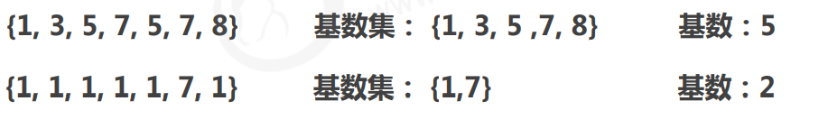

# redis

NoSQL:即Not- OnlySQL (泛指非关系型的数据库) , 作为关系型数据库的补充。

作用:应对基于海量用户和海量数据前提下的数据处理问题。

特征：

- 可扩容，可伸缩
- 大数据量下高性能
- 灵活的数据模型
- 高可用

常见的Nosql数据库

- <span style='color:red'>Redis</span>
- memcache
- HBase
- MongoDB


解决方案：

​		商品的基本信息：mysql

​			名称，价格，厂商（访问的数据，固定唯一）

​		商品详情：MongoDB

​			描述，详情，评论（存储文档，高频访问的数据）

​		图片信息：分布式系统（FastDFS集群）

​		搜索关键字：ES，Lucene，solr

​		热点信息：<span style='color:red'>redis</span>、memcache、tair

​			高频，波段性（访问量多，实时波动着，或多或少）

​			

---

## 概念：

<span style='color:red'>Redis (**RE**mote **DI**ctionary **S**erver)</span>是用C语言开发的一个开源的高性能键值对(<span style='color:red'>**key-value**</span>) 数据库。

## 特征：

1. 数据间没有必然的关联关系
2. 内部采用单线程机制进行工作
3. 高性能。官方提供测试数据, 50个并发执行100000 个请求读的速度是110000次/s,写的速度是81000次/s。
4. 多数据类型支持：
   - 字符串类型		string
   - 列表类型			list
   - 散列类型			hash
   - 集合类型			set
   - 有序集合类型		sorted set
5. 持久化支持。可以进行数据灾难恢复


## redis应用

1. 为热点数据加速查询(主要场景),如热点商品、 热点新闻、热点资讯、推广类等高访问量信息等
2. 任务队列，如秒杀、抢购、购票排队等
3. 即时信息查询，如各位排行榜、各类网站访问统计、公交到站信息在线人数信息(聊天室、网站)、设
   备信号等
4. 时效性信息控制，如验证码控制、投票控制等
5. 分布式数据共享，如分布式集群架构中的session分离
6. 消息队列
7. 分布式锁


## windows安装

> 下载地址： https://github.com/MicrosoftArchive/redis/releases
>
> 下载后一般解压到某根目录下即可

[redis-windows版下载地址](https://github.com/MSOpenTech/redis/releases)


config：配置文件

docx：说明文件

redis-server.exe：开启服务

redis-cli.exe：redes文件

redis-check-aof：持久化

redis-benchmark.exe：性能测试


双击redis-server.exe；开启服务————>prot：端口号；PID(随机生成)：redis对象的实例id


客户端启动：双击redis-cli.exe即可————>也可以在cmd打开，进入redis客户端所在目录

输入：redis-cli


> 安装：
>
> 打开cmd命令窗口，使用命令进行安装和注册redis到window服务
>
> <span style='color:red'>安装命令</span>：redis-server.exe --service-install redis.windows.conf --loglevel verbose
>
> <span style='color:red'>启动服务命令</span>：redis-server.exe --service-start
>
> <span style='color:red'>关闭服务命令</span>：redis-server.exe --service-stop
>
> <span style='color:red'>卸载服务</span>：redis-server --service-uninstall
>
> 
>
> 最后返回的successfully表示安装成功。（也可以在服务中查看）


> 使用redis：
>
> 打开一个cmd ,作为一个客户端调用redis服务，调用命令是：redis-cli.exe -h 127.0.0.1 -p 6379(地址和端口)
>
> 
>
> 
>
> 设置密码：
>
> ```
> CONFIG SET requirepass "密码"
> ```
>
> 
>
> 清空密码：
>
> ```
> CONFIG SET requirepass ""
> ```
>
> 


## 功能性命令

> <span style='color:red'>**信息添加**：</span>
>
> ​		功能：设置key，value数据
>
> ​		命令：set key value————>set name itheima
>
> <span style='color:red'>**信息查询**：</span>
>
> ​		功能：根据key查询对应的value,如果不存在，返回空(nil)
>
> ​		命令：get key——————>get name


## 清除屏幕信息

​		clear


## 帮助信息查阅

  help 命令名————>help get

  help @组名————>help @string


## 退出指令

> ​		1、quit
>
> ​		2、exit
>
> ​		3、esc键(window上使用，且是双击redis-cli.exe；那么着会把窗口也关闭)；使用cmd则不会


## redis数据类型


> **作为缓存使用**
>
> ​	1、作为缓存使用
>
> ​		原始业务功能设计：秒杀，618活动，双11活动，排队购票
>
> ​	2、运营平台监控到的突发高频访问数据：突发时政要闻，被强势关注围观（八卦）
>
> ​	3、高频、复杂的统计数据：在线人数（直播），投票
>
> 
>
> **附加功能**
>
> 系统功能优化或升级：单服务器升级集群、Session管理、Token管理


<span style='color:red'>**数据存储类型介绍**：</span>

redis自身是一个Map，其中所有的数据都是采用<span style='color:red'>key : value</span>的形式存储
<span style='color:red'>数据类型</span>指的是存储的数据的类型，也就是value部分的类型，key部分永远都是字符串


常用的5种类型；类似java里面的：String，HashMap，LinkedList，HashSet，TreeSet


### string：**key的数据类型一直都是string**

​	 存储的数据：单个数据，最简单的数据存储类型，也是最常用的数据存储类型 

​	 存储数据的格式：一个存储空间保存一个数据 

​	 存储内容：通常使用字符串，如果字符串以整数的形式展示，可以作为数字操作使用

<span style='color:red'>**基本操作：**</span>

```
1、get key value：获取key对应的值

2、set key 值：设置/修改key的值(原本有，则修改，没有创建)

3、del key：删除数据——>返回(integer)1：则成功;0
```


<span style='color:red'>以下的m代表：Multiple(多种)</span>

```
4、mset key value1 key2 value2... ：添加/修改多个数据

5、mget key1 key2...：获取多个数据,出现不存在的key，则显示(nil)

6、strlen key：获取数据字符个数（字符串长度）;不存在则返回0

7、append key value：追加信息到原始信息后面(存在，则追加；不存在，则新建)
```


<span style='color:red'>单数据操作与多数据操作的选择之惑</span>

数据在一定数据量，不算多，例如50条数据，那么可以选择mset

数据过多，例如一亿条数据，那么就分为多次发送；否则会线程阻塞


---


#### <span style='color:red'>**扩展操作：**</span>

```
大型企业级应用中，分表操作是基本操作,使用多张表存储同类型数据，但是对应的主键id必须保证统性，不能重复。Oradle数据库具有sequence(序列)设定,可以解决该问题，但是MySQL数据库并不具有类似的机制，那么如何解决?
```

解决方案：

		redis用于控制数据库表主键id,为数据库表主键提供生成策略,保障数据库表的主键唯一性
		此方案适用于所有数据库，且支持数据库集群


​	设置数值数据增加指定范围的值：字符串只能是纯数字，才能操作

```
incr key :指定key，一次增加一个值(+1);key不存在则为1

incrby key increment ：指定key，增加指定的整数值;key不存在则值为增量;为负数则为减效果

incrbyfloat key increment(增量)：指定key，增加指定的整数值，或者小数;key不存在则值为增量;为负数则为减效果
```


​	设置数值数据减少指定范围的值：字符串只能是纯数字，才能操作

```
decr key :指定key，一次减少一个值(-1);为整数则为加效果

decrby key increment：指定key，减少指定的整数值;为整数则为加效果
```


**<span style='color:red'>string作为数值操作</span>**

- string在redis内部存储默认就是一个字符串，当遇到增减类操作incr，decr时会转成数值型进行计算。 (仍然是字符串)

- redis所有的操作都是原子性的，采用单线程处理所有业务，命令是一个一个执行的，因此无需考虑并发 带来的数据影响。(不能同时调用某个值)


注意：

<span style='color:red'>按数值进行操作的数据，如果原始数据不能转成数值，或超越了redis 数值上限范围，将报错</span>。 9223372036854775807（java中long型数据最大值，Long.MAX_VALUE）

量报错情况.jpg)

非数字或超过最大范围


---


#### <span style='color:red'>**扩展操作2：**</span>

```
“最强女生”启动海选投票，只能通过微信投票,每个微信号每4小时只能投1票。

电商商家开启热门商品推荐,热门商品不能一-直处于热门期，每种商品热期维持3天, 3天后自动取消热门。

新闻网站会出现热点新闻，热点新闻最大的特征是时效性,如何自动控制热点新闻的时效性。
```

**解决方案**

redis控制数据的生命周期，通过数据是否失效控制业务行为,适用于所有具有时效性限定控制的操作


<span style='color:red'>设置数据具有指定的生命周期</span>

<span style='color:red'>如果设置了生命周期，却又进行了更改，那么生命周期则无效，值为新的值</span>

```
setex key seconds value：设置指定的key，秒数，值(key不存在则创建)

psetex key milliseconds value：设置指定的key，毫秒数，值(key不存在则创建)
```

---

#### string类型数据操作的注意事项

数据操作不成功的反馈与数据正常操作之间的差异

​		1、表示运行结果是否成功

			(integer)0——————>false 失败
			(integer)1——————>true	成功
​		2、表示运行结果值

```
(integer)3——————>3		3个
(integer)1——————>1		1个
```

数据未获取到

​		(nil)等同于null

<span style='color:red'>string最大存储量：512MB</span>

数值计算最大范围(java中的long的最大值)：<span style='color:red'>9223372036854775807</span>

---

业务场景

页高频访问信息显示控制，例如新浪微博大V主页显示粉丝数与微博数量

**redis应用于各种结构型和非结构型高热度数据访问加速**


在redis中为大V用户设定用户信息，以用户主键和属性值作为key，后台设定定时刷新策略即可 

set 表名:主键名:主键值:属性名 属性值：

set user​：id:00789:blogs 789

**案例：（eg：如）**

eg: user：id::3506728370:fans → 12210947 ————>set user:id：55:fans 2550505

eg: user：id::3506728370:blogs → 6164 ——————>set user：id:00789:blogs 789

eg: useri：d::3506728370:focuss → 83


在redis中**以json格式存储**大V用户信息，定时刷新（也可以使用hash类型）

​	user​：id::3506728370 {id:3506728370,name:春晚,fans:12210947 ,blogs:6164,focus:83}

​	set user​：id:00789 {id:00789,blogs:789,fans:12210947}


<span style='color:red'>json格式的数据不可自增/减；只能重新设置</span>


---


### hash：

**对象类数据的存储如果具有较频繁的更新需求操作会显得笨重**


**新的存储需求**:对一系列存储的数据进行编组， 方便管理,典型应用存储对象信息

**需要的存储结构**:一个存储空间保存多 个键值对数据

**hash类型**:底层使用哈希表结构实现数据存储

field：领域


> **hash存储结构优化**
>
> 如果field数量较少,存储结构优化为类数组结构
>
> 如果field数量较多 ，存储结构使用HashMap结构


#### 基本操作

```
添加/修改数据（新增返回1；修改返回0）
hset key field value
		hset user name zhangsan
		hset user age 38
		hset user weight 80

获取数据
hget key field————>hget user name
hgetal1 key———————>HGETALL user

删除数据(后面的field可以跟多个，空格隔开)
hde1 key field1 [field2]————>hdel user weight

```


```
添加/修改多个数据（新增返回1；修改返回0）；没有则新增
hmset key field1 value1 field2 value2...


获取多个数据
hmget key field1 field2...


获取hash表中的字段的数量；key不存在返回0；且不能获取field的长度
hlen key


获取hash表中是否存在指定字段；1：有；0：没有
hexists key field
```


#### 扩展操作

```
获取哈希表中所有的字段名或字段值；key不存在会报错
hkeys key：通过key得到field的值（只有一个key，一个field和value；那么也是返回field的名称）
hvals key：通过key得到value的值；key不存在则什么都没有


设置指定字段的数值数据增加指定范围的值；field不存在会创建且赋值
hincrby key field increment
hincrbyfloat key field increment

将哈希表 key 中的域 field 的值设置为 value ，当且仅当域 field 不存在。
若域 field 已经存在，该操作无效。
如果 key 不存在，一个新哈希表被创建并执行 HSETNX 命令
hsetnx key field value（新增返回1；存在返回0）


```


**对于hash设置单个字段的过期方案**

```
Redis 的 Hash 数据结构不支持为其中的单个字段（field）设置过期时间。在 Redis 中，过期时间是设置在整个键（key）上的，而不是键中的单个字段上。


HSET user name zhangsan
HSET user age 38
不能只为 "age" 字段设置过期时间。如果设置过期时间，会应用到整个 "user" 键上，包括所有的字段。

然而，如果你确实需要为 Hash 中的单个字段实现类似过期的功能，你可以考虑以下替代方案：

1、使用单独的键：
将需要设置过期时间的字段存储为单独的键。

SET user:name zhangsan
SET user:age 38
EXPIRE user:age 3600  // 设置 age 过期时间为 1 小时
2、存储过期时间：
在 Hash 中存储字段的过期时间，并在应用层面处理过期逻辑。

HSET user name zhangsan
HSET user age 38
HSET user age_expire (当前时间戳 + 过期秒数)
然后在读取时检查是否过期。
3、使用 Redis 的排序集合（Sorted Set）：
将过期时间作为分数，定期清理过期的成员。

ZADD user:age (当前时间戳 + 过期秒数) 38
4、使用 Lua 脚本：
编写 Lua 脚本来模拟字段级别的过期功能。
5、定期清理：
在应用层面实现定期清理机制，删除过期的字段。
6、使用 Redis 模块：
有一些第三方 Redis 模块可能提供更细粒度的过期控制，但这需要额外的配置和可能的性能开销。
这些方法各有优缺点，选择哪种取决于你的具体需求、性能要求和系统复杂度。通常，如果只有少量字段需要单独设置过期时间，使用单独的键可能是最简单和直接的方法。如果需要处理大量这样的情况，可能需要考虑更复杂的解决方案或重新设计数据结构。
```


#### hash类型数据操作的注意事项

hash类型下的**value只能存储字符串(数字也可以)**,不允许存储其他数据类型,不存在嵌套现象。如果数据末获取到，
对应的值为(nil)；

每个<span style='color:red'>hash可以存储232次方- 1</span>个键值对

hash类型十分贴近对象的数据存储形式，并且可以灵活添加删除对象属性。但hash设计初衷不是为了存
储大量对象而设计的，切记不可滥用，更不可以将hash作为对象列表使用

hgetall操作可以获取全部属性，如果内部field过多 ，遍历整体数据效率就很会低，有可能成为数据访问瓶颈


#### 业务场景

电商网站购物车设计与实现


**业务分析**：

仅分析购物车的redis存储模型
				添加、浏览、更改数量、删除、清空

购物车于数据库间持久化同步(不讨论)

购物车于订单间关系(不讨论)
				提交购物车:读取数据生成订单
				商家临时价格调整:隶属于订单级别

未登录用户购物车信息存储(不讨论)
				cookie存储


**解决方案**

> 以客户id作为key,每位客户创建一个hash存储结构存储对应的购物车信息
>
> 将商品编号作为field,购买数量作为value进行存储
>
> 添加商品:追加全新的field与value
>
> 浏览:遍历hash
>
> 更改数量:自增/自减，设置value值
>
> 删除商品:删除field
>
> 清空:删除key


当前仅仅是将数据存储到了redis中，并没有起到加速的作用，商品信息还需要二次查询数据库

- 每条购物车中的商品记录保存成两条field

- field1专用于保存购买数量
  				命名格式:商品id:nums
        				保存数据:数值

  以下作为独立的hash

- field2专用于保存购物车中显示的信息，包含文字描述，图片地址,所属商家信息等

  ​				命名格式:商品id:info
  ​				保存数据: json
  
  

---


### list：

- 数据存储需求：存储多个数据，并对数据进入存储空间的顺序进行区分 

- 需要的存储结构：一个存储空间保存多个数据，且通过数据可以体现进入顺序 

-  list类型：保存多个数据，底层使用双向链表存储结构实现

  


-  数据存储需求：存储多个数据，并对数据进入存储空间的顺序进行区分 

- 需要的存储结构：一个存储空间保存多个数据，且通过数据可以体现进入顺序 

-  list类型：保存多个数据，底层使用双向链表存储结构实现

  

#### 基本操作

- 添加/修改数据（先进先出）；返回当前list的长度

  - ```
    //从左到右进，取出时相当于倒序
    lpush key value1 [value2] ……
    //从右到左进，取出时相当于顺序
    rpush key value1 [value2] ……
    ```

    

- 获取数据；没数据时或key不存在，什么都不显示

  - ```
    //读取指定key所有的数据:0 -1(结束)
    lrange key start stop
    lindex key index
    llen key
    ```

    

- 获取并移除数据；没有数据时，返回nil

- lpop key	//获取指定key最左边的值；且删除此数据

  rpop key	//获取指定key最右边的值；且删除此数据


#### list 类型数据扩展操作

​	**规定时间内获取并移除数据;有就立马取出一个;没有就等待指定的秒数返回nil**

```
blpop key1 [key2] timeout(秒)
brpop key1 [key2] timeout
brpoplpush source destination timeout

//如果有任何数据进入指定的键列表1，它将返回数据并将其推入另一个列表，否则，将在100秒后返回nil值
BRPOPLPUSH list1 list2 100
```


**redis 应用于具有操作先后顺序的数据控制**

##### 业务场景

微信朋友圈点赞，要求按照点赞顺序显示点赞好友信息 如果取消点赞，移除对应好友信息


##### 解决方案

移除指定数据：

```
lrem key count value

rpush 001 a b c d e	//设置list001的key的值
lrange list001 0 -1	//读取key为list001的值
lrem list001 1 d	//删除key为list001为d的一个value
```


#### list 类型数据操作注意事项

- list中保存的数据都是string类型的，数据总容量是有限的，最多 2<sup>32-1</sup> 个元素 (4294967295)。 
-  list具有索引的概念，但是操作数据时通常以队列的形式进行入队出队操作，或以栈的形式进行入栈出栈操作
-  获取全部数据操作结束索引设置为-1 
-  list可以对数据进行分页操作，通常第一页的信息来自于list，第2页及更多的信息通过数据库的形式加载


#### list 类型应用场景

**redis 应用于最新消息展示**

##### 业务场景

twitter、新浪微博、腾讯微博中个人用户的关注列表需要按照用户的关注顺序进行展示，粉丝列表需要将最 近关注的粉丝列在前面

新闻、资讯类网站如何将最新的新闻或资讯按照发生的时间顺序展示？

 企业运营过程中，系统将产生出大量的运营数据，如何保障多台服务器操作日志的统一顺序输出？


##### 解决方案

- 依赖list的数据具有顺序的特征对信息进行管理 
-  使用队列模型解决多路信息汇总合并的问题 
-  使用栈模型解决最新消息的问题

---


### set：

- 新的存储需求：存储大量的数据，在查询方面提供更高的效率 
- 需要的存储结构：能够保存大量的数据，高效的内部存储机制，便于查询 
- set类型：与hash存储结构完全相同，仅存储键，不存储值（nil），并且值是不允许重复的
- 


#### 基本操作

- 添加数据(可添加多个)

  - ```
    sadd key member1 [member2]
    ```

    

- 获取全部数据(只能获取整个key的所有值)

  - ```
    smembers key 
    ```

    

- 删除数据(可删除多个)，指定的值不存在则返回0(删除的个数)

  - ```
    srem key member1 [member2]
    ```

    

- 获取集合数据总量；返回指定key中存在值的个数(指定的key不存在返回0)

  - ```
    scard key
    ```

    

- 判断集合中是否包含指定数据

  - ```
    sismember key member
    ```


#### set 类型数据的扩展操作

**redis 应用于随机推荐类信息检索，例如热点歌单推荐，热点新闻推荐，热卖旅游线路，应用APP推荐， 大V推荐等**


##### 业务场景

每位用户首次使用今日头条时会设置3项爱好的内容，但是后期为了增加用户的活跃度、兴趣点，必须让用户 对其他信息类别逐渐产生兴趣，增加客户留存度，如何实现？


##### 业务分析

- 系统分析出各个分类的最新或最热点信息条目并组织成set集合 
- 随机挑选其中部分信息 
- 配合用户关注信息分类中的热点信息组织成展示的全信息集合

##### 解决方案

- 随机获取集合中指定数量的数据(不写个数默认count为1)

  - ```
    srandmember key [count]
    ```

    

- 随机获取集合中的某个数据并将该数据移出集合(count不写，默认为1)

  - ```
    spop key [count]
    ```


##### 业务场景

> 脉脉为了促进用户间的交流，保障业务成单率的提升，需要让每位用户拥有大量的好友，事实上职场新人不 具有更多的职场好友，如何快速为用户积累更多的好友？ 
>
> 新浪微博为了增加用户热度，提高用户留存性，需要微博用户在关注更多的人，以此获得更多的信息或热门 话题，如何提高用户关注他人的总量？ 
>
> QQ新用户入网年龄越来越低，这些用户的朋友圈交际圈非常小，往往集中在一所学校甚至一个班级中，如何 帮助用户快速积累好友用户带来更多的活跃度？ 
>
> 微信公众号是微信信息流通的渠道之一，增加用户关注的公众号成为提高用户活跃度的一种方式，如何帮助 用户积累更多关注的公众号？ 
>
> 美团外卖为了提升成单量，必须帮助用户挖掘美食需求，如何推荐给用户最适合自己的美食？


##### 解决方案

- 求两个集合的交、并、差集

  - ```
    sinter key1 [key2]
    sunion key1 [key2]
    sdiff key1 [key2]
    ```

- 求两个集合的交、并、差集并存储到指定集合中(destination新集合)；没有则返回(empty list or set)

  - ```
    sinterstore destination key1 [key2]
    sunionstore destination key1 [key2]
    sdiffstore destination key1 [key2]
    ```

- 将指定数据从原始集合中移动到目标集合中

  - ```
    smove source destination member 
    		原集合	目标集合		指定的值
    ```


- redis 应用于同类信息的关联搜索，二度关联搜索，深度关联搜索
-  显示共同关注（一度） 
- 显示共同好友（一度） 
- 由用户A出发，获取到好友用户B的好友信息列表（一度） 
- 由用户A出发，获取到好友用户B的购物清单列表（二度） 
- 由用户A出发，获取到好友用户B的游戏充值列表（二度）


#### set 类型数据操作的注意事项

- set 类型不允许数据重复，如果添加的数据在 set 中已经存在，将只保留一份 
- set 虽然与hash的存储结构相同，但是无法启用hash中存储值的空间


#### set 类型应用场景

**redis 应用于同类型数据的快速去重**

##### 业务场景

> 集团公司共具有12000名员工，内部OA系统中具有700多个角色，3000多个业务操作，23000多种数据，每 位员工具有一个或多个角色，如何快速进行业务操作的权限校验？


> 公司对旗下新的网站做推广，统计网站的PV（访问量）,UV（独立访客）,IP（独立IP）。 
>
> PV：网站被访问次数，可通过刷新页面提高访问量 
>
> UV：网站被不同用户访问的次数，可通过cookie统计访问量，相同用户切换IP地址，UV不变 
>
> IP：网站被不同IP地址访问的总次数，可通过IP地址统计访问量，相同IP不同用户访问，IP不变


##### 解决方案

- 利用set集合的数据去重特征，记录各种访问数据 
- 建立string类型数据，利用incr统计日访问量（PV） 
- 建立set模型，记录不同cookie数量（UV） 
- 建立set模型，记录不同IP数量（IP）


##### 业务场景

**redis 应用于基于黑名单与白名单设定的服务控制**

> 黑名单 
>
> ​	资讯类信息类网站追求高访问量，但是由于其信息的价值，往往容易被不法分子利用，通过爬虫技术， 快速获取信息，个别特种行业网站信息通过爬虫获取分析后，可以转换成商业机密进行出售。例如第三方火 车票、机票、酒店刷票代购软件，电商刷评论、刷好评。 
>
> ​	同时爬虫带来的伪流量也会给经营者带来错觉，产生错误的决策，有效避免网站被爬虫反复爬取成为每 个网站都要考虑的基本问题。在基于技术层面区分出爬虫用户后，需要将此类用户进行有效的屏蔽，这就是 <span style='color:red'>**黑名单**</span>的典型应用。
>
> ​		ps:不是说爬虫一定做摧毁性的工作，有些小型网站需要爬虫为其带来一些流量。 
>
> 白名单 
>
> ​	对于安全性更高的应用访问，仅仅靠黑名单是不能解决安全问题的，此时需要设定可访问的用户群体， 依赖<span style='color:red'>**白名单**</span>做更为苛刻的访问验证


##### 解决方案

- 基于经营战略设定问题用户发现、鉴别规则 
- 周期性更新满足规则的用户黑名单，加入set集合 
- 用户行为信息达到后与黑名单进行比对，确认行为去向 
- 黑名单过滤IP地址：应用于开放游客访问权限的信息源 
- 黑名单过滤设备信息：应用于限定访问设备的信息源 
- 黑名单过滤用户：应用于基于访问权限的信息源

---


### sorted_set：

- 新的存储需求：数据排序有利于数据的有效展示，需要提供一种可以根据自身特征进行排序的方式 
- 需要的存储结构：新的存储模型，可以保存可排序的数据 
-  sorted_set类型：在set的存储结构基础上添加可排序字段


#### 基本操作

- 添加数据(可一次添加多个)；保存才会返回1，修改或其他返回0

  - ```
    zadd key score1 member1 [score2 member2]
    	key		序号1	值1		序号2		值2
    ```

- 获取全部数据;key不存在返回(empty list or set)

  - ```
    zrange key start stop [WITHSCORES]
    正序		key	开始下标	结束下标	(带上WITHSCORES表示把对应值的序号也)
    zrevrange key start stop [WITHSCORES]
    逆序
    ```

- 删除数据(可根据指定的值多删除)；指定的key或值不存在返回0

  - ```
    zrem key member [member ...]
    ```

  

- 按条件获取数据；limit在withscores前后都可以

  - ```
    zrangebyscore key min max [WITHSCORES] [LIMIT]
    正序		key		最小序号	最大序号	类似mysql分页操作
    zrevrangebyscore key max min [WITHSCORES]
    ```

- 条件删除数据

  - ```
    zremrangebyrank key start stop
    按索引删除		key		开始下标	结束下标
    zremrangebyscore key min max
    删除				key	最小序号 最大序号
    ```

#### 注意： 

- <span style='color:red'>min与max用于限定搜索查询的条件 </span>
- <span style='color:red'>start与stop用于限定查询范围，作用于索引，表示开始和结束索引 </span>
- <span style='color:red'>offset与count用于限定查询范围，作用于查询结果，表示开始位置和数据总量</span>


- 获取集合数据总量

  - ```
    zcard key
    zcount key min max(包前也包后)
    ```

- 集合交、并操作(后面key的个数对应不上numkeys指定的个数会报错：ERR syntax error)；合并后会把对应值的score相加

  - ```
    zinterstore destination numkeys key [key ...]
    			目标集合	交集集合个数	指定个数的集合
    zinterstore destination numkeys key [key ...] [AGGREGATE SUM|MIN|MAX]
    			目标集合	交集集合个数	指定个数的集合		求出指定集合的总和/最小/最大到新集合
    			
    zunionstore destination numkeys key [key ...]
    ```


##### 


##### 业务场景

**redis 应用于计数器组合排序功能对应的排名**

> 票选广东十大杰出青年，各类综艺选秀海选投票 各类资源网站TOP10（电影，歌曲，文档，电商，游戏等） 聊天室活跃度统计 游戏好友亲密度


##### 业务分析

- 为所有参与排名的资源建立排序依据


##### 解决方案

- 获取数据对应的索引（排名）;key或value不存在返回nil

  - ```
    zrank key member
    正序		key 值
    zrevrank key member
    逆序		key 值
    ```

- score值获取与修改；返回对应value的score值

  - ```
    zscore key member//根据value获取score
    zincrby key increment member//根据指定key的vaule自增长指定的值
    ```


#### sorted_set 类型数据操作的注意事项

- score保存的数据存储空间是64位，如果是整数范围是-9007199254740992~9007199254740992 
- score保存的数据也可以是一个双精度的double值，基于双精度浮点数的特征，可能会丢失精度，使用时 候要慎重 
- sorted_set 底层存储还是基于set结构的，因此数据不能重复，**如果重复添加相同的数据，score值将被反 复覆盖**，保留最后一次修改的结果


##### 业务场景

**redis 应用于定时任务执行顺序管理或任务过期管理**


> ​	基础服务+增值服务类网站会设定各位会员的试用，让用户充分体验会员优势。例如观影试用VIP、游戏 VIP体验、云盘下载体验VIP、数据查看体验VIP。当VIP体验到期后，如果有效管理此类信息。即便对于正式 VIP用户也存在对应的管理方式。 
>
> ​	网站会定期开启投票、讨论，限时进行，逾期作废。如何有效管理此类过期信息


##### 解决方案

- 对于基于时间线限定的任务处理，将处理时间记录为score值，利用排序功能区分处理的先后顺序 

- 记录下一个要处理的时间，当到期后处理对应任务，移除redis中的记录，并记录下一个要处理的时间 

- 当新任务加入时，判定并更新当前下一个要处理的任务时间 

- 为提升sorted_set的性能，通常将任务根据特征存储成若干个sorted_set。例如1小时内，1天内，周内， 月内，季内，年度等，操作时逐级提升，将即将操作的若干个任务纳入到1小时内处理的队列中

- ```
  获取当前系统时间
  time
  ```


##### 业务场景

**redis 应用于即时任务/消息队列执行管理**

> 任务/消息权重设定应用 
>
> ​	当任务或者消息待处理，形成了任务队列或消息队列时，对于高优先级的任务要保障对其优先处理，如 何实现任务权重管理。


##### 解决方案

- 对于带有权重的任务，优先处理权重高的任务，采用score记录权重即可 
- 多条件任务权重设定 
  - 如果权重条件过多时，需要对排序score值进行处理，保障score值能够兼容2条件或者多条件，例如外贸 订单优先于国内订单，总裁订单优先于员工订单，经理订单优先于员工订单 
- 因score长度受限，需要对数据进行截断处理，尤其是时间设置为小时或分钟级即可（折算后） 
- 先设定订单类别，后设定订单发起角色类别，整体score长度必须是统一的，不足位补0。第一排序规则首 位不得是0 
  - 例如外贸101，国内102，经理004，员工008。 (保证位数相同时，会从左依次比较)
  - 员工下的外贸单score值为101008（优先） 
  - 经理下的国内单score值为102004

---

### 数据类型实践案例

#### 业务场景

**redis 应用于限时按次结算的服务控制**

> 人工智能领域的语义识别与自动对话将是未来服务业机器人应答呼叫体系中的重要技术，百度自研用户评价 语义识别服务，免费开放给企业试用，同时训练百度自己的模型。现对试用用户的使用行为进行限速，限制 每个用户每分钟最多发起10次调用


#### 解决方案

- 设计计数器，记录调用次数，用于控制业务执行次数。以用户id作为key，使用次数作为value 
-  在调用前获取次数，判断是否超过限定次数 
  - 不超过次数的情况下，每次调用计数+1 
  - 业务调用失败，计数-1 
- 为计数器设置生命周期为指定周期，例如1秒/分钟，自动清空周期内使用次数


#### 解决方案改良

- 取消最大值的判定，利用incr操作超过最大值抛出异常的形式替代每次判断是否大于最大值 

- 判断是否为nil， 

  - 如果是，设置为Max-次数 
  - 如果不是，计数+1 
  - 业务调用失败，计数-1 

- 遇到异常即+操作超过上限，视为使用达到上限

  **9223372036854775807：string最大值**

  

---


#### 业务场景

**redis 应用于基于时间顺序的数据操作，而不关注具体时间**

> 使用微信的过程中，当微信接收消息后，会默认将最近接收的消息置顶，当多个好友及关注的订阅号同时发 送消息时，该排序会不停的进行交替。同时还可以将重要的会话设置为置顶。一旦用户离线后，再次打开微 信时，消息该按照什么样的顺序显示？


#### 业务分析


#### 解决方案

- 依赖list的数据具有顺序的特征对消息进行管理，将list结构作为栈使用 
- 对置顶与普通会话分别创建独立的list分别管理 
- 当某个list中接收到用户消息后，将消息发送方的id从list的一侧加入list（此处设定左侧） 
- 多个相同id发出的消息反复入栈会出现问题，在入栈之前无论是否具有当前id对应的消息，先删除对应id 
- 推送消息时先推送置顶会话list，再推送普通会话list，推送完成的list清除所有数据 
- <span style='color:red'>消息的数量，也就是微信用户对话数量采用计数器的思想另行记录，伴随list操作同步更新</span>


---

### 解决方案列表

- Tips 1：redis用于控制数据库表主键id，为数据库表主键提供生成策略，保障数据库表的主键唯一性 
- Tips 2：redis 控制数据的生命周期，通过数据是否失效控制业务行为，适用于所有具有时效性限定控制的操作 
- Tips 3：redis应用于各种结构型和非结构型高热度数据访问加速 
- Tips 4：redis 应用于购物车数据存储设计 
- Tips 5：redis 应用于抢购，限购类、限量发放优惠卷、激活码等业务的数据存储设计 
- Tips 6：redis 应用于具有操作先后顺序的数据控制 
- Tips 7：redis 应用于最新消息展示 
- Tips 8：redis 应用于随机推荐类信息检索，例如热点歌单推荐，热点新闻推荐，热卖旅游线路，应用APP推荐，大V推荐等 
- Tips 9：redis 应用于同类信息的关联搜索，二度关联搜索，深度关联搜索 
- Tips 10：redis 应用于同类型不重复数据的合并、取交集操作 
- Tips 11：redis 应用于同类型数据的快速去重 
- Tips 12：redis 应用于基于黑名单与白名单设定的服务控制 
- Tips 13：redis 应用于计数器组合排序功能对应的排名 
- Tips 14：redis 应用于定时任务执行顺序管理或任务过期管理 
- Tips 15：redis 应用于及时任务/消息队列执行管理 
- Tips 16：redis 应用于按次结算的服务控制 
- Tips 17：redis 应用于基于时间顺序的数据操作，而不关注具体时间

---


## key通用操作

### key 特征

- key是一个字符串，通过key获取redis中保存的数据

### key应该设计哪些操作？


- 对于key自身状态的相关操作，例如：删除，判定存在，获取类型等 
- 对于key有效性控制相关操作，例如：有效期设定，判定是否有效，有效状态的切换等 
- 对于key快速查询操作，例如：按指定策略查询key

---


### key 基本操作

- 删除指定key
  - ```
    del key
    
    ```
  
  //删除当前数据库中的所有Key
    flushdb
    //删除所有数据库中的key
    flushall
  
    ```
  
    ```
  
- 获取key是否存在

  - ```
    exists key
    ```

-  获取key的类型

  - ```
    type key
    ```

    

### key 扩展操作（时效性控制）

- 为指定key设置有效期

  - ```
    expire key seconds(秒)
    pexpire key milliseconds(毫秒;1 如果超时被设置，0如果key不存在)
    expireat key timestamp(UNIX 时间戳)
    pexpireat key milliseconds-timestamp(毫秒)
    //返回1，当设置成功时。
    //返回0，当指定的key不存在时，或不能为指定的key设置生存时间时
    ```

- 获取key的有效时间

  - ```
    ttl key(返回-2表示key不存在；key存在返回-1没设置时间；否则返回毫秒为单位的剩余存在时间)
    pttl key(秒为单位)
    ```

- 切换key从时效性转换为永久性；key不存在或转换失败返回0

  - ```
    persist key
    ```

    

- 查询key

  - ```
    keys pattern
    ```

- **查询模式规则**

  \* 匹配任意数量的任意符号 

  ? 配合一个任意符号 

  [] 匹配一个指定符号

  ```
  keys * 			查询所有
  keys it* 		查询所有以it开头
  keys *heima 	查询所有以heima结尾
  keys ??heima 	查询所有前面两个字符任意，后面以heima结尾
  keys user:? 	查询所有以user:开头，最后一个字符任意
  keys u[st]er:1 	查询所有以u开头，以er:1结尾，中间包含一个字母，s或t
  ```

- 为key改名

  - ```
    rename key newkey(如果新命令的key存在,那么会把值覆盖掉)
    renamenx key newkey(新命名的key存在则不会进行更改，返回0)
    ```

- 对所有key排序;只能对list/set/sort_set进行排序

  - ```
    sort
    ```

- 其他key通用操作

  - ```
    help @generic
    ```


---

## 数据库通用指令

### key 的重复问题

- key是由程序员定义的 
- redis在使用过程中，伴随着操作数据量的增加，会出现大量的数据以及对应的key 
- 数据不区分种类、类别混杂在一起，极易出现重复或冲突


### 解决方案

- redis为每个服务提供有16个数据库，编号从0到15 
- 每个数据库之间的数据相互独立


### db 基本操作

- 切换数据库;默认使用0号库

  - ```
    select index
    ```

- 其他操作

  - ```
    quit
    ping(测试redis是否联通)
    echo message(相当于redis日志)
    ```

    

- 数据移动

  - ```
    move key db(如果指定库存在指定key，那么移动失败返回0)
    ```

- 数据清除

  - ```
    dbsize(获取当前库key存在的个数)
    flushdb(清除当前所处库的所有数据)
    flushall(清除所有库的数据)
    ```

  ---


## JEDIS

### HelloWorld(jedis版)

pom文件

```xml
<?xml version="1.0" encoding="UTF-8"?>
<project xmlns="http://maven.apache.org/POM/4.0.0" xmlns:xsi="http://www.w3.org/2001/XMLSchema-instance"
         xsi:schemaLocation="http://maven.apache.org/POM/4.0.0 https://maven.apache.org/xsd/maven-4.0.0.xsd">
    <modelVersion>4.0.0</modelVersion>
    <parent>
        <groupId>org.springframework.boot</groupId>
        <artifactId>spring-boot-starter-parent</artifactId>
        <version>2.4.4</version>
        <relativePath/> <!-- lookup parent from repository -->
    </parent>
    <groupId>com.fsir</groupId>
    <artifactId>jedis-demo</artifactId>
    <version>0.0.1-SNAPSHOT</version>
    <name>jedis-demo</name>
    <description>Demo project for Spring Boot</description>
    <properties>
        <java.version>11</java.version>
    </properties>
    <dependencies>
        <dependency>
            <groupId>org.springframework.boot</groupId>
            <artifactId>spring-boot-starter</artifactId>
        </dependency>

        <dependency>
            <groupId>org.springframework.boot</groupId>
            <artifactId>spring-boot-starter-test</artifactId>
            <scope>test</scope>
        </dependency>

        <!-- https://mvnrepository.com/artifact/redis.clients/jedis -->
        <dependency>
            <groupId>redis.clients</groupId>
            <artifactId>jedis</artifactId>
            <version>3.3.0</version>
        </dependency>

    </dependencies>

    <build>
        <plugins>
            <plugin>
                <groupId>org.springframework.boot</groupId>
                <artifactId>spring-boot-maven-plugin</artifactId>
            </plugin>
        </plugins>
    </build>

</project>

```

```java
package com.fsir.jedisDemo;

import org.junit.jupiter.api.Test;
import org.slf4j.Logger;
import org.slf4j.LoggerFactory;
import org.springframework.boot.test.context.SpringBootTest;
import redis.clients.jedis.Jedis;

@SpringBootTest
class JedisDemoApplicationTests {
    private static final Logger logger = LoggerFactory.getLogger(JedisDemoApplicationTests.class);


    @Test
    void testJedis() {
        //1、连接redis
        Jedis jedis = new Jedis("127.0.0.1", 6379);
        //2、操作redis
        /*String name = jedis.set("name", "itcast-jedis");
        logger.info(name + "\t23行");//OK	23行*/

        String name = jedis.get("name");
        logger.info(name + "\t26行");//itcast-jedis	26行

        //3、关闭连接
        jedis.close();
    }
    
    @Test
    void testList() {
        //1、连接redis
        Jedis jedis = new Jedis("127.0.0.1", 6379);
        //2、操作redis
        //返回当前操作list长度
        Long list1 = jedis.lpush("list1", "a-jedis", "b-jedis", "c-jedis");
        Long list2 = jedis.rpush("list1", "x-jedis");
        logger.info(list1 + "\t41行");//3	41行
        logger.info(list2 + "\t42行");//4	42行

        List<String> list3 = jedis.lrange("list1", 0, -1);
        logger.info(list3 + "\t45行");//[c-jedis, b-jedis, a-jedis, x-jedis]	45行

         logger.info(jedis.llen("list1") + "\t47行");//4	47行

        //3、关闭连接
        jedis.close();
    }

    @Test
    void testHash() {
        //1、连接redis
        Jedis jedis = new Jedis("127.0.0.1", 6379);
        //2、操作redis
        //返回当前操作list长度
        Long hash1 = jedis.hset("hash1", "a1-jedis", "a1-jedis");
        Long hash2 = jedis.hset("hash1", "a2-jedis", "a2-jedis");
        Long hash3 = jedis.hset("hash1", "a3-jedis", "a3-jedis");
        logger.info(hash1 + "\t65行");//1	65行
        logger.info(hash2 + "\t66行");//1	66行
        logger.info(hash3 + "\t67行");//1	67行

        Map<String, String> hgetAll = jedis.hgetAll("hash1");
        logger.info(hgetAll + "\t70行");//{a1-jedis=a1-jedis, a2-jedis=a2-jedis, a3-jedis=a3-jedis}	70行

        logger.info(jedis.hlen("hash1") + "\t72行");//3	72行

        //3、关闭连接
        jedis.close();
    }

}

```


---


### Jedis读写redis数据

```

```


---


### Jedis简易工具类开发

### 

```java
package com.fsir.jedisDemo.utils;

import redis.clients.jedis.Jedis;
import redis.clients.jedis.JedisPool;
import redis.clients.jedis.JedisPoolConfig;

import java.util.ResourceBundle;

/**
 * @author fsir
 * @company com.fsir.jedisDemo.utils
 * @date 2021-03-28 17:33
 * @description jedis工具类
 */
public class JedisUtil {
    private static JedisPool jp = null;
    private static String host = null;
    private static Integer port = null;
    private static Integer maxTotal = null;
    private static Integer maxIdle = null;
    static {
        ResourceBundle rb = ResourceBundle.getBundle("application");
        host = rb.getString("spring.redis.host");
        port = Integer.parseInt(rb.getString("spring.redis.port"));
        maxTotal = Integer.parseInt(rb.getString("spring.redis.jedis.pool.max-active"));
        maxIdle = Integer.parseInt(rb.getString("spring.redis.jedis.pool.max-idle"));
        JedisPoolConfig jedisPoolConfig = new JedisPoolConfig();
//        final String host = "127.0.0.1";
//        final int port = 6379;
//        jedisPoolConfig.setMaxTotal(30);    //最大连接数
//        jedisPoolConfig.setMaxIdle(10);     //活动连接数
        jedisPoolConfig.setMaxTotal(maxTotal);    //最大连接数
        jedisPoolConfig.setMaxIdle(maxIdle);     //活动连接数
        jp = new JedisPool(jedisPoolConfig, host, port);//连接池配置对象, 服务地址, 服务端口号
    }

    public static Jedis getJedis() {
        return jp.getResource();
    }

    public static void main(String[] args) {
        JedisUtil.getJedis();
    }
}

```

```properties
spring.redis.host=127.0.0.1
spring.redis.port=6379
# 连接池最大连接数（使用负值表示没有限制）
spring.redis.jedis.pool.max-active=30
# 连接池中的最大空闲连接
spring.redis.jedis.pool.max-idle=8
# 连接池最大阻塞等待时间（使用负值表示没有限制）
spring.redis.jedis.pool.max-wait=30
#  连接池中的最小空闲连接
spring.redis.jedis.pool.min-idle=0

```


---

## Linux安装redis

[博客地址](https://blog.csdn.net/qq_39135287/article/details/83474865)

redis更换端口启动：redis-server --port 端口号

​	启动cli指定端口：redis-cli -h ip地址

​									redis-cli -p 端口号

​									redis-cli -h ip地址 -p 端口号appendonly

```shell
# 可取简单部分进行启动
	port 6379
    daemonize yes
    logfile "6379.log"
    dir /home/redis/redis/log /# dir redis日志文件存放目录
```

取出文件中注释部分：

​	

```shell
cat redis.conf | grep -v "#" |grep -v "^$"
```

移动到指定目录中

```shell
cat redis.conf | grep -v "#" |grep -v "^$" > redis-6379.conf
```

> daemonize yes：控制台不打印日志信息，由后台启动(以守护进程方式后动，使用本启动方式, redis将以服务的形式存在，日志将不再打印到命令窗口中)
>
> logfile ""：后台启动时，日志文件名(logfile "6379.log")
>
> dir ：日志文件存放位置(dir redis/data)
>
> 

redis配置文件启动：redis-server 配置文件名

```shell
./redis-server /home/redis/redis/etc/redis.conf

# 配置redis-server为全局命令		ln -s /home/redis/redis/bin/redis-server /usr/bin/redis-server
# /home/redis/redis/bin为redis-
redis-server /home/redis/redis/etc/redis.conf

```

查看redis是否启动：

```shell
    ps rf | grep redis-
    ps aux | grep redis

# 可根据kill -s 9 对应pid进行删除
```

可以复制配置文件，改掉其端口就可以启动多个不同端口的redis

```shell
cp redis-6379.conf redis-6380.conf
```


---

### linux redis持久化

#### 持久化简介

防止数据的意外丢失，确保数据安全性

> 利用永久性存储介质将数据进行保存，在特定的时间将保存的数据进行恢复的工作机制称为持久化。

#### 持久化过程保存什么

- 将当前数据状态进行保存，快照形式，存储数据结果，存储格式简单，关注点在数据 
- 将数据的操作过程进行保存，日志形式，存储操作过程，存储格式复杂，关注点在数据的操作过程


#### RDB

<span style='color:red'>启动方式</span>

- 谁：redis操作者（用户） 
- 什么时间：即时（随时进行） 
- 干什么事情：保存数据


- 命令：

```
save
```

- 作用：
  - 手动执行一次保存操作


##### **RDB启动方式 —— save指令相关配置**

> - dbfilename dump.rdb 
>   - 说明：设置本地数据库文件名，默认值为 dump.rdb 
>   - 经验：通常设置为<span style='color:red'>dump-</span><span style='color:blue'>端口号</span><span style='color:red'>.rdb</span> 
> - dir 
>   - 说明：设置存储.rdb文件的路径 
>   - 经验：通常设置成存储空间较大的目录中，目录名称<span style='color:red'>data </span>
> - rdbcompression yes 
>   - 说明：设置存储至本地数据库时是否压缩数据，默认为 yes，采用 LZF 压缩 
>   - 经验：通常默认为开启状态，如果设置为no，可以节省 CPU 运行时间，但会使存储的文件变大（巨大） 
> - rdbchecksum yes 
>   - 说明：设置是否进行RDB文件格式校验，该校验过程在写文件和读文件过程均进行 
>   - 经验：通常默认为开启状态，如果设置为no，可以节约读写性过程约10%时间消耗，但是存储一定的数据损坏风险


**RDB启动方式**

​	数据量过大，单线程执行方式造成效率过低如何处理？

<span style='color:red'>后台执行</span>

- 谁：redis操作者（用户）发起指令；redis服务器控制指令执行 
- 什么时间：即时（发起）；合理的时间（执行） 
- 干什么事情：保存数据


RDB启动方式 —— bgsave指令

```
bgsave
```

作用 

​	手动启动后台保存操作，但不是立即执行


<span style='color:red'>注意: bgsave命令是针对save阻塞问题做的优化。Redis内部所有涉及到RDB操作都采用bgsave的方式
save命令可以放弃使用。</span>


##### **RDB启动方式 —— bgsave指令相关配置**

- dbfilename dump.rdb 
- dir 
- rdbcompression yes 
- rdbchecksum yes 
- stop-writes-on-bgsave-error yes 
  - 说明：后台存储过程中如果出现错误现象，是否停止保存操作 
  - 经验：通常默认为开启状态

反复执行保存指令，忘记了怎么办？不知道数据产生了多少变化，何时保存？

<span style='color:red'>自动执行</span>

- 谁：redis服务器发起指令（基于条件）
- 什么时间：满足条件 
- 干什么事情：保存数据

**RDB启动方式 ——save配置**(执行的bgsave操作)

- 配置 

  - ```
    save second changes
    ```

    

- 作用 

  - 满足限定时间范围内key的变化数量达到指定数量即进行持久化 

- 参数 

  - second：监控时间范围 
  - changes：监控key的变化量(即使听一个key发生两次变化也会进行持久化)

- 位置 

  - 在conf文件中进行配置 

- 范例 

  - ```shell
     save 900 1 
     save 300 10 
     save 60 10000
    ```

  

<span style='color:red'>**注意**</span>

- save配置要根据实际业务情况进行设置，频度过高或过低都会出现性能问题，结果可能是灾难性的 
- save配置中对于second与changes设置通常具有互补对应关系，尽量不要设置成包含性关系 
- save配置启动后执行的是bgsave操作


**save配置相关配置** 

- dbfilename dump.rdb 
- dir 
- rdbcompression yes 
- rdbchecksum yes


**rdb特殊启动形式**

默认情况下执行shutdown命令时，

自动执行 bgsave(如果没有开启AOF持久化功能)


- 全量复制 

  - 在主从复制中详细讲解 

- 服务器运行过程中重启 

  - ```shell
    debug reload
    ```

    

- 关闭服务器时指定保存数据   

  - ```shell
    shutdown save
    ```


**RDB优点**

- RDB是一个紧凑压缩的二进制文件，存储效率较高 
- RDB内部存储的是redis在某个<span style='color:red'>时间点</span>的数据快照，非常适合用于数据备份，全量复制等场景 
- RDB恢复数据的速度要比AOF快很多 
- 应用：服务器中每X小时执行bgsave备份，并将RDB文件拷贝到远程机器中，用于灾难恢复。


**Rdb缺点**

- RDB方式无论是执行指令还是利用配置，无法做到实时持久化，具有较大的可能性丢失数据 
- bgsave指令每次运行要执行fork操作创建子进程，要牺牲掉一些性能 
- Redis的众多版本中未进行RDB文件格式的版本统一，有可能出现各版本服务之间数据格式无法兼容现象

---


#### AOF

**RDB存储的弊端**

- 存储数据量较大，效率较低 
  - 基于快照思想，每次读写都是全部数据，当数据量巨大时，效率非常低 
- 大数据量下的IO性能较低 
- 基于fork创建子进程，内存产生额外消耗 
- 宕机带来的数据丢失风险


**解决思路**

- 不写全数据，仅记录部分数据 
- 降低区分数据是否改变的难度，改记录数据为记录操作过程 
- 对所有操作均进行记录，排除丢失数据的风险


**AOF概念**

- AOF(append only file)持久化：以独立日志的方式记录每次写命令，重启时再重新执行AOF文件中命令 达到恢复数据的目的。与RDB相比可以简单描述为<span style='color:red'>改记录数据为记录数据产生的过程 </span>
- AOF的主要作用是解决了数据持久化的实时性，目前已经是Redis持久化的主流方式


**AOF写数据三种策略(appendfsync)**

- always(每次） 
  - 每次写入操作均同步到AOF文件中，<span style='color:blue'>数据零误差</span>，<span style='color:red'>**性能较低 **</span>，不建议使用。
- everysec（每秒） 
  - 每秒将缓冲区中的指令同步到AOF文件中，<span style='color:red'>数据准确性较高</span>，<span style='color:blue'>性能较高 </span>，建议使用，也是默认配置
  - 在系统突然宕机的情况下丢失1秒内的数据 

- no（系统控制） 
  - 由操作系统控制每次同步到AOF文件的周期，整体过程<span style='color:red'>**不可控**</span>


##### **AOF功能开启**

- 配置 ：默认no

  - ```shel
    appendonly yes|no
    ```

    

- 作用 

  - 是否开启AOF持久化功能，默认为不开启状态 

- 配置 

  - ```shell
    appendfsync always|everysec|no
    ```

    

- 作用 AOF写数据策略  


##### **AOF相关配置** 

- 配置 （和RDB文件名称一样，可以自定义）

  - ```shell
    appendfilename filename
    ```

    

- 作用 

  - AOF持久化文件名，默认文件名未appendonly.aof，建议配置为appendonly-端口号.aof 

- 配置 

  - ```shell
    dir
    ```

    

- 作用 

  - AOF持久化文件保存路径，与RDB持久化文件保持一致即可


**AOF写数据遇到的问题**

​	**如果连续执行如下指令该如何处理**


##### **AOF重写** 

> 随着命令不断写入AOF，文件会越来越大，为了解决这个问题，Redis引入了AOF重写机制压缩文件体积。AOF文件重 写是将Redis进程内的数据转化为写命令同步到新AOF文件的过程。简单说就是将对同一个数据的若干个条命令执行结 果转化成最终结果数据对应的指令进行记录。

#####  **AOF重写作用** 

- 降低磁盘占用量，提高磁盘利用率 
- 提高持久化效率，降低持久化写时间，提高IO性能 
- 降低数据恢复用时，提高数据恢复效率


##### **AOF重写规则** 

- 进程内已超时的数据不再写入文件 
- 忽略无效指令，重写时使用进程内数据直接生成，这样新的AOF文件只保留最终数据的写入命令 
  - 如del key1、 hdel key2、srem key3、set key4 111、set key4 222等 
- 对同一数据的多条写命令合并为一条命令 
  - 如lpush list1 a、lpush list1 b、 lpush list1 c 可以转化为：lpush list1 a b c。 
  - 为防止数据量过大造成客户端缓冲区溢出，对list、set、hash、zset等类型，每条指令最多写入64个元素


##### **AOF重写方式** 

- 手动重写 

  - ```shell
     bgrewriteaof 
    ```

    

- 自动重写

  - ```shell
    auto-aof-rewrite-min-size size 
    auto-aof-rewrite-percentage percentage
    ```


**AOF自动重写方式**

- 自动重写触发条件设置 

  - ```shell
    auto-aof-rewrite-min-size size
    auto-aof-rewrite-percentage percent
    ```

    

- 自动重写触发比对参数（ 运行指令info Persistence获取具体信息 ） 

  - ```shell
    aof_current_size
    aof_base_size
    ```

    

- 自动重写触发条件

  - 


> AOF缓冲区同步文件策略，由参数appendfsync控制 
>
> 
>
> 系统调用write和fsync说明： 
>
> - write操作会触发延迟写（delayed write）机制，Linux在内核提供页缓冲区用 来提高硬盘IO性能。write操作在写入系统缓冲区后直接返回。同步硬盘操作依 赖于系统调度机制，列如：缓冲区页空间写满或达到特定时间周期。同步文件之 前，如果此时系统故障宕机，缓冲区内数据将丢失。 
>
> - fsync针对单个文件操作（比如AOF文件），做强制硬盘同步，fsync将阻塞知道 写入硬盘完成后返回，保证了数据持久化。 
>
>   
>
>   除了write、fsync、Linx还提供了sync、fdatasync操作，具体API说明参见：

---


#### RDB和AOF区别


**RDB与AOF的选择之惑**

- 对数据非常敏感，建议使用默认的AOF持久化方案 
  - AOF持久化策略使用everysecond，每秒钟fsync一次。该策略redis仍可以保持很好的处理性能，当出 现问题时，最多丢失0-1秒内的数据。 
  - 注意：由于AOF文件存储体积较大，且恢复速度较慢 
- 数据呈现阶段有效性，建议使用RDB持久化方案 
  - 数据可以良好的做到阶段内无丢失（该阶段是开发者或运维人员手工维护的），且恢复速度较快，阶段 点数据恢复通常采用RDB方案 
  - 注意：利用RDB实现紧凑的数据持久化会使Redis降的很低，慎重总结： 
- 综合比对 
  - RDB与AOF的选择实际上是在做一种权衡，每种都有利有弊 
  - 如不能承受数分钟以内的数据丢失，对业务数据非常敏感，选用AOF 
  - 如能承受数分钟以内的数据丢失，且追求大数据集的恢复速度，选用RDB 
  - 灾难恢复选用RDB 
  - 双保险策略，同时开启 RDB 和 AOF，重启后，Redis优先使用 AOF 来恢复数据，降低丢失数据的量


---


#### 持久化应用场景

- Tips 1：<del style='color:red'>redis用于控制数据库表主键id，为数据库表主键提供生成策略，保障数据库表的主键唯一性 </del>
- Tips 3：<del style='color:red'>redis应用于各种结构型和非结构型高热度数据访问加速 </del>
- Tips 4：<del style='color:red'>redis 应用于购物车数据存储设计 </del>
- Tips 5：redis 应用于抢购，限购类、限量发放优惠卷、激活码等业务的数据存储设计 
- Tips 6：redis 应用于具有操作先后顺序的数据控制 
- Tips 7：redis 应用于最新消息展示 
- Tips 9：<del style='color:red'>redis 应用于同类信息<的关联搜索，二度关联搜索，深度关联搜索 </del>
- Tips 12：redis 应用于基于黑名单与白名单设定的服务控制 
- Tips 13：redis 应用于计数器组合排序功能对应的排名 
- Tips 15：<del style='color:blue'>redis 应用于即时任务/消息队列执行管理 </del>
- Tips 16：<del style='color:red'>redis 应用于按次结算的服务控制</del>

---


#### 事务

##### 什么是事务

​	**Redis执行指令过程中，多条连续执行的指令被干扰，打断，插队**

> ​	redis事务就是一个命令执行的队列，将一系列预定义命令包装成一个整体（一个队列）。当执行时，一次性 按照添加顺序依次执行，中间不会被打断或者干扰。
>
> ​	一个队列中，一次性、顺序性、排他性的执行一系列命令


##### 事务的边界


##### 事务的基本操作

- 开启事务

  - ```shell
    multi
    ```

- 作用

  - 设定事务的开启位置，此指令执行后，后续的所有指令均加入到事务中

- 执行事务

  - ```shell
    exec
    ```

- 作用

  - 设定事务的结束位置，同时执行事务。与multi成对出现，成对使用

  

  <span style='color:red'>注意：加入事务的命令暂时进入到任务队列中，并没有立即执行，只有执行exec命令才开始执行</span>


**事务定义过程中发现出了问题，怎么办？**

- 取消事务

  - ```shell
    discard
    ```

- 作用

  - 终止当前事务的定义，发生在multi之后，exec之前


##### 事务的注意事项

**定义事务的过程中，命令格式输入错误怎么办**

- **语法错误** 
  - 指命令书写格式有误 
- 处理结果 
  - 如果定义的事务中所包含的命令存在语法错误，**整体事务中所有命令均不会执行。包括那些语法正确的命令**。


**定义事务的过程中，命令执行出现错误怎么办？**

- **运行错误** 
  - 指命令格式正确，但是无法正确的执行。例如对list进行incr操作 
- 处理结果 
  - 能够正确运行的命令会执行，**运行错误的命令不会被执行**

<span style='color:red'>注意：已经执行完毕的命令对应的数据不会自动回滚，需要程序员自己在代码中实现回滚。</span>


##### 手动进行事务回滚

- 记录操作过程中被影响的数据之前的状态 
  - 单数据：string 
  - 多数据：hash、list、set、zset 
- 设置指令恢复所有的被修改的项 
  - 单数据：直接set（注意周边属性，例如时效） 
  - 多数据：修改对应值或整体克隆复制


#### 锁

**基于特定条件的事务执行**

​	**业务场景**

> 天猫双11热卖过程中，对已经售罄的货物追加补货，4个业务员都有权限进行补货。补货的操作可能是一系 列的操作，牵扯到多个连续操作，如何保障不会重复操作？


**业务分析**

- 多个客户端有可能同时操作同一组数据，并且该数据一旦被操作修改后，将不适用于继续操作 
- 在操作之前锁定要操作的数据，一旦发生变化，终止当前操作


**基于特定条件的事务执行——锁**

**解决方案**

- 对 key 添加监视锁，在执行exec前如果key发生了变化，终止事务执行 

  - ```shell
    watch key1 [key2……]
    ```

    

- 取消对所有 key 的监视

  - ```shell
    unwatch
    ```


**Tips 18：redis 应用基于状态控制的批量任务执行**


**基于特定条件的事务执行——分布式锁**

**业务场景**

> 天猫双11热卖过程中，对已经售罄的货物追加补货，且补货完成。客户购买热情高涨，3秒内将所有商品购 买完毕。本次补货已经将库存全部清空，如何避免最后一件商品不被多人同时购买？【超卖问题】


**业务分析**

- 使用watch监控一个key有没有改变已经不能解决问题，此处要监控的是具体数据 
- 虽然redis是单线程的，但是多个客户端对同一数据同时进行操作时，如何避免不被同时修改？

**解决方案**

- 使用 setnx 设置一个公共锁 

  - ```shell
    setnx lock-key value
    ```

    

- 利用setnx命令的返回值特征，有值则返回

  - 对于返回设置成功的，拥有控制权，进行下一步的具体业务操作 
  - 对于返回设置失败的，不具有控制权，排队或等待

- 操作完毕通过del操作释放锁


**注意：上述解决方案是一种设计概念，依赖规范保障，具有风险性**

**Tips 19：redis 应用基于分布式锁对应的场景控制**


**业务场景**

依赖分布式锁的机制，某个用户操作时对应客户端宕机，且此时已经获取到锁。如何解决？


**业务分析**

-  由于锁操作由用户控制加锁解锁，必定会存在加锁后未解锁的风险 
- 需要解锁操作不能仅依赖用户控制，系统级别要给出对应的保底处理方案


**基于特定条件的事务执行——分布式锁改良**

**解决方案**

- 使用 expire 为锁key添加时间限定，到时不释放，放弃锁

  - ```shell
    expire lock-key second
    pexpire lock-key milliseconds
    ```

- 由于操作通常都是微秒或毫秒级，因此该锁定时间不宜设置过大。具体时间需要业务测试后确认。 

  - 例如：持有锁的操作最长执行时间127ms，最短执行时间7ms。 
  - 测试百万次最长执行时间对应命令的最大耗时，测试百万次网络延迟平均耗时 
  - 锁时间设定推荐：最大耗时*120%+平均网络延迟*110% 
  - 如果业务最大耗时<<网络平均延迟，通常为2个数量级，取其中单个耗时较长即可


---


#### Redis 删除策略

##### 过期数据

​	**Redis中的数据特征**

- Redis是一种内存级数据库，所有数据均存放在内存中，内存中的数据可以通过TTL指令获取其状态 
  - XX ：具有时效性的数据 
  - -1 ：永久有效的数据 
  -  -2 ：<span style='color: red'>已经过期的数据 或 被删除的数据 或 未定义的数据</span>


##### 数据删除策略

1. 定时删除 
2.  惰性删除 
3. 定期删除


##### 时效性数据的存储结构


##### 数据删除策略的目标

在内存占用与CPU占用之间寻找一种平衡，顾此失彼都会造成整体redis性能的下降，甚至引发服务器宕机或 内存泄露


##### 定时删除

- 创建一个定时器，当key设置有过期时间，且过期时间到达时，由定时器任务立即执行对键的删除操作 
- 优点：节约内存，到时就删除，快速释放掉不必要的内存占用 
- 缺点：CPU压力很大，无论CPU此时负载量多高，均占用CPU，会影响redis服务器响应时间和指令吞吐量 
- 总结：用处理器性能换取存储空间（拿时间换空间）


##### 惰性删除

- 数据到达过期时间，不做处理。等下次访问该数据时 
  - 如果未过期，返回数据 
  - 发现已过期，删除，返回不存在 
- 优点：节约CPU性能，发现必须删除的时候才删除 
- 缺点：内存压力很大，出现长期占用内存的数据 
- 总结：用存储空间换取处理器性能  （拿时间换空间）


##### 定期删除

**两种方案都走极端，有没有折中方案？**

- Redis启动服务器初始化时，读取配置server.hz的值，默认为10 
- 每秒钟执行server.hz次<span style='color: red'>serverCron() </span>:服务器每次执行多少次
  - ​									<span style='color: red'>databasesCron()</span>:循环检查每一个库
    - ​									<span style='color: red'>activeExpireCycle()</span>:循环检查每个库的key
- <span style='color: red'>activeExpireCycle()</span>对每个expires[*]逐一进行检测，每次执行250ms/server.hz
- 对某个expires[*]检测时，随机挑选W个key检测 
  - 如果key超时，删除key *
  - *如果一轮中删除的key的数量>W*25%，循环该过程 
  - 如果一轮中删除的key的数量≤W*25%，检查下一个expires[*]，0-15循环 
  - W取值=ACTIVE_EXPIRE_CYCLE_LOOKUPS_PER_LOOP(活动时长周期查找循环次数)属性值 
-  参数current_db用于记录<span style='color: red'>activeExpireCycle() </span>进入哪个expires[*] 执行 
-  如果<span style='color: red'>activeExpireCycle()</span>执行时间到期，下次从current_db继续向下执行


-  周期性轮询redis库中的时效性数据，采用随机抽取的策略，利用过期数据占比的方式控制删除频度 
- 特点1：CPU性能占用设置有峰值，检测频度可自定义设置 
- 特点2：内存压力不是很大，长期占用内存的冷数据会被持续清理 
- 总结：周期性抽查存储空间 expireIfNeeded() （随机抽查，重点抽查）


##### 删除策略比对

1. 定时删除 	节约内存，无占用		不分时段占用CPU资源，频度高	                拿时间换空间
2. 惰性删除    内存占用严重                 延时执行，CPU利用率高                               拿空间换时间
3. 定期删除     内存定期随机清理        每秒花费固定的CPU资源维护内存                随机抽查，重点抽查


#### Redis逐出算法	

**新数据进入检测**

**当新数据进入redis时，如果内存不足怎么办？**

- Redis使用内存存储数据，在执行每一个命令前，会调用freeMemoryIfNeeded()检测内存是否充足。如 果内存不满足新加入数据的最低存储要求，redis要临时删除一些数据为当前指令清理存储空间。清理数据 的策略称为逐出算法。 
- 注意：逐出数据的过程不是100%能够清理出足够的可使用的内存空间，如果不成功则反复执行。当对所 有数据尝试完毕后，如果不能达到内存清理的要求，将出现错误信息。

```shell
(error) OOM command not allowed when used memory >'maxmemory'
```


##### 影响数据逐出的相关配置

- 最大可使用内存 

  - ```shell
    maxmemory
    ```

    

- 占用物理内存的比例，默认值为0，表示不限制。生产环境中根据需求设定，通常设置在50%以上。 

- 每次选取待删除数据的个数 

  - ```shell
    maxmemory-samples
    ```

    

- 选取数据时并不会全库扫描，导致严重的性能消耗，降低读写性能。因此采用随机获取数据的方式作为待检测删除数据 

- 删除策略 

  - ```shell
    maxmemory-policy
    ```

    

- 达到最大内存后的，对被挑选出来的数据进行删除的策略


##### 影响数据逐出的相关配置

- 检测易失数据（可能会过期的数据集server.db[i].expires ） 
  - ① volatile-lru：挑选最近最少使用的数据淘汰 
  - ② volatile-lfu：挑选最近使用次数最少的数据淘汰 
  - ③ volatile-ttl：挑选将要过期的数据淘汰 
  - ④ volatile-random：任意选择数据淘汰 
  - 
  
- 检测全库数据（所有数据集server.db[i].dict ） 
  - ⑤ allkeys-lru：挑选最近最少使用的数据淘汰 
  - ⑥ allkeys-lfu：挑选最近使用次数最少的数据淘汰 
  - ⑦ allkeys-random：任意选择数据淘汰 
  
- 放弃数据驱逐 
  
  - ⑧ no-enviction（驱逐）：禁止驱逐数据（redis4.0中默认策略），会引发错误OOM（Out Of Memory）
  
- 配置方式

  - ```shell
    maxmemory-polocy volatile-lru
    ```

    


##### 数据逐出策略配置依据

使用INFO命令输出监控信息，查询缓存 hit 和 miss 的次数，根据业务需求调优Redis配置

```shell
# info 查看redis配置信息
info 中Stats
	keyspace_hits:13  	key命中次数为13
	keyspace_misses:1	key空间丢失次数为1
```

---


#### 服务器基本配置-redis.conf

**服务器端设定**

- 设置服务器以守护进程的方式运行 

  - ```shell
    daemonize yes|no
    ```

    

- 绑定主机地址 

  - ```shell
    bind 127.0.0.1
    ```

    

- 设置服务器端口号 

  - ```shell
    port 6379
    ```

    

- 设置数据库数量

  - ```shell
    databases 16
    
    ```


**日志配置**

注意：日志级别开发期设置为verbose即可，生产环境中配置为notice，简化日志输出量，降低写日志IO的频度

- 设置服务器以指定日志记录级别 

  - ```shell
    loglevel debug|verbose|notice|warning
    ```

    

- 日志记录文件名

  - ```shell
    logfile 端口号.log
    ```


**客户端配置**

- 设置同一时间最大客户端连接数，默认无限制。当客户端连接到达上限，Redis会关闭新的连接 

  - ```shell
    maxclients 0
    ```

    

- 客户端闲置等待最大时长，达到最大值后关闭连接。如需关闭该功能，设置为 0

  - ```shell
    timeout 300
    ```


**多服务器快捷配置**

-  导入并加载指定配置文件信息，用于快速创建redis公共配置较多的redis实例配置文件，便于维护

  - ```shell
    include /path/server-端口号.conf
    ```

    


---


#### 高级数据类型

##### Bitmaps


###### Bitmaps类型的基础操作

- 获取指定key对应偏移量上的bit值；数据不存在也返回0

  - ```shell
    getbit key offset
    ```

    

- 设置指定key对应偏移量上的bit值，value只能是1或0

  - ```shell
    setbit key offset value
    			多少位		值
    ```


###### Bitmaps类型的扩展操作

**业务场景**

电影网站 

- 统计每天某一部电影是否被点播 
- 统计每天有多少部电影被点播 
- 统计每周/月/年有多少部电影被点播 
- 统计年度哪部电影没有被点播


**Bitmaps类型的扩展操作**

- 对指定key按位进行交、并、非、异或操作，并将结果保存到destKey中 

  - ```shell
    bitop op destKey key1 [key2...]
    ```

    

  -  and：交 

  - or：并 

  - not：非 

  - xor：异或 

- 统计指定key中1的数量

  - ```shell
    bitcount key [start end]
    ```


**Tips 21： redis 应用于信息状态统计**


##### HyperLogLog

**统计独立UV**

- 原始方案：set 
  - 存储每个用户的id（字符串） 
- 改进方案：Bitmaps 
  -  存储每个用户状态（bit） 
-  全新的方案：Hyperloglog


###### 基数

- 基数是数据集去重后元素个数 

- HyperLogLog 是用来做基数统计的，运用了LogLog的算法

  

###### HyperLogLog类型的基本操作

-  添加数据 

  - ```shell
    pfadd key element [element ...]
    ```

    

- 统计数据 ;key不存在也返回0

  - ```shell
    pfcount key [key ...]
    ```

    

- 合并数据

  - ```shell
    pfmerge destkey sourcekey [sourcekey...]
    ```


**Tips 22：redis 应用于独立信息统计**

**相关说明**

- 用于进行基数统计，不是集合，不保存数据，只记录数量而不是具体数据 
- 核心是基数估算算法，最终数值存在一定误差 
- 误差范围：基数估计的结果是一个带有 0.81% 标准错误的近似值 
- 耗空间极小，每个hyperloglog key占用了12K的内存用于标记基数 
- pfadd命令不是一次性分配12K内存使用，会随着基数的增加内存逐渐增大 
- Pfmerge命令合并后占用的存储空间为12K，无论合并之前数据量多少


##### GEO

**GEO类型的基本操作**

- 添加坐标点 

  - ```shell
    geoadd key longitude latitude member [longitude latitude member ...]
    			经度		纬度		名称
    ```
  ```
    
    
  ```

- 获取坐标点 

  - ```shell
    geopos key member [member ...]
    ```

    

- 计算坐标点距离;不会计算高度

  - ```shell
    geodist key member1 member2 [unit]
    
    用户没有显式地指定单位参数， 那么 GEODIST 默认使用米作为单位
    m 表示单位为米。
    km 表示单位为千米。
    mi 表示单位为英里。
    ft 表示单位为英尺
    
    GEODIST 命令在计算距离时会假设地球为完美的球形， 在极限情况下， 这一假设最大会造成 0.5% 的误差
    ```


- 添加坐标点

  - ```shell
    georadius key longitude latitude radius m|km|ft|mi [withcoord] [withdist] [withhash] [count count]
    				经度		纬度		
    
    ```
  ```
    
    
  ```

- 获取坐标点————————也可以使用asc/desc做升序/降序

  - ```shell
    georadiusbymember key member radius m|km|ft|mi [withcoord] [withdist] [withhash] [count count]
    						名称	范围		单位			坐标   	两端距离     hash
    ```

- 计算经纬度

  - ```shell
    geohash key member [member ...]
    ```

- ```shell
  127.0.0.1:6379> geoadd geos 1 1 1,1
  (integer) 1
  127.0.0.1:6379> geoadd geos 1 2 1,2
  (integer) 1
  127.0.0.1:6379> geoadd geos 1 3 1,3
  (integer) 1
  127.0.0.1:6379> geoadd geos 3 1 2,1
  (integer) 1
  127.0.0.1:6379> geoadd geos 2 2 2,2
  (integer) 1
  127.0.0.1:6379> geoadd geos 2 3 2,3
  (integer) 1
  127.0.0.1:6379> geoadd geos 3 1 3,1
  (integer) 1
  127.0.0.1:6379> geoadd geos 3 2 3,2
  (integer) 1
  127.0.0.1:6379> geoadd geos 3 3 3,3
  (integer) 1
  127.0.0.1:6379> geoadd geos 5 5 5,5
  (integer) 1
  127.0.0.1:6379> georadiusbymember geos 2,2 180 km
  1) "1,1"
  2) "1,2"
  3) "2,2"
  4) "2,1"
  5) "3,1"
  6) "3,2"
  7) "1,3"
  8) "2,3"
  9) "3,3"
  127.0.0.1:6379> georadiusbymember geos 2,2 120 km
  1) "1,2"
  2) "2,2"
  3) "2,3"
  4) "3,2"
  127.0.0.1:6379> georadiusbymember geos 2,2 1800 km
   1) "1,1"
   2) "1,2"
   3) "2,2"
   4) "2,1"
   5) "3,1"
   6) "3,2"
   7) "1,3"
   8) "2,3"
   9) "3,3"
  10) "5,5"
  127.0.0.1:6379> georadius geos 1.5 1.5 90 km
  1) "1,2"
  2) "2,2"
  3) "1,1"
  127.0.0.1:6379> geohash geos 2,2
  1) "s037ms06g70"
  127.0.0.1:6379> 
  
  ```

  

**Tips 23： redis 应用于地理位置计算**

---

#### 主从复制

##### 主从复制简介


###### 你的“Redis”是否高可用

单机redis的风险与问题 

- 问题1.机器故障 
  - 现象：硬盘故障、系统崩溃 
  - 本质：数据丢失，很可能对业务造成灾难性打击 
  - 结论：基本上会放弃使用redis. 
- 问题2.容量瓶颈 
  - 现象：内存不足，从16G升级到64G，从64G升级到128G，无限升级内存 
  - 本质：穷，硬件条件跟不上 
  - 结论：放弃使用redis 
- 结论： 
  - 为了避免单点Redis服务器故障，准备多台服务器，互相连通。将数据复制多个副本保存在不同的服 务器上，连接在一起，并保证数据是同步的。即使有其中一台服务器宕机，其他服务器依然可以继续 提供服务，实现Redis的高可用，同时实现数据冗余备份。

**多台服务器连接方案**

-  提供数据方：master 
  - 主服务器，主节点，主库 
  - 主客户端 
- 接收数据方：slave 
  - 从服务器，从节点，从库 
  - 从客户端 
- 需要解决的问题： 
  - 数据同步 
- 核心工作： 
  - master的数据复制到slave中


###### 主从复制

主从复制即将master中的数据即时、有效的复制到slave中 

特征：一个master可以拥有多个slave，一个slave只对应一个master 

职责： 

- master: 

  - 写数据 
  - 执行写操作时，将出现变化的数据自动同步到slave 

  - 读数据（可忽略） 

-  slave: 

  - 读数据 
  - 写数据（禁止）


###### 主从复制的作用

- 读写分离：master写、slave读，提高服务器的读写负载能力 
- 负载均衡：基于主从结构，配合读写分离，由slave分担master负载，并根据需求的变化，改变slave的数 量，通过多个从节点分担数据读取负载，大大提高Redis服务器并发量与数据吞吐量 
- 故障恢复：当master出现问题时，由slave提供服务，实现快速的故障恢复 
- 数据冗余：实现数据热备份，是持久化之外的一种数据冗余方式 
- 高可用基石：基于主从复制，构建哨兵模式与集群，实现Redis的高可用方案


##### 主从复制工作流程

**总述**

- 主从复制过程大体可以分为3个阶段 
  - 建立连接阶段（即准备阶段） 
  - 数据同步阶段 
  - 命令传播阶段


###### 阶段一：建立连接阶段

- 建立slave到master的连接，使master能够识别slave，并保存slave端口号


**主从连接（slave连接master）**

- 方式一：客户端发送命令 

  - ```shell
    slaveof <masterip> <masterport>
    
    ```

  slaveof 127.0.0.1 6379
    ```
    
    
    ```

- 方式二：启动服务器参数 

  - ```shell
    redis-server -slaveof <masterip> <masterport>
    
    ```

  redis-server /home/redis/redis/etc/redis-6380.conf --slaveof 127.0.0.1 6379
    ```
    
    
    ```

- 方式三：服务器配置

  - ```shell
    slaveof <masterip> <masterport>
    ```

    

- slave系统信息

  - master_link_down_since_seconds 
  - masterhost 
  - masterport

- master系统信息

  - slave_listening_port(多个)


**主从断开连接**

- 客户端发送命令 (从服务端)

  - ```shell
    slaveof no one
    ```

    

- 说明：

  - slave断开连接后，不会删除已有数据，只是不再接受master发送的数据


###### 授权访问

- master客户端发送命令设置密码

  - ```shell
    requirepass <password>
    ```

    

- master配置文件设置密码

  - ```shell
    config set requirepass <password>
    config get requirepass 
    ```

    

- slave客户端发送命令设置密码

  - ```shell
    auth <password>
    ```

    

-  slave配置文件设置密码

  - ```shell
    masterauth <password>
    ```

- slave启动服务器设置密码

  - ```shell
    slave启动服务器设置密码
    ```

    

###### 阶段二：数据同步阶段工作流程

-  在slave初次连接master后，复制master中的所有数据到slave 
- 将slave的数据库状态更新成master当前的数据库状态


**数据同步阶段master说明**

1. 如果master数据量巨大，数据同步阶段应避开流量高峰期，避免造成master阻塞，影响业务正常执行 

2. 复制缓冲区大小设定不合理，会导致数据溢出。如进行全量复制周期太长，进行部分复制时发现数据已 经存在丢失的情况，必须进行第二次全量复制，致使slave陷入死循环状态

   1. ```shell
      # 同步数据块的大小：默认1MB
      repl-backlog-size 1mb
      ```

3. master单机内存占用主机内存的比例不应过大，建议使用50%-70%的内存，留下30%-50%的内存用于执 行bgsave命令和创建复制缓冲区


**数据同步阶段slave说明**

1. 为避免slave进行全量复制、部分复制时服务器响应阻塞或数据不同步，建议关闭此期间的对外服务 

   1. ```shell
      slave-serve-stale-data yes|no
      ```

      

2. 数据同步阶段，master发送给slave信息可以理解master是slave的一个客户端，主动向slave发送 命令 

3. 多个slave同时对master请求数据同步，master发送的RDB文件增多，会对带宽造成巨大冲击，如果 master带宽不足，因此数据同步需要根据业务需求，适量错峰 

4. slave过多时，建议调整拓扑结构，由一主多从结构变为树状结构，中间的节点既是master，也是 slave。注意使用树状结构时，由于层级深度，导致深度越高的slave与最顶层master间数据同步延迟 较大，数据一致性变差，应谨慎选择

###### 阶段三：命令传播阶段

- 当master数据库状态被修改后，导致主从服务器数据库状态不一致，此时需要让主从数据同步到一致的 状态，同步的动作称为命令传播 

- master将接收到的数据变更命令发送给slave，slave接收命令后执行命令 

  

  

- 主从复制过程大体可以分为3个阶段 

  - 建立连接阶段（即准备阶段） 
  - 数据同步阶段 
  - 命令传播阶段

###### 命令传播阶段的部分复制

- 命令传播阶段出现了断网现象
  - 网络闪断闪连 		忽略
  - 短时间网络中断     部分复制
  - 长时间网络中断     全量复制
- 部分复制的三个核心要素
  - 服务器的运行 id（run id） 
  - 主服务器的复制积压缓冲区 
  - 主从服务器的复制偏移量

###### 服务器运行ID（runid）

- 概念：服务器运行ID是每一台服务器每次运行的身份识别码，一台服务器多次运行可以生成多个运行id 
- 组成：运行id由40位字符组成，是一个随机的十六进制字符 
  - 例如：fdc9ff13b9bbaab28db42b3d50f852bb5e3fcdce 
- 作用：运行id被用于在服务器间进行传输，识别身份 
  - 如果想两次操作均对同一台服务器进行，必须每次操作携带对应的运行id，用于对方识别 
- 实现方式：运行id在每台服务器启动时自动生成的，master在首次连接slave时，会将自己的运行ID发 送给slave，slave保存此ID，通过info Server命令，可以查看节点的runid


###### 复制缓冲区

- 概念：复制缓冲区，又名复制积压缓冲区，是一个先进先出（FIFO）的队列，用于存储服务器执行过的命 令，每次传播命令，master都会将传播的命令记录下来，并存储在复制缓冲区

- 由来：每台服务器启动时，如果开启有AOF或被连接成为master节点，即创建复制缓冲区 

- 作用：用于保存master收到的所有指令（仅影响数据变更的指令，例如set，select） 

- 数据来源：当master接收到主客户端的指令时，除了将指令执行，会将该指令存储到缓冲区中

  

###### 复制缓冲区内部工作原理


###### 主从服务器复制偏移量（offset）

- 概念：一个数字，描述复制缓冲区中的指令字节位置 
- 分类： 
  - master复制偏移量：记录发送给所有slave的指令字节对应的位置（多个） 
  - slave复制偏移量：记录slave接收master发送过来的指令字节对应的位置（一个） 
- 数据来源： 
  - master端：发送一次记录一次 
  - slave端：接收一次记录一次 
- 作用：同步信息，比对master与slave的差异，当slave断线后，恢复数据使用


###### 数据同步+命令传播阶段工作流程


###### 心跳机制

- 进入命令传播阶段候，master与slave间需要进行信息交换，使用心跳机制进行维护，实现双方连接保持在线 
- master心跳： 
  - 指令：PING 
  - 周期：由repl-ping-slave-period决定，默认10秒 
  - 作用：判断slave是否在线 
  - 查询：INFO replication 获取slave最后一次连接时间间隔，lag项维持在0或1视为正常 (非0或1都表示丢失过)
- slave心跳任务 
  - 指令：REPLCONF ACK {offset} 
  - 周期：1秒 
  - 作用1：汇报slave自己的复制偏移量，获取最新的数据变更指令 
  - 作用2：判断master是否在线

###### 心跳阶段注意事项

- 当slave多数掉线，或延迟过高时，master为保障数据稳定性，将拒绝所有信息同步操作 

  - ```shell
    min-slaves-to-write 2	#最小的从服务写的数量，小于这个值的时候就不写了
    min-slaves-max-lag 8	# 设置从服务的最大连接时长，到达这个值的时候，就不写了
    ```

    

  - slave数量少于2个，或者所有slave的延迟都大于等于10秒时，强制关闭master写功能，停止数据同步 

- slave数量由slave发送**REPLCONF ACK**命令做确认 

- slave延迟由slave发送**REPLCONF ACK**命令做确认


##### 主从复制常见问题

###### 频繁的全量复制（1）

伴随着系统的运行，master的数据量会越来越大，一旦master重启，runid将发生变化，会导致全部slave的 全量复制操作 


内部优化调整方案： 

1. master内部创建master_replid变量，使用runid相同的策略生成，长度41位，并发送给slave
2. 在master关闭时执行命令 shutdown save，进行RDB持久化,将runid与offset保存到RDB文件中 
   1. repl-id repl-offset  
   2. 通过redis-check-rdb命令可以查看该信息
3. master重启后加载RDB文件，恢复数据 
   1. 重启后，将RDB文件中保存的repl-id与repl-offset加载到内存中 
      1. master_repl_id = repl 
      2. master_repl_offset = repl-offset 
      3. 通过info命令可以查看该信息

作用： 

​		本机保存上次runid，重启后恢复该值，使所有slave认为还是之前的master


###### 频繁的全量复制（2）

- 问题现象 

  - 网络环境不佳，出现网络中断，slave不提供服务 

- 问题原因 

  - 复制缓冲区过小，断网后slave的offset越界，触发全量复制 

- 最终结果 

  - slave反复进行全量复制 

- 解决方案 

  - 修改复制缓冲区大小 

    - ```shell
      repl-backlog-size
      ```

      

- 建议设置如下： 

- 1. 测算从master到slave的重连平均时长second 
  2.  获取master平均每秒产生写命令数据总量write_size_per_second 
  3. 最优复制缓冲区空间 = 2 * second * write_size_per_second


###### 频繁的网络中断（1）

- 问题现象 

  - master的CPU占用过高 或 slave频繁断开连接 

- 问题原因 

  - slave每1秒发送REPLCONF ACK命令到master 
  - 当slave接到了慢查询时（keys * ，hgetall等），会大量占用CPU性能 
  - master每1秒调用复制定时函数replicationCron()，比对slave发现长时间没有进行响应

- 最终结果 

  - master各种资源（输出缓冲区、带宽、连接等）被严重占用 

- 解决方案 

  - 通过设置合理的超时时间，确认是否释放slave 

  - ```shell
    repl-timeout
    ```

    

    - 该参数定义了超时时间的阈值（默认60秒），超过该值，释放slave


###### 频繁的网络中断（2）

- 问题现象 

  - slave与master连接断开 

- 问题原因 

  - master发送ping指令频度较低 
  - master设定超时时间较短 
  - ping指令在网络中存在丢包 

-  解决方案 

  - 提高ping指令发送的频度 

  - ```shell
    repl-ping-slave-period
    ```

    

    - 超时时间repl-time的时间至少是ping指令频度的5到10倍，否则slave很容易判定超时


###### 数据不一致

- 问题现象 

  - 多个slave获取相同数据不同步 

- 问题原因 

  - 网络信息不同步，数据发送有延迟 

- 解决方案 

  - 优化主从间的网络环境，通常放置在同一个机房部署，如使用阿里云等云服务器时要注意此现象 

  - 监控主从节点延迟（通过offset）判断，如果slave延迟过大，暂时屏蔽程序对该slave的数据访问 

  - ```shell
    slave-serve-stale-data yes|no
    ```

    

    - 开启后仅响应info、slaveof等少数命令（慎用，除非对数据一致性要求很高）


---


#### 哨兵模式

##### 哨兵简介

**主机“宕机”**

- 关闭master和所有slave 
- 找一个slave作为master 
- 修改其他slave的配置，连接新的主 
- 启动新的master与slave 
- 全量复制*N+部分复制*N


- 关闭期间的数据服务谁来承接？ 
- 找一个主？怎么找法？ 
- 修改配置后，原始的主恢复了怎么办


###### 哨兵

​	哨兵(sentinel) 是一个分布式系统，用于对主从结构中的每台服务器进行监控，当出现故障时通过投票机制选择新的 master并将所有slave连接到新的master。


###### 哨兵的作用

- 监控 
  - 不断的检查master和slave是否正常运行。 
  - master存活检测、master与slave运行情况检测 
- 通知（提醒） 
  - 当被监控的服务器出现问题时，向其他（哨兵间，客户端）发送通知。 
- 自动故障转移 
  - 断开master与slave连接，选取一个slave作为master，将其他slave连接到新的master，并告知客户端新的服 务器地址

注意： 

​	哨兵也是一台redis服务器，只是不提供数据服务 (只做监控，其他都不行)

​	通常哨兵配置数量为单数


##### 启用哨兵模式

###### 配置哨兵

- 配置一拖二的主从结构 

- 配置三个哨兵（配置相同，端口不同） 

  - 参看sentinel.conf 

- 启动哨兵；哨兵启动后对应配置文件会自动发生变化

  - ```shell
    redis-sentinel sentinel-端口号.conf
    ```

| 配置项                                                       | 范例                                              | 说明                                                         |
| ------------------------------------------------------------ | ------------------------------------------------- | ------------------------------------------------------------ |
| sentinel auth-pass  <服务器名称><password>                   | sentinel auth-pass mymaster itcast                | 连接服务器口令                                               |
| sentinel down-after-milliseconds <自定义服 务名称><主机地址><端口><主从服务器总量> | sentinel monitor mymaster  192.168.194.131 6381 1 | 设置哨兵监听的主服务器信息，最后的参数决定了最终参与选举的服务器 数量（-1） |
| sentinel down-after-milliseconds  <服务名称><毫秒数（整数）> | sentinel down-after-milliseconds mymaster 3000    | 指定哨兵在监控Redis服务时，判定服务器挂掉的时间周期，默认30秒 （30000），也是主从切换的启动条件之一 |
| sentinel parallel-syncs  <服务名称><服务器数（整数）>        | sentinel parallel-syncs  mymaster 1               | 指定同时进行主从的slave数量，数值越大，要求网络资源越高，要求约 小，同步时间约长 |
| sentinel failover-timeout  <服务名称><毫秒数（整数）>        | sentinel failover-timeout  mymaster 9000          | 指定出现故障后，故障切换的最大超时时间，超过该值，认定切换失败， 默认3分钟 |
| sentinel notification-script  <服务名称><脚本路径>           |                                                   | 服务器无法正常联通时，设定的执行脚本，通常调试使用           |

```conf
# 哨兵端口，通常是6379最前面加个2作为端口
port 26379
# 哨兵的工作信息存储位置目录
dir ../data/sentinel-log
# 设置哨兵监控的主服务，mymaster 自定义主服务名称，2代表：有两个哨兵认为主服务挂了就真的挂了；一般设定哨兵数量一般+1
sentinel monitor mymaster 127.0.0.1 6379 2
# 主服务连接多长时间没响应，就让它挂掉，mymaster 是主服务名称（毫秒单位）；30秒认为主机下线
sentinel down-after-milliseconds mymaster 30000
# 新的主服务进行数据同步的时候一次有多少个进行同步，值越小，服务器压力越小(速度越慢)
sentinel parallel-syncs mymaster 1
# 新的主服务进行同步的时候，超过这个时间就算超时(毫秒单位)；三分钟认为同步超时
sentinel failover-timeout mymaster 180000
# 是否以守护进程的方式启动
# daemonize yes

```

```shell
# 复制多个哨兵（替换指定端口），复制到指定目录指定文件名
sed 's/26379/26380/g' sentinel-26379.conf > sentinel-26380.conf 
sed 's/26379/26381/g' sentinel-26379.conf > sentinel-26381.conf
```


##### 哨兵工作原理

###### 主从切换

- 哨兵在进行主从切换过程中经历三个阶段 
  - 监控 
  - 通知 
  - 故障转移


###### 阶段一：监控阶段

- 用于同步各个节点的状态信息 
  - 获取各个sentinel的状态（是否在线） 
  - 获取master的状态 
    - master属性 
      - runid
      - role：master 
    - 各个slave的详细信息 
  - 获取所有slave的状态（根据master中的slave信息） 
    - slave属性 
      - runid 
      - role：slave 
      - master_host、master_port 
      - offset 
      - ……


###### 阶段二：通知阶段


###### 阶段三：故障转移阶段


- 服务器列表中挑选备选master 
  - 在线的 
  - 响应慢的 
  - 与原master断开时间久的
  - 优先原则  优先级 
    - offset 
    - runid 
  - 发送指令（ sentinel ） 
    - 向新的master发送slaveof no one 
    - 向其他slave发送slaveof 新master IP端口


###### 主从切换总结

- 服务器列表中挑选备选master 
  - 在线的 
  - 响应慢的 
  - 与原master断开时间久的 
  - 优先原则 
    - 优先级 
    - offset 
    - runid


- 监控 
  -  同步信息 
- 通知 
  - 保持联通 
- 故障转移 
  - 发现问题 
  - 竞选负责人 
  - 优选新master 
  - 新master上任，其他slave切换master，原master作为slave故障回复后连接

---

#### 集群

##### 集群简介

**现状问题**

​	**业务发展过程中遇到的峰值瓶**

- redis提供的服务OPS可以达到10万/秒，当前业务OPS已经达到10万/秒 
- 内存单机容量达到256G，当前业务需求内存容量1T 
- 使用集群的方式可以快速解决上述问题


###### 集群架构

集群就是使用网络将若干台计算机联通起来，并提供统一的管理方式，使其对外呈现单机的服务效果


集群作用 

- ​	分散单台服务器的访问压力，实现负载均衡 
- 分散单台服务器的存储压力，实现可扩展性 
- 降低单台服务器宕机带来的业务灾难


##### Redis集群结构设计


###### 数据存储设计

- 通过算法设计，计算出key应该保存的位置 
- 所有的存储空间计划切割成16384份，每台主机保存一部分 
  - 每份代表的是一个存储空间，不是一个key的保存空间 
- 将key按照计算出的结果放到对应的存储空间


- 增强可扩展性


###### 集群内部通讯设计

- 各个数据库相互通信，保存各个库中槽的编号数据 
- 一次命中，直接返回 
- 一次未命中，告知具体位置


##### cluster集群结构搭建

###### 搭建方式

- 原生安装（单条命令） 
  - 配置服务器（3主3从） 
  - 建立通信（Meet） 
  - 分槽（Slot） 
  - 搭建主从（master-slave） 
- 工具安装（批处理）


###### Cluster配置

- 添加节点 

  - ```shell
    cluster-enabled yes|no
    ```

    

- cluster配置文件名，该文件属于自动生成，仅用于快速查找文件并查询文件内容 

  - ```shell
    cluster-config-file <filename>
    ```

    

- 节点服务响应超时时间，用于判定该节点是否下线或切换为从节点 

  - ```shell
    cluster-node-timeout <milliseconds>
    ```

    

- master连接的slave最小数量

  - ```shell
    cluster-migration-barrier <count>
    ```


```shell
# 此服务的端口号
port 6379
# 是否后台启动
daemonize no
# redis日志文件存放目录
dir /home/redis/redis/data
# rdb持久化的文件名称
dbfilename dump-6379.rdb
# rdb持久化开启压缩
rdbcompression yes
# RDB持久化策略（每10秒有2次操作就进行持久化）
save 10 2
# 开启AOFc持久化
appendonly yes
# AOF持久化策略
appendfsync always
appendfilename appendonly-6379.aof
# 主机地址（只能通过这个地址访问）
bind 127.0.0.1
# 这个redis服务有16个库
databases 16
# 声明这是一个集群节点
cluster-enabled yes
# 开启集群的时候，会生成节点配置文件，多个集群在同一个目录会文件冲突，因为名称都一样，因此需要自己配置文件名称
cluster-config-file nodes-6379.conf
# 节点超时时间（10秒）
cluster-node-timeout 10000

```

```shell
# 创建master集群，replicas 1指定内部结构1个master连1(命令写几就允许几个连)个slave;后面跟的是master地址
redis-trib.rb create --replicas 1 127.0.0.1:6379 127.0.0.1:6380 127.0.0.1:6381 127.0.0.1:6382 127.0.0.1:6383 127.0.0.1:6384

如果出现：WARNING: redis-trib.rb is not longer available!
解决：
	redis5.0使用redis-cli作为创建集群的命令，使用c语言实现，不再使用ruby语言

redis-cli --cluster create 127.0.0.1:6379 127.0.0.1:6380 127.0.0.1:6381 127.0.0.1:6382 127.0.0.1:6383 127.0.0.1:6384 --cluster-replicas 1
```

```shell
# 启动集群master客户端；加-c参数，表示专门用来操作master集群
redis-cli -c

# 启动集群master客户端；加-c参数，表示专门用来操作master集群；如果需要带其他端口任然是-p 端口号
redis-cli -c -p 6380
```


###### Cluster节点操作命令

- 查看集群节点信息 

  - ```shell
    cluster nodes
    ```

    

- 进入一个从节点 redis，切换其主节点 

  - ```shell
    cluster replicate <master-id>
    ```

    

- 发现一个新节点，新增主节点 

  - ```shell
    cluster meet ip:port
    ```

    

- 忽略一个没有solt的节点 

  - ```shell
    cluster forget <id>
    ```

    

- 手动故障转移

  - ```shell
    cluster failover
    ```


###### redis-trib命令

- 添加节点 

  - ```shell
    redis-trib.rb add-node
    ```

    

- 删除节点 

  - ```shell
    redis-trib.rb del-node
    ```

    

- 重新分片

  - ```shell
    redis-trib.rb reshard
    ```


---

## 企业级解决方案

### 缓存预热 

**宕机**

​	服务器启动后迅速宕机

**问题排查**

	1. 请求数量较高 
	2. 主从之间数据吞吐量较大，数据同步操作频度较高


**解决方案**

前置准备工作： 

 1. 日常例行统计数据访问记录，统计访问频度较高的热点数据 

 2. 利用LRU数据删除策略，构建数据留存队列 

    例如：storm与kafka配合 

准备工作： 

	1. 将统计结果中的数据分类，根据级别，redis优先加载级别较高的热点数据 
	2. 利用分布式多服务器同时进行数据读取，提速数据加载过程 
	3. 热点数据主从同时预热 

实施： 

	1. 使用脚本程序固定触发数据预热过程 
	2. 如果条件允许，使用了CDN（内容分发网络），效果会更好


#### 总结

​	缓存预热就是系统启动前，提前将相关的缓存数据直接加载到缓存系统。避免在用户请求的时候，先查询数据库，然后再将数据缓 存的问题！用户直接查询事先被预热的缓存数据！


### 缓存雪崩 

**数据库服务器崩溃（1）**

1. 系统平稳运行过程中，忽然数据库连接量激增 
2. 应用服务器无法及时处理请求 
3. 大量408，500错误页面出现 
4. 客户反复刷新页面获取数据 
5. 数据库崩溃 
6. 应用服务器崩溃 
7. 重启应用服务器无效 
8. Redis服务器崩溃 
9. Redis集群崩溃 
10. 重启数据库后再次被瞬间流量放倒


**问题排查**

	1. 在一个<span style='color:red'>较短</span>的时间内，缓存中<span style='color:red'>较多</span>的key<span style='color:red'>集中过期 </span>
	2. 此周期内请求访问过期的数据，redis未命中，redis向数据库获取数据 
	3. 数据库同时接收到大量的请求无法及时处理 
	4. Redis大量请求被积压，开始出现超时现象 
	5. 数据库流量激增，数据库崩溃 
	6. 重启后仍然面对缓存中无数据可用 
	7. Redis服务器资源被严重占用，Redis服务器崩溃 
	8. Redis集群呈现崩塌，集群瓦解 
	9. 应用服务器无法及时得到数据响应请求，来自客户端的请求数量越来越多，应用服务器崩溃 
	10. 应用服务器，redis，数据库全部重启，效果不理想


**问题分析**

- 短时间范围内 
- 大量key集中过期

#### **解决方案（道）**

 1. 更多的页面静态化处理

 2. 构建多级缓存架构 

    Nginx缓存+redis缓存+ehcache缓存

 3. 检测Mysql严重耗时业务进行优化 

    对数据库的瓶颈排查：例如超时查询、耗时较高事务等

 4. 灾难预警机制 

    监控redis服务器性能指标 

    - CPU占用、CPU使用率
    - 内存容量
    - 查询平均响应时间  线程数 

 5. 限流、降级

    短时间范围内牺牲一些客户体验，限制一部分请求访问，降低应用服务器压力，待业务低速运转后再逐步放开访问

#### **解决方案（术）**

1. LRU与LFU切换 

2. 数据有效期策略调整 

   -  根据业务数据有效期进行分类错峰，A类90分钟，B类80分钟，C类70分钟
   - 过期时间使用固定时间+随机值的形式，稀释集中到期的key的数量 

3. 超热数据使用永久key

4. 定期维护（自动+人工）

   对即将过期数据做访问量分析，确认是否延时，配合访问量统计，做热点数据的延时

5. 加锁

   慎用！

#### 总结

缓存雪崩就是瞬间过期数据量太大，导致对数据库服务器造成压力。如能够有效避免过期时间集中，可以有效解决雪崩现象的出现 （约40%），配合其他策略一起使用，并监控服务器的运行数据，根据运行记录做快速调整。


### 缓存击穿 

**数据库服务器崩溃（2）**

1. 系统平稳运行过程中
2. 数据库连接量瞬间激增
3. Redis服务器无大量key过期
4. Redis内存平稳，无波动
5. Redis服务器CPU正常
6. 数据库崩溃

**问题排查**

1. Redis中某个key过期，该key访问量巨大
2. 多个数据请求从服务器直接压到Redis后，均未命中
3.  Redis在短时间内发起了大量对数据库中同一数据的访问

**问题分析**

- 单个key高热数据 
- key过期

#### 解决方案（术）

1. 预先设定

   1. 以电商为例，每个商家根据店铺等级，指定若干款主打商品，在购物节期间，加大此类信息key的过期时长
   2. 注意：购物节不仅仅指当天，以及后续若干天，访问峰值呈现逐渐降低的趋势

2. 现场调整

   监控访问量，对自然流量激增的数据延长过期时间或设置为永久性key

3. 后台刷新数据

   启动定时任务，高峰期来临之前，刷新数据有效期，确保不丢失

4. 二级缓存

   设置不同的失效时间，保障不会被<span style='color:red'>同时</span>淘汰就行

5. 加锁

   分布式锁，防止被击穿，但是要注意也是性能瓶颈，慎重！

#### 总结

​	缓存击穿就是单个高热数据过期的瞬间，数据访问量较大，未命中redis后，发起了大量对同一数据的数据库访问，导致对数据库服 务器造成压力。应对策略应该在业务数据分析与预防方面进行，配合运行监控测试与即时调整策略，毕竟单个key的过期监控难度 较高，配合雪崩处理策略即可。


### 缓存穿透 

**数据库服务器崩溃（3）**

1. 系统平稳运行过程中
2. 应用服务器流量随时间增量较大
3. Redis服务器命中率随时间逐步降低 
4.  Redis内存平稳，内存无压力
5. Redis服务器CPU占用激增
6. 数据库服务器压力激增
7. 数据库崩溃


**问题排查**

1. Redis中大面积出现未命中
2.  出现非正常URL访问

**问题分析**

- 获取的数据在数据库中也不存在，数据库查询未得到对应数据
- Redis获取到null数据未进行持久化，直接返回
- 下次此类数据到达重复上述过程
- 出现黑客攻击服务器

#### 解决方案（术）

 1. 缓存null 

    对查询结果为null的数据进行缓存（长期使用，定期清理），设定短时限，例如30-60秒，最高5分钟

 2.  白名单策略

    - 提前预热各种分类数据id对应的bitmaps，id作为bitmaps的offset，相当于设置了数据白名单。当加载正常数据时，放 行，加载异常数据时直接拦截（效率偏低）
    - 使用布隆过滤器（有关布隆过滤器的命中问题对当前状况可以忽略）

 3. 实施监控

    实时监控redis命中率（业务正常范围时，通常会有一个波动值）与null数据的占比

    - 非活动时段波动：通常检测3-5倍，超过5倍纳入重点排查对象
    - 活动时段波动：通常检测10-50倍，超过50倍纳入重点排查对象

    根据倍数不同，启动不同的排查流程。然后使用黑名单进行防控（运营）

 4. key加密

    问题出现后，临时启动防灾业务key，对key进行业务层传输加密服务，设定校验程序，过来的key校验

    例如每天随机分配60个加密串，挑选2到3个，混淆到页面数据id中，发现访问key不满足规则，驳回数据访问

#### 总结

​	缓存穿透访问了不存在的数据，跳过了合法数据的redis数据缓存阶段，每次访问数据库，导致对数据库服务器造成压力。通常此类 数据的出现量是一个较低的值，当出现此类情况以毒攻毒，并及时<span style='color:red'>报警</span>。应对策略应该在临时预案防范方面多做文章。 

​	无论是黑名单还是白名单，都是对整体系统的压力，警报解除后尽快移除


### 性能指标监控

#### 监控指标

- 性能指标：Performance
- 内存指标：Memory
- 基本活动指标：Basic activity
- 持久性指标：Persistence
- 错误指标：Error


- 性能指标：Performance

| Name                      | Description             |
| ------------------------- | ----------------------- |
| latency                   | Redis响应一个请求的时间 |
| instantaneous_ops_per_sec | 平均每秒处理请求总数    |
| hit rate(calculated)      | 缓存命中率(计算出来)    |


- 内存指标：Memory

| Name                    | Description                                   |
| ----------------------- | --------------------------------------------- |
| used_memory             | 已使用内存                                    |
| mem_fragmentation_ratio | 内存碎片率                                    |
| evicted_keys            | 由于最大内存限制被移除的key的数量             |
| blocked_clients         | 由于BLPOP,BRPOP,or BRPOPLPUSH而备阻塞的客户端 |


- 基本活动指标：Basic activity

| Name                       | Description            |
| -------------------------- | ---------------------- |
| connected_clients          | 客户端连接数           |
| connected_slaves           | Slave数量              |
| master_last_io_seconds_ago | 最近一次主从交互的秒数 |
| keyspace                   | 数据库中的key值总数    |


- 持久性指标：Persistence
  - [ ] | Name                        | Description                        |
    | --------------------------- | ---------------------------------- |
    | rdb_last_save_time          | 最后一次持久化保存到磁盘           |
    | rdb_changes_since_last_save | 自最后一次持久化以来数据库的更改数 |


- 错误指标：Error

| Name                           | Description                           |
| ------------------------------ | ------------------------------------- |
| rejected_connections           | 由于达到maxclient限制而被拒绝的连接数 |
| keyspace_misses                | key值查找失败(没有命中)次数           |
| master_link_down_since_seconds | 主从端口的持续时间(单位:秒)           |


#### 监控方式

- 工具
  - Cloud Insight Redis
  - Prometheus
  - Redis-stat
  - Redis-faina
  - RedisLive
  - zabbix
- 命令
  - benchmark
  - redis cli
    - monitor
    - showlog


**benchmark**

- 命令

  ```shell
  redis-benchmark [-h ] [-p ] [-c ] [-n <requests]> [-k ]
  ```

  

- 范例1

```shell
redis-benchmark
```


- 范例2

  ```shell
  redis-benchmark -c 100 -n 5000
  ```

  说明：100个连接，5000次请求对应的性能


**monitor**

- 命令：打印服务器调试信息

  ```shell
  monitor
  ```


**showlong**

- 命令

  ```shell
  showlong [operator]
  
  get ：获取慢查询日志
  len ：获取慢查询日志条目数
  reset ：重置慢查询日志
  ```

- 相关配置

  ```shell
  slowlog-log-slower-than 1000 #设置慢查询的时间下线，单位：微妙
  slowlog-max-len 100 #设置慢查询命令对应的日志显示长度，单位：命令数
  ```

  